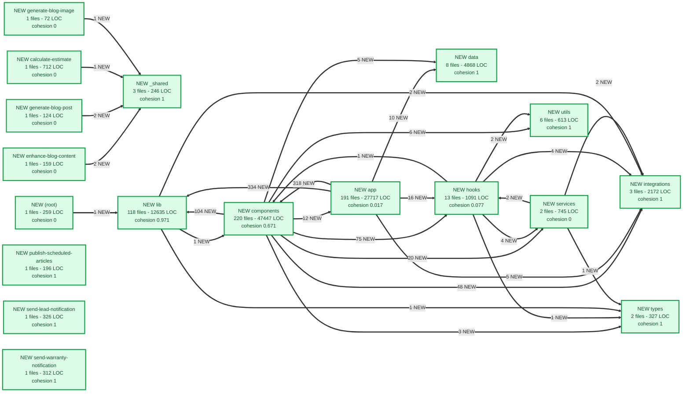

# Codebase map

Generated 2026-08-14T17:51:22.047Z from commit `05287c9` on `seo/phase-2-titles-meta`.
Last commit: SEO: single brand suffix in titles, shorten template, drop redirecting URLs from sitemap (#102)

> **Baseline run.** No previous snapshot found, so everything is marked new and nothing is flagged as a regression. Commit `.codemap/snapshot.json` so the next run can diff against it.

## At a glance

| Metric | Now | Before | Delta |
|---|---:|---:|---:|
| Source files | 574 |  |  |
| Test files | 0 |  |  |
| Lines of code | 100021 |  |  |
| Internal imports | 1688 |  |  |
| Modules | 18 |  |  |
| Entry points | 194 |  |  |
| External packages | 64 |  |  |

## What changed in this commit

**New files (574)**

- `src/app/about/page.tsx` — 233 LOC, module `app`
- `src/app/admin/[...catchAll]/page.tsx` — 4 LOC, module `app`
- `src/app/admin/page.tsx` — 4 LOC, module `app`
- `src/app/api/admin/analyze-project/route.ts` — 200 LOC, module `app`
- `src/app/api/admin/broadcasts/sync-suppression/route.ts` — 19 LOC, module `app`
- `src/app/api/admin/content-actions/apply/route.ts` — 133 LOC, module `app`
- `src/app/api/admin/content-actions/draft/route.ts` — 137 LOC, module `app`
- `src/app/api/admin/content-actions/route.ts` — 84 LOC, module `app`
- `src/app/api/admin/content-actions/stage/route.ts` — 92 LOC, module `app`
- `src/app/api/admin/crew/route.ts` — 75 LOC, module `app`
- `src/app/api/admin/emails/[id]/route.ts` — 30 LOC, module `app`
- `src/app/api/admin/emails/route.ts` — 60 LOC, module `app`
- `src/app/api/admin/estimate-email/_schema.ts` — 57 LOC, module `app`
- `src/app/api/admin/estimate-email/leads/route.ts` — 59 LOC, module `app`
- `src/app/api/admin/estimate-email/log/route.ts` — 42 LOC, module `app`
- `src/app/api/admin/estimate-email/preview/route.ts` — 43 LOC, module `app`
- `src/app/api/admin/estimate-email/send/route.ts` — 125 LOC, module `app`
- `src/app/api/admin/follow-ups/route.ts` — 80 LOC, module `app`
- `src/app/api/admin/home-care/home-records/route.ts` — 197 LOC, module `app`
- `src/app/api/admin/home-care/parse-amazon/route.ts` — 74 LOC, module `app`
- _...and 554 more_

**Modified files (0)**

_none_

**Deleted files (0)**

_none_

**New module boundaries crossed (29)**

- `app` now imports from `lib`
- `app` now imports from `components`
- `components` now imports from `lib`
- `components` now imports from `hooks`
- `components` now imports from `integrations`
- `components` now imports from `services`
- `app` now imports from `hooks`
- `components` now imports from `app`
- `app` now imports from `data`
- `components` now imports from `utils`
- `app` now imports from `integrations`
- `components` now imports from `data`
- `hooks` now imports from `integrations`
- `hooks` now imports from `services`
- `components` now imports from `types`
- `hooks` now imports from `utils`
- `lib` now imports from `integrations`
- `services` now imports from `integrations`
- `services` now imports from `hooks`
- `enhance-blog-content` now imports from `_shared`
- _...and 9 more_

## Module map

Green is new in this commit, yellow was modified, dashed red was deleted. Thick arrows are dependency edges that did not exist before.



## File map for changed modules

```mermaid
%% Generated by codebase-cartographer. File level view of changed modules only.
flowchart LR
  subgraph n7367617070["app"]
    n7372632f6170702f61626f75742f706167652e74["NEW about/page.tsx"]:::added
    n7372632f6170702f61646d696e2f5b2e2e2e6361["NEW [...catchAll]/page.tsx"]:::added
    n7372632f6170702f61646d696e2f706167652e74["NEW admin/page.tsx"]:::added
    n7372632f6170702f6170692f61646d696e2f616e["NEW analyze-project/route.ts"]:::added
    n7372632f6170702f6170692f61646d696e2f6272["NEW sync-suppression/route.ts"]:::added
    n7372632f6170702f6170692f61646d696e2f636f["NEW apply/route.ts"]:::added
    n7372632f6170702f6170692f61646d696e2f636f["NEW draft/route.ts"]:::added
    n7372632f6170702f6170692f61646d696e2f636f["NEW content-actions/route.ts"]:::added
    n7372632f6170702f6170692f61646d696e2f636f["NEW stage/route.ts"]:::added
    n7372632f6170702f6170692f61646d696e2f6372["NEW crew/route.ts"]:::added
    n7372632f6170702f6170692f61646d696e2f656d["NEW [id]/route.ts"]:::added
    n7372632f6170702f6170692f61646d696e2f656d["NEW emails/route.ts"]:::added
    n7372632f6170702f6170692f61646d696e2f6573["NEW estimate-email/_schema.ts"]:::added
    n7372632f6170702f6170692f61646d696e2f6573["NEW leads/route.ts"]:::added
    n7372632f6170702f6170692f61646d696e2f6573["NEW log/route.ts"]:::added
    n7372632f6170702f6170692f61646d696e2f6573["NEW preview/route.ts"]:::added
    n7372632f6170702f6170692f61646d696e2f6573["NEW send/route.ts"]:::added
    n7372632f6170702f6170692f61646d696e2f666f["NEW follow-ups/route.ts"]:::added
    n7372632f6170702f6170692f61646d696e2f686f["NEW home-records/route.ts"]:::added
    n7372632f6170702f6170692f61646d696e2f686f["NEW parse-amazon/route.ts"]:::added
    n7372632f6170702f6170692f61646d696e2f686f["NEW product-image/route.ts"]:::added
    n7372632f6170702f6170692f61646d696e2f686f["NEW [id]/route.ts"]:::added
    n7372632f6170702f6170692f61646d696e2f686f["NEW products/route.ts"]:::added
    n7372632f6170702f6170692f61646d696e2f6b65["NEW keyword-research/route.ts"]:::added
    n7372632f6170702f6170692f61646d696e2f6c69["NEW import/route.ts"]:::added
    n7372632f6170702f6170692f61646d696e2f6c69["NEW verify/route.ts"]:::added
    n7372632f6170702f6170692f61646d696e2f7072["NEW preferences/route.ts"]:::added
    n7372632f6170702f6170692f61646d696e2f7072["NEW [id]/route.ts"]:::added
    n7372632f6170702f6170692f61646d696e2f7072["NEW proposals/route.ts"]:::added
    n7372632f6170702f6170692f61646d696e2f7265["NEW releases/route.ts"]:::added
    n7372632f6170702f6170692f61646d696e2f7265["NEW send/route.ts"]:::added
    n7372632f6170702f6170692f61646d696e2f7365["NEW service-quote/_schema.ts"]:::added
    n7372632f6170702f6170692f61646d696e2f7365["NEW complete/route.ts"]:::added
    n7372632f6170702f6170692f61646d696e2f7365["NEW dispatch/route.ts"]:::added
    n7372632f6170702f6170692f61646d696e2f7365["NEW intake/route.ts"]:::added
    n7372632f6170702f6170692f61646d696e2f7365["NEW schedule/route.ts"]:::added
    n7372632f6170702f6170692f61646d696e2f7365["NEW send/route.ts"]:::added
    n7372632f6170702f6170692f61646d696e2f7375["NEW subscribers/route.ts"]:::added
    n7372632f6170702f6170692f62616e6e6572732f["NEW admin/route.ts"]:::added
    n7372632f6170702f6170692f62616e6e6572732f["NEW banners/route.ts"]:::added
    n7372632f6170702f6170692f6275792d616e642d["NEW subscribe/route.ts"]:::added
    n7372632f6170702f6170692f6275792d616e642d["NEW track/route.ts"]:::added
    n7372632f6170702f6170692f6275792d616e642d["NEW unsubscribe/route.ts"]:::added
    n7372632f6170702f6170692f6275792d616e642d["NEW verify/route.ts"]:::added
    n7372632f6170702f6170692f636f6e73656e742f["NEW log/route.ts"]:::added
    n7372632f6170702f6170692f637265772f636f6e["NEW confirm/route.ts"]:::added
    n7372632f6170702f6170692f63726f6e2f67656e["NEW generate-renderings/route.ts"]:::added
    n7372632f6170702f6170692f63726f6e2f686561["NEW health/route.ts"]:::added
    n7372632f6170702f6170692f63726f6e2f686f6d["NEW home-care-newsletter/route.ts"]:::added
    n7372632f6170702f6170692f63726f6e2f696e74["NEW intake-chase/route.ts"]:::added
    n7372632f6170702f6170692f63726f6e2f6d6f6e["NEW monthly-newsletter/route.ts"]:::added
    n7372632f6170702f6170692f63726f6e2f707562["NEW publish/route.ts"]:::added
    n7372632f6170702f6170692f63726f6e2f726573["NEW resend-sync/route.ts"]:::added
    n7372632f6170702f6170692f63726f6e2f73656e["NEW send-follow-ups/route.ts"]:::added
    n7372632f6170702f6170692f63726f6e2f73656f["NEW seo-ingest/route.ts"]:::added
    n7372632f6170702f6170692f63726f6e2f73656f["NEW seo-maintain/route.ts"]:::added
    n7372632f6170702f6170692f63726f6e2f73656f["NEW seo-report/route.ts"]:::added
    n7372632f6170702f6170692f63726f6e2f73656f["NEW seo-rollback/route.ts"]:::added
    n7372632f6170702f6170692f63726f6e2f73656f["NEW seo-suggest/route.ts"]:::added
    n7372632f6170702f6170692f63726f6e2f766973["NEW visit-dispatch-escalation/route.ts"]:::added
    n7372632f6170702f6170692f63726f6e2f766973["NEW visit-reminders/route.ts"]:::added
    n7372632f6170702f6170692f646f63756d656e74["NEW [type]/route.ts"]:::added
    n7372632f6170702f6170692f666565646261636b["NEW create/route.ts"]:::added
    n7372632f6170702f6170692f666565646261636b["NEW list/route.ts"]:::added
    n7372632f6170702f6170692f666565646261636b["NEW update/route.ts"]:::added
    n7372632f6170702f6170692f666f6c6c6f772d75["NEW follow-up/route.ts"]:::added
    n7372632f6170702f6170692f6865616c74682f66["NEW forms/route.ts"]:::added
    n7372632f6170702f6170692f686f6d652d636172["NEW access/route.ts"]:::added
    n7372632f6170702f6170692f686f6d652d636172["NEW login/route.ts"]:::added
    n7372632f6170702f6170692f686f6d652d636172["NEW profile/route.ts"]:::added
    n7372632f6170702f6170692f686f6d652d636172["NEW record/route.ts"]:::added
    n7372632f6170702f6170692f686f6d652d636172["NEW subscribe/route.ts"]:::added
    n7372632f6170702f6170692f686f6d652d636172["NEW task/route.ts"]:::added
    n7372632f6170702f6170692f686f6d652d636172["NEW unsubscribe/route.ts"]:::added
    n7372632f6170702f6170692f686f6d652d636172["NEW verify/route.ts"]:::added
    n7372632f6170702f6170692f686f6d652d636172["NEW visit.ics/route.ts"]:::added
    n7372632f6170702f6170692f696e74616b652f5b["NEW answer/route.ts"]:::added
    n7372632f6170702f6170692f696e74616b652f5b["NEW message/route.ts"]:::added
    n7372632f6170702f6170692f696e74616b652f5b["NEW photo/route.ts"]:::added
    n7372632f6170702f6170692f6c656164732f636f["NEW conversations/route.ts"]:::added
    n7372632f6170702f6170692f6c656164732f6c69["NEW list/route.ts"]:::added
    n7372632f6170702f6170692f6c656164732f7375["NEW submit/route.ts"]:::added
    n7372632f6170702f6170692f6c656164732f7765["NEW webhook/route.ts"]:::added
    n7372632f6170702f6170692f6e6577736c657474["NEW subscribe/route.ts"]:::added
    n7372632f6170702f6170692f6e6f746966792f66["NEW form-error/route.ts"]:::added
    n7372632f6170702f6170692f6e6f746966792f6e["NEW new-lead/route.ts"]:::added
    n7372632f6170702f6170692f6e6f746966792f74["NEW telegram-lead/route.ts"]:::added
    n7372632f6170702f6170692f707265666572656e["NEW preferences/route.ts"]:::added
    n7372632f6170702f6170692f707265666572656e["NEW unsubscribe-by-email/route.ts"]:::added
    n7372632f6170702f6170692f707265666572656e["NEW unsubscribe/route.ts"]:::added
    n7372632f6170702f6170692f70726f706f73616c["NEW submit/route.ts"]:::added
    n7372632f6170702f6170692f726566657272616c["NEW referrals/route.ts"]:::added
    n7372632f6170702f6170692f776562686f6f6b73["NEW resend/route.ts"]:::added
    n7372632f6170702f617574682f6c61796f75742e["NEW auth/layout.tsx"]:::added
    n7372632f6170702f617574682f706167652e7473["NEW auth/page.tsx"]:::added
    n7372632f6170702f626c6f672f5b736c75675d2f["NEW [slug]/layout.tsx"]:::added
    n7372632f6170702f626c6f672f5b736c75675d2f["NEW [slug]/page.tsx"]:::added
    n7372632f6170702f626c6f672f6c61796f75742e["NEW blog/layout.tsx"]:::added
    n7372632f6170702f626c6f672f706167652e7473["NEW blog/page.tsx"]:::added
    n7372632f6170702f626c6f672f70726576696577["NEW [slug]/page.tsx"]:::added
    n7372632f6170702f626f6e642f706167652e7473["NEW bond/page.tsx"]:::added
    n7372632f6170702f6272616e642d6b69742f636f["NEW brand-kit/copy-button.tsx"]:::added
    n7372632f6170702f6272616e642d6b69742f7061["NEW brand-kit/page.tsx"]:::added
    n7372632f6170702f6275792d616e642d72656d6f["NEW [slug]/page.tsx"]:::added
    n7372632f6170702f6275792d616e642d72656d6f["NEW buy-and-remodel/page.tsx"]:::added
    n7372632f6170702f6275792d616e642d72656d6f["NEW unlock/page.tsx"]:::added
    n7372632f6170702f636d732f5b2e2e2e736c7567["NEW [...slug]/page.tsx"]:::added
    n7372632f6170702f636f6d6d65726369616c2d73["NEW commercial-services/page.tsx"]:::added
    n7372632f6170702f636f6e746163742f70616765["NEW contact/page.tsx"]:::added
    n7372632f6170702f637265772f636f6e6669726d["NEW [token]/CrewConfirmActions.tsx"]:::added
    n7372632f6170702f637265772f636f6e6669726d["NEW [token]/page.tsx"]:::added
    n7372632f6170702f646174612d7269676874732f["NEW data-rights/layout.tsx"]:::added
    n7372632f6170702f646174612d7269676874732f["NEW data-rights/page.tsx"]:::added
    n7372632f6170702f646f2d6e6f742d73656c6c2f["NEW do-not-sell/layout.tsx"]:::added
    n7372632f6170702f646f2d6e6f742d73656c6c2f["NEW do-not-sell/page.tsx"]:::added
    n7372632f6170702f6661712f706167652e747378["NEW faq/page.tsx"]:::added
    n7372632f6170702f667265652d657374696d6174["NEW free-estimate/page.tsx"]:::added
    n7372632f6170702f686f6d652d636172652f626f["NEW book/page.tsx"]:::added
    n7372632f6170702f686f6d652d636172652f6368["NEW checklist/page.tsx"]:::added
    n7372632f6170702f686f6d652d636172652f6775["NEW [season]/page.tsx"]:::added
    n7372632f6170702f686f6d652d636172652f7061["NEW home-care/page.tsx"]:::added
    n7372632f6170702f686f6d652d636172652f7365["NEW setup/page.tsx"]:::added
    n7372632f6170702f686f6d652d636172652f7768["NEW whats-new/page.tsx"]:::added
    n7372632f6170702f686f6d652d73657276696365["NEW home-services/page.tsx"]:::added
    n7372632f6170702f696e737572616e63652f7061["NEW insurance/page.tsx"]:::added
    n7372632f6170702f696e74616b652f5b746f6b65["NEW [token]/IntakeThread.tsx"]:::added
    n7372632f6170702f696e74616b652f5b746f6b65["NEW [token]/page.tsx"]:::added
    n7372632f6170702f6c61796f75742e747378["NEW app/layout.tsx"]:::added
    n7372632f6170702f6c656176652d612d72657669["NEW leave-a-review/page.tsx"]:::added
    n7372632f6170702f6c6963656e73652f70616765["NEW license/page.tsx"]:::added
    n7372632f6170702f6c6f636174696f6e732f5b63["NEW [city]/page.tsx"]:::added
    n7372632f6170702f6c6f636174696f6e732f5b63["NEW [service]/page.tsx"]:::added
    n7372632f6170702f6c6f636174696f6e732f5b63["NEW services/page.tsx"]:::added
    n7372632f6170702f6c6f636174696f6e732f6d6f["NEW bathroom-renovation/page.tsx"]:::added
    n7372632f6170702f6c6f636174696f6e732f7061["NEW locations/page.tsx"]:::added
    n7372632f6170702f6c6f636174696f6e732f7665["NEW bathroom-renovation/page.tsx"]:::added
    n7372632f6170702f6c702f626173656d656e742d["NEW basement-finishing/page.tsx"]:::added
    n7372632f6170702f6c702f62617468726f6f6d2d["NEW bathroom-renovation/page.tsx"]:::added
    n7372632f6170702f6c702f6b69746368656e2d72["NEW kitchen-remodel/page.tsx"]:::added
    n7372632f6170702f6e6f742d666f756e642e7473["NEW app/not-found.tsx [ORPHAN]"]:::orphan
    n7372632f6170702f706167652e747378["NEW app/page.tsx"]:::added
    n7372632f6170702f706f7274666f6c696f2f6c61["NEW portfolio/layout.tsx"]:::added
    n7372632f6170702f706f7274666f6c696f2f7061["NEW portfolio/page.tsx"]:::added
    n7372632f6170702f707265666572656e6365732f["NEW preferences/PreferencesClient.tsx"]:::added
    n7372632f6170702f707265666572656e6365732f["NEW preferences/page.tsx"]:::added
    n7372632f6170702f707269766163792d706f6c69["NEW privacy-policy/layout.tsx"]:::added
    n7372632f6170702f707269766163792d706f6c69["NEW privacy-policy/page.tsx"]:::added
    n7372632f6170702f70726f636573732f6c61796f["NEW process/layout.tsx"]:::added
    n7372632f6170702f70726f636573732f70616765["NEW process/page.tsx"]:::added
    n7372632f6170702f70726f6a6563742d63616c63["NEW project-calculator/layout.tsx"]:::added
    n7372632f6170702f70726f6a6563742d63616c63["NEW project-calculator/page.tsx"]:::added
    n7372632f6170702f70726f6a6563742d63616c63["NEW [leadId]/page.tsx"]:::added
    n7372632f6170702f70726f6a656374732f5b736c["NEW [slug]/page.tsx"]:::added
    n7372632f6170702f70726f706f73616c2f5b746f["NEW [token]/ProposalView.tsx"]:::added
    n7372632f6170702f70726f706f73616c2f5b746f["NEW [token]/page.tsx"]:::added
    n7372632f6170702f726566657272616c2f706167["NEW referral/page.tsx"]:::added
    n7372632f6170702f726571756573742d65737469["NEW request-estimate/page.tsx"]:::added
    n7372632f6170702f7265736f75726365732f5b73["NEW [slug]/page.tsx"]:::added
    n7372632f6170702f7265736f75726365732f7061["NEW resources/page.tsx"]:::added
    n7372632f6170702f726576696577732f70616765["NEW reviews/page.tsx"]:::added
    n7372632f6170702f726f626f74732e7473["NEW app/robots.ts [ORPHAN]"]:::orphan
    n7372632f6170702f73657276696365732f5b736c["NEW [slug]/page.tsx"]:::added
    n7372632f6170702f73657276696365732f696e74["NEW interior-finishing/page.tsx"]:::added
    n7372632f6170702f73657276696365732f706167["NEW services/page.tsx"]:::added
    n7372632f6170702f73657276696365732f77686f["NEW whole-home-remodeling/page.tsx"]:::added
    n7372632f6170702f736974656d61702e7473["NEW app/sitemap.ts [ORPHAN]"]:::orphan
    n7372632f6170702f737072696e672d72656e6f76["NEW spring-renovation/page.tsx"]:::added
    n7372632f6170702f7465726d732d616e642d636f["NEW terms-and-conditions/layout.tsx"]:::added
    n7372632f6170702f7465726d732d616e642d636f["NEW terms-and-conditions/page.tsx"]:::added
    n7372632f6170702f756e7375622f556e73756243["NEW unsub/UnsubClient.tsx"]:::added
    n7372632f6170702f756e7375622f706167652e74["NEW unsub/page.tsx"]:::added
    n7372632f6170702f766163612d6d676d742f616e["NEW analytics/page.tsx"]:::added
    n7372632f6170702f766163612d6d676d742f6175["NEW automation-test/page.tsx"]:::added
    n7372632f6170702f766163612d6d676d742f6372["NEW crew/page.tsx"]:::added
    n7372632f6170702f766163612d6d676d742f656d["NEW [id]/page.tsx"]:::added
    n7372632f6170702f766163612d6d676d742f656d["NEW emails/page.tsx"]:::added
    n7372632f6170702f766163612d6d676d742f6665["NEW feedback/page.tsx"]:::added
    n7372632f6170702f766163612d6d676d742f666f["NEW follow-ups/page.tsx"]:::added
    n7372632f6170702f766163612d6d676d742f686f["NEW home-care-shop/page.tsx"]:::added
    n7372632f6170702f766163612d6d676d742f686f["NEW home-records/page.tsx"]:::added
    n7372632f6170702f766163612d6d676d742f6c61["NEW vaca-mgmt/layout.tsx"]:::added
    n7372632f6170702f766163612d6d676d742f7061["NEW vaca-mgmt/page.tsx"]:::added
    n7372632f6170702f766163612d6d676d742f7065["NEW performance/page.tsx"]:::added
    n7372632f6170702f766163612d6d676d742f7072["NEW preferences/page.tsx"]:::added
    n7372632f6170702f766163612d6d676d742f7072["NEW proposals/page.tsx"]:::added
    n7372632f6170702f766163612d6d676d742f7265["NEW releases/page.tsx"]:::added
    n7372632f6170702f766163612d6d676d742f7365["NEW log/page.tsx"]:::added
    n7372632f6170702f766163612d6d676d742f7365["NEW send-estimate/page.tsx"]:::added
    n7372632f6170702f766163612d6d676d742f7365["NEW send-service-quote/page.tsx"]:::added
    n7372632f6170702f77617272616e74792f6c6179["NEW warranty/layout.tsx"]:::added
    n7372632f6170702f77617272616e74792f706167["NEW warranty/page.tsx"]:::added
  end
  subgraph n7367636f6d706f6e656e7473["components"]
    n7372632f636f6d706f6e656e74732f4142546573["NEW components/ABTesting.tsx [ORPHAN]"]:::orphan
    n7372632f636f6d706f6e656e74732f41646d696e["NEW components/AdminContent.tsx"]:::added
    n7372632f636f6d706f6e656e74732f416e616c79["NEW components/Analytics.tsx"]:::added
    n7372632f636f6d706f6e656e74732f4265666f72["NEW components/BeforeAfterGallery.tsx [ORPHAN]"]:::orphan
    n7372632f636f6d706f6e656e74732f4265666f72["NEW components/BeforeAfterSlider.tsx"]:::added
    n7372632f636f6d706f6e656e74732f426c6f6750["NEW components/BlogPostGrid.tsx"]:::added
    n7372632f636f6d706f6e656e74732f4272656164["NEW components/Breadcrumb.tsx"]:::added
    n7372632f636f6d706f6e656e74732f434d535061["NEW components/CMSPageLayout.tsx"]:::added
    n7372632f636f6d706f6e656e74732f434d535061["NEW components/CMSPageRenderer.tsx"]:::added
    n7372632f636f6d706f6e656e74732f43616c6375["NEW components/CalculatorResultsPage.tsx"]:::added
    n7372632f636f6d706f6e656e74732f43616c6c54["NEW components/CallTrackingWrapper.tsx"]:::added
    n7372632f636f6d706f6e656e74732f43616e6f6e["NEW components/CanonicalUrl.tsx"]:::added
    n7372632f636f6d706f6e656e74732f436974794c["NEW components/CityLandingClient.tsx"]:::added
    n7372632f636f6d706f6e656e74732f436c69656e["NEW components/ClientLeadGenWidgets.tsx"]:::added
    n7372632f636f6d706f6e656e74732f436f6d706c["NEW components/ComplianceDocuments.tsx"]:::added
    n7372632f636f6d706f6e656e74732f436f6e7461["NEW components/ContactForm.tsx"]:::added
    n7372632f636f6d706f6e656e74732f436f6e7461["NEW components/ContactHeroPhone.tsx"]:::added
    n7372632f636f6d706f6e656e74732f436f6e7461["NEW components/ContactTrustBadges.tsx"]:::added
    n7372632f636f6d706f6e656e74732f436f6f6b69["NEW components/CookieConsent.tsx"]:::added
    n7372632f636f6d706f6e656e74732f44796e616d["NEW components/DynamicSitemap.tsx"]:::added
    n7372632f636f6d706f6e656e74732f457374696d["NEW components/EstimateForm.tsx [ORPHAN]"]:::orphan
    n7372632f636f6d706f6e656e74732f4578697449["NEW components/ExitIntentPopup.tsx"]:::added
    n7372632f636f6d706f6e656e74732f46696e616e["NEW components/FinancingCalculator.tsx"]:::added
    n7372632f636f6d706f6e656e74732f466f6f7465["NEW components/Footer.tsx"]:::added
    n7372632f636f6d706f6e656e74732f4672656545["NEW components/FreeEstimateLanding.tsx"]:::added
    n7372632f636f6d706f6e656e74732f476f6f676c["NEW components/GoogleMaps.tsx"]:::added
    n7372632f636f6d706f6e656e74732f4865616465["NEW components/Header.tsx"]:::added
    n7372632f636f6d706f6e656e74732f486561744d["NEW components/HeatMap.tsx [ORPHAN]"]:::orphan
    n7372632f636f6d706f6e656e74732f4865726f2e["NEW components/Hero.tsx"]:::added
    n7372632f636f6d706f6e656e74732f486f6d6545["NEW components/HomeEstimateForm.tsx"]:::added
    n7372632f636f6d706f6e656e74732f486f72697a["NEW components/HorizontalNav.tsx"]:::added
    n7372632f636f6d706f6e656e74732f496d616765["NEW components/ImageLightbox.tsx"]:::added
    n7372632f636f6d706f6e656e74732f496e616374["NEW components/InactivityTimer.tsx [ORPHAN]"]:::orphan
    n7372632f636f6d706f6e656e74732f496e74616b["NEW components/IntakeInvite.tsx"]:::added
    n7372632f636f6d706f6e656e74732f4c616e6469["NEW components/LandingPageHeader.tsx"]:::added
    n7372632f636f6d706f6e656e74732f4c616e6469["NEW components/LandingPageLeadForm.tsx"]:::added
    n7372632f636f6d706f6e656e74732f4c617a7953["NEW components/LazySection.tsx [ORPHAN]"]:::orphan
    n7372632f636f6d706f6e656e74732f4c65617665["NEW components/LeaveReviewClient.tsx"]:::added
    n7372632f636f6d706f6e656e74732f4c69737469["NEW components/ListingsGallery.tsx"]:::added
    n7372632f636f6d706f6e656e74732f4c6f63616c["NEW components/LocalSEOContent.tsx [ORPHAN]"]:::orphan
    n7372632f636f6d706f6e656e74732f4c6f63616c["NEW components/LocalSEOSchema.tsx"]:::added
    n7372632f636f6d706f6e656e74732f4c6f636174["NEW components/LocationServiceClient.tsx"]:::added
    n7372632f636f6d706f6e656e74732f4d61726b64["NEW components/MarkdownContent.tsx"]:::added
    n7372632f636f6d706f6e656e74732f4d6f62696c["NEW components/MobileContactBanner.tsx [ORPHAN]"]:::orphan
    n7372632f636f6d706f6e656e74732f4d6f62696c["NEW components/MobileSwipeGallery.tsx [ORPHAN]"]:::orphan
    n7372632f636f6d706f6e656e74732f4e4150496e["NEW components/NAPInfo.tsx"]:::added
    n7372632f636f6d706f6e656e74732f4f7074696d["NEW components/OptimizedImage.tsx [ORPHAN]"]:::orphan
    n7372632f636f6d706f6e656e74732f5061676556["NEW components/PageViewTracker.tsx"]:::added
    n7372632f636f6d706f6e656e74732f506f727466["NEW components/PortfolioContent.tsx"]:::added
    n7372632f636f6d706f6e656e74732f50726f6365["NEW components/ProcessPageClient.tsx"]:::added
    n7372632f636f6d706f6e656e74732f50726f6a65["NEW components/ProjectCase.tsx [ORPHAN]"]:::orphan
    n7372632f636f6d706f6e656e74732f50726f6a65["NEW components/ProjectDetailClient.tsx"]:::added
    n7372632f636f6d706f6e656e74732f50726f6a65["NEW components/ProjectGallery.tsx"]:::added
    n7372632f636f6d706f6e656e74732f50726f6a65["NEW components/ProjectImageGallery.tsx [ORPHAN]"]:::orphan
    n7372632f636f6d706f6e656e74732f5265666572["NEW components/ReferralForm.tsx"]:::added
    n7372632f636f6d706f6e656e74732f5265766965["NEW components/ReviewToast.tsx"]:::added
    n7372632f636f6d706f6e656e74732f5265766965["NEW components/ReviewsBottomCTA.tsx"]:::added
    n7372632f636f6d706f6e656e74732f5265766965["NEW components/ReviewsPageClient.tsx"]:::added
    n7372632f636f6d706f6e656e74732f53454f5363["NEW components/SEOSchema.tsx"]:::added
    n7372632f636f6d706f6e656e74732f5363726f6c["NEW components/ScrollHint.tsx"]:::added
    n7372632f636f6d706f6e656e74732f5363726f6c["NEW components/ScrollToEstimateButton.tsx"]:::added
    n7372632f636f6d706f6e656e74732f5365637469["NEW components/SectionTracker.tsx"]:::added
    n7372632f636f6d706f6e656e74732f5365727669["NEW components/ServiceAreas.tsx"]:::added
    n7372632f636f6d706f6e656e74732f5365727669["NEW components/ServiceDetailClient.tsx"]:::added
    n7372632f636f6d706f6e656e74732f5365727669["NEW components/Services.tsx"]:::added
    n7372632f636f6d706f6e656e74732f536d617274["NEW components/SmartBanner.tsx"]:::added
    n7372632f636f6d706f6e656e74732f536f636961["NEW components/SocialProofPopup.tsx [ORPHAN]"]:::orphan
    n7372632f636f6d706f6e656e74732f537469636b["NEW components/StickyCTA.tsx"]:::added
    n7372632f636f6d706f6e656e74732f5374727563["NEW components/StructuredData.tsx"]:::added
    n7372632f636f6d706f6e656e74732f5465616d4d["NEW components/TeamMember.tsx"]:::added
    n7372632f636f6d706f6e656e74732f5465737469["NEW components/TestimonialCard.tsx [ORPHAN]"]:::orphan
    n7372632f636f6d706f6e656e74732f5465737469["NEW components/Testimonials.tsx"]:::added
    n7372632f636f6d706f6e656e74732f547261636b["NEW components/TrackedSection.tsx"]:::added
    n7372632f636f6d706f6e656e74732f556e696669["NEW components/UnifiedCalculator.tsx"]:::added
    n7372632f636f6d706f6e656e74732f5669736974["NEW components/VisitorTracker.tsx"]:::added
    n7372632f636f6d706f6e656e74732f5761727261["NEW components/WarrantyForm.tsx"]:::added
    n7372632f636f6d706f6e656e74732f5761727261["NEW components/WarrantyFormWrapper.tsx"]:::added
    n7372632f636f6d706f6e656e74732f5768794368["NEW components/WhyChoose.tsx"]:::added
    n7372632f636f6d706f6e656e74732f61646d696e["NEW admin/AIContentAssistant.tsx"]:::added
    n7372632f636f6d706f6e656e74732f61646d696e["NEW admin/ActiveDripsList.tsx"]:::added
    n7372632f636f6d706f6e656e74732f61646d696e["NEW admin/AdminDashboard.tsx"]:::added
    n7372632f636f6d706f6e656e74732f61646d696e["NEW admin/AdminSidebar.tsx"]:::added
    n7372632f636f6d706f6e656e74732f61646d696e["NEW admin/AnalyticsSettings.tsx"]:::added
    n7372632f636f6d706f6e656e74732f61646d696e["NEW admin/BannerManager.tsx"]:::added
    n7372632f636f6d706f6e656e74732f61646d696e["NEW admin/BlogPostEditor.tsx"]:::added
    n7372632f636f6d706f6e656e74732f61646d696e["NEW admin/BlogPostGenerator.tsx"]:::added
    n7372632f636f6d706f6e656e74732f61646d696e["NEW admin/BlogPostList.tsx"]:::added
    n7372632f636f6d706f6e656e74732f61646d696e["NEW admin/BrokenLinkDetector.tsx"]:::added
    n7372632f636f6d706f6e656e74732f61646d696e["NEW admin/BulkSEOEditor.tsx"]:::added
    n7372632f636f6d706f6e656e74732f61646d696e["NEW admin/CMSPageEditor.tsx"]:::added
    n7372632f636f6d706f6e656e74732f61646d696e["NEW admin/ComplianceDocumentsManager.tsx"]:::added
    n7372632f636f6d706f6e656e74732f61646d696e["NEW admin/ConversionDashboard.tsx"]:::added
    n7372632f636f6d706f6e656e74732f61646d696e["NEW admin/DiagnosticTool.tsx"]:::added
    n7372632f636f6d706f6e656e74732f61646d696e["NEW admin/EstimatesManager.tsx"]:::added
    n7372632f636f6d706f6e656e74732f61646d696e["NEW admin/GMBSettings.tsx"]:::added
    n7372632f636f6d706f6e656e74732f61646d696e["NEW admin/HeadshotCropper.tsx"]:::added
    n7372632f636f6d706f6e656e74732f61646d696e["NEW admin/HomeCareShopManager.tsx"]:::added
    n7372632f636f6d706f6e656e74732f61646d696e["NEW admin/LeadsManager.tsx"]:::added
    n7372632f636f6d706f6e656e74732f61646d696e["NEW admin/ListingsManager.tsx"]:::added
    n7372632f636f6d706f6e656e74732f61646d696e["NEW admin/MarkdownEditor.tsx"]:::added
    n7372632f636f6d706f6e656e74732f61646d696e["NEW admin/NonNegotiablesManager.tsx"]:::added
    n7372632f636f6d706f6e656e74732f61646d696e["NEW admin/PageSpeedMonitor.tsx"]:::added
    n7372632f636f6d706f6e656e74732f61646d696e["NEW admin/PortfolioManager.tsx"]:::added
    n7372632f636f6d706f6e656e74732f61646d696e["NEW admin/PricingManager.tsx"]:::added
    n7372632f636f6d706f6e656e74732f61646d696e["NEW admin/ProjectUploadSystem.tsx"]:::added
    n7372632f636f6d706f6e656e74732f61646d696e["NEW admin/ProjectsEditor.tsx [ORPHAN]"]:::orphan
    n7372632f636f6d706f6e656e74732f61646d696e["NEW admin/RedirectManager.tsx"]:::added
    n7372632f636f6d706f6e656e74732f61646d696e["NEW admin/ReportsPage.tsx"]:::added
    n7372632f636f6d706f6e656e74732f61646d696e["NEW admin/RichTextEditor.tsx [ORPHAN]"]:::orphan
    n7372632f636f6d706f6e656e74732f61646d696e["NEW admin/SEODashboard.tsx"]:::added
    n7372632f636f6d706f6e656e74732f61646d696e["NEW admin/SEOEditor.tsx [ORPHAN]"]:::orphan
    n7372632f636f6d706f6e656e74732f61646d696e["NEW admin/SeoSuggestionsDashboard.tsx"]:::added
    n7372632f636f6d706f6e656e74732f61646d696e["NEW admin/ServiceAreasEditor.tsx"]:::added
    n7372632f636f6d706f6e656e74732f61646d696e["NEW admin/ServicesEditor.tsx"]:::added
    n7372632f636f6d706f6e656e74732f61646d696e["NEW admin/SubscribersDashboard.tsx"]:::added
    n7372632f636f6d706f6e656e74732f61646d696e["NEW admin/UptimeMonitor.tsx"]:::added
    n7372632f636f6d706f6e656e74732f61646d696e["NEW project-steps/ProjectBasicInfoStep.tsx"]:::added
    n7372632f636f6d706f6e656e74732f61646d696e["NEW project-steps/ProjectDetailsStep.tsx"]:::added
    n7372632f636f6d706f6e656e74732f61646d696e["NEW project-steps/ProjectPhotosStep.tsx"]:::added
    n7372632f636f6d706f6e656e74732f61646d696e["NEW project-steps/ProjectSEOStep.tsx"]:::added
    n7372632f636f6d706f6e656e74732f61646d696e["NEW ui/AdminCheckbox.tsx"]:::added
    n7372632f636f6d706f6e656e74732f61646d696e["NEW ui/AdminRadioGroup.tsx"]:::added
    n7372632f636f6d706f6e656e74732f63616c6375["NEW calculator/CalculatorLayout.tsx [ORPHAN]"]:::orphan
    n7372632f636f6d706f6e656e74732f63616c6375["NEW calculator/ProgressBar.tsx"]:::added
    n7372632f636f6d706f6e656e74732f63616c6375["NEW calculator/ProgressIndicator.tsx [ORPHAN]"]:::orphan
    n7372632f636f6d706f6e656e74732f63616c6375["NEW calculator/ProjectTypeSelector.tsx [ORPHAN]"]:::orphan
    n7372632f636f6d706f6e656e74732f63616c6375["NEW steps/AdditionalFeaturesStep.tsx"]:::added
    n7372632f636f6d706f6e656e74732f63616c6375["NEW steps/ConfirmationStep.tsx"]:::added
    n7372632f636f6d706f6e656e74732f63616c6375["NEW steps/ContactInfoStep.tsx"]:::added
    n7372632f636f6d706f6e656e74732f63616c6375["NEW steps/DimensionsStep.tsx"]:::added
    n7372632f636f6d706f6e656e74732f63616c6375["NEW steps/EstimateResultsStep.tsx [ORPHAN]"]:::orphan
    n7372632f636f6d706f6e656e74732f63616c6375["NEW steps/MaterialOptionsStep.tsx"]:::added
    n7372632f636f6d706f6e656e74732f63616c6375["NEW steps/OptionalUpgradesStep.tsx [ORPHAN]"]:::orphan
    n7372632f636f6d706f6e656e74732f63616c6375["NEW steps/PDFUploadStep.tsx"]:::added
    n7372632f636f6d706f6e656e74732f63616c6375["NEW steps/ProjectOverviewStep.tsx"]:::added
    n7372632f636f6d706f6e656e74732f63616c6375["NEW steps/ProjectTypeSelectionStep.tsx"]:::added
    n7372632f636f6d706f6e656e74732f63616c6375["NEW steps/QualityLevelStep.tsx"]:::added
    n7372632f636f6d706f6e656e74732f63616c6375["NEW steps/ResultsStep.tsx [ORPHAN]"]:::orphan
    n7372632f636f6d706f6e656e74732f63616c6375["NEW steps/SquareFootageStep.tsx [ORPHAN]"]:::orphan
    n7372632f636f6d706f6e656e74732f666f726d73["NEW forms/ContactTimePicker.tsx"]:::added
    n7372632f636f6d706f6e656e74732f67616c6c65["NEW gallery/PhotoGallery.tsx"]:::added
    n7372632f636f6d706f6e656e74732f686f6d6563["NEW homecare/ChecklistPreview.tsx"]:::added
    n7372632f636f6d706f6e656e74732f686f6d6563["NEW homecare/DiyKitShelf.tsx"]:::added
    n7372632f636f6d706f6e656e74732f686f6d6563["NEW homecare/HomeCareBanner.tsx"]:::added
    n7372632f636f6d706f6e656e74732f686f6d6563["NEW homecare/HomeCareBookingForm.tsx"]:::added
    n7372632f636f6d706f6e656e74732f686f6d6563["NEW homecare/HomeCareChecklistClient.tsx"]:::added
    n7372632f636f6d706f6e656e74732f686f6d6563["NEW homecare/HomeCareOptInForm.tsx"]:::added
    n7372632f636f6d706f6e656e74732f686f6d6563["NEW homecare/HomeCareRecordCapture.tsx"]:::added
    n7372632f636f6d706f6e656e74732f686f6d6563["NEW homecare/HomeCareSetupWizard.tsx"]:::added
    n7372632f636f6d706f6e656e74732f686f6d6563["NEW homecare/UpcomingVisitCard.tsx"]:::added
    n7372632f636f6d706f6e656e74732f6c69737469["NEW listings/FooterBuyRemodelLink.tsx"]:::added
    n7372632f636f6d706f6e656e74732f6c69737469["NEW listings/ListingPhotos.tsx"]:::added
    n7372632f636f6d706f6e656e74732f6c69737469["NEW listings/ListingsUnlockForm.tsx"]:::added
    n7372632f636f6d706f6e656e74732f6c69737469["NEW listings/PreviewBanner.tsx"]:::added
    n7372632f636f6d706f6e656e74732f6c69737469["NEW listings/SubscriberGreeting.tsx"]:::added
    n7372632f636f6d706f6e656e74732f6d6f62696c["NEW mobile/AMPBlogPost.tsx"]:::added
    n7372632f636f6d706f6e656e74732f6d6f62696c["NEW mobile/ClickToCall.tsx"]:::added
    n7372632f636f6d706f6e656e74732f6d6f62696c["NEW mobile/MobileContactBanner.tsx"]:::added
    n7372632f636f6d706f6e656e74732f6d6f62696c["NEW mobile/MobileNavigation.tsx"]:::added
    n7372632f636f6d706f6e656e74732f6d6f62696c["NEW mobile/MobileOptimizedButton.tsx [ORPHAN]"]:::orphan
    n7372632f636f6d706f6e656e74732f6d6f62696c["NEW mobile/MobileSEO.tsx"]:::added
    n7372632f636f6d706f6e656e74732f6d6f62696c["NEW mobile/MobileTestingUtils.tsx"]:::added
    n7372632f636f6d706f6e656e74732f6d6f62696c["NEW mobile/index.ts"]:::added
    n7372632f636f6d706f6e656e74732f70726f7669["NEW components/providers.tsx"]:::added
    n7372632f636f6d706f6e656e74732f7265636170["NEW recaptcha/RecaptchaChallengeProvider.tsx"]:::added
    n7372632f636f6d706f6e656e74732f73656f2f46["NEW seo/FAQSection.tsx"]:::added
    n7372632f636f6d706f6e656e74732f73656f2f48["NEW seo/HowToSchema.tsx"]:::added
    n7372632f636f6d706f6e656e74732f73656f2f4f["NEW seo/OptimizedList.tsx"]:::added
    n7372632f636f6d706f6e656e74732f73656f2f50["NEW seo/PricingTable.tsx"]:::added
    n7372632f636f6d706f6e656e74732f73656f2f52["NEW seo/ReviewSchema.tsx"]:::added
    n7372632f636f6d706f6e656e74732f73656f2f53["NEW seo/SpeakableSchema.tsx"]:::added
    n7372632f636f6d706f6e656e74732f73656f2f54["NEW seo/TableOfContents.tsx"]:::added
    n7372632f636f6d706f6e656e74732f73656f2f69["NEW seo/index.ts"]:::added
    n7372632f636f6d706f6e656e74732f7365727669["NEW services/RequestEstimateForm.tsx"]:::added
    n7372632f636f6d706f6e656e74732f7365727669["NEW services/ServiceImageGrid.tsx"]:::added
    n7372632f636f6d706f6e656e74732f7365727669["NEW services/ServiceTile.tsx"]:::added
    n7372632f636f6d706f6e656e74732f7365727669["NEW services/ServicesBottomTabs.tsx"]:::added
    n7372632f636f6d706f6e656e74732f7365727669["NEW services/ServicesTrustBar.tsx"]:::added
    n7372632f636f6d706f6e656e74732f7365727669["NEW services/serviceData.ts"]:::added
    n7372632f636f6d706f6e656e74732f75692f6163["NEW ui/accordion.tsx"]:::added
    n7372632f636f6d706f6e656e74732f75692f616c["NEW ui/alert-dialog.tsx"]:::added
    n7372632f636f6d706f6e656e74732f75692f616c["NEW ui/alert.tsx"]:::added
    n7372632f636f6d706f6e656e74732f75692f6176["NEW ui/avatar.tsx"]:::added
    n7372632f636f6d706f6e656e74732f75692f6261["NEW ui/badge.tsx"]:::added
    n7372632f636f6d706f6e656e74732f75692f6272["NEW ui/breadcrumb.tsx [ORPHAN]"]:::orphan
    n7372632f636f6d706f6e656e74732f75692f6275["NEW ui/button.tsx"]:::added
    n7372632f636f6d706f6e656e74732f75692f6361["NEW ui/calendar.tsx"]:::added
    n7372632f636f6d706f6e656e74732f75692f6361["NEW ui/card.tsx"]:::added
    n7372632f636f6d706f6e656e74732f75692f6361["NEW ui/carousel.tsx"]:::added
    n7372632f636f6d706f6e656e74732f75692f6368["NEW ui/chart.tsx [ORPHAN]"]:::orphan
    n7372632f636f6d706f6e656e74732f75692f6368["NEW ui/checkbox-icon.tsx"]:::added
    n7372632f636f6d706f6e656e74732f75692f6368["NEW ui/checkbox.tsx"]:::added
    n7372632f636f6d706f6e656e74732f75692f636f["NEW ui/collapsible.tsx"]:::added
    n7372632f636f6d706f6e656e74732f75692f636f["NEW ui/command.tsx"]:::added
    n7372632f636f6d706f6e656e74732f75692f6469["NEW ui/dialog.tsx"]:::added
    n7372632f636f6d706f6e656e74732f75692f6472["NEW ui/drawer.tsx [ORPHAN]"]:::orphan
    n7372632f636f6d706f6e656e74732f75692f6472["NEW ui/dropdown-menu.tsx"]:::added
    n7372632f636f6d706f6e656e74732f75692f666f["NEW ui/form.tsx [ORPHAN]"]:::orphan
    n7372632f636f6d706f6e656e74732f75692f696e["NEW ui/input.tsx"]:::added
    n7372632f636f6d706f6e656e74732f75692f6c61["NEW ui/label.tsx"]:::added
    n7372632f636f6d706f6e656e74732f75692f706f["NEW ui/popover.tsx"]:::added
    n7372632f636f6d706f6e656e74732f75692f7072["NEW ui/progress.tsx"]:::added
    n7372632f636f6d706f6e656e74732f75692f7261["NEW ui/radio-group.tsx"]:::added
    n7372632f636f6d706f6e656e74732f75692f7363["NEW ui/scroll-area.tsx"]:::added
    n7372632f636f6d706f6e656e74732f75692f7365["NEW ui/select.tsx"]:::added
    n7372632f636f6d706f6e656e74732f75692f7365["NEW ui/separator.tsx"]:::added
    n7372632f636f6d706f6e656e74732f75692f7368["NEW ui/sheet.tsx"]:::added
    n7372632f636f6d706f6e656e74732f75692f7369["NEW ui/sidebar.tsx [ORPHAN]"]:::orphan
    n7372632f636f6d706f6e656e74732f75692f736b["NEW ui/skeleton.tsx"]:::added
    n7372632f636f6d706f6e656e74732f75692f736c["NEW ui/slider.tsx"]:::added
    n7372632f636f6d706f6e656e74732f75692f736f["NEW ui/sonner.tsx"]:::added
    n7372632f636f6d706f6e656e74732f75692f7377["NEW ui/switch.tsx"]:::added
    n7372632f636f6d706f6e656e74732f75692f7461["NEW ui/table.tsx"]:::added
    n7372632f636f6d706f6e656e74732f75692f7461["NEW ui/tabs.tsx"]:::added
    n7372632f636f6d706f6e656e74732f75692f7465["NEW ui/textarea.tsx"]:::added
    n7372632f636f6d706f6e656e74732f75692f746f["NEW ui/toast.tsx"]:::added
    n7372632f636f6d706f6e656e74732f75692f746f["NEW ui/toaster.tsx"]:::added
    n7372632f636f6d706f6e656e74732f75692f746f["NEW ui/toggle.tsx [ORPHAN]"]:::orphan
    n7372632f636f6d706f6e656e74732f75692f746f["NEW ui/tooltip.tsx"]:::added
    n7372632f636f6d706f6e656e74732f75692f7573["NEW ui/use-toast.ts [ORPHAN]"]:::orphan
  end
  subgraph n736764617461["data"]
    n7372632f646174612f666171446174612e7473["NEW data/faqData.ts"]:::added
    n7372632f646174612f6c6f636174696f6e446174["NEW data/locationData.ts"]:::added
    n7372632f646174612f7265736f75726365436f6e["NEW data/resourceContent.tsx"]:::added
    n7372632f646174612f7265736f75726365446174["NEW data/resourceData.ts"]:::added
    n7372632f646174612f73656f2d626c6f672d706f["NEW data/seo-blog-posts-batch2.ts [ORPHAN]"]:::orphan
    n7372632f646174612f73656f2d626c6f672d706f["NEW data/seo-blog-posts-batch3.ts [ORPHAN]"]:::orphan
    n7372632f646174612f73656f2d626c6f672d706f["NEW data/seo-blog-posts-batch4.ts [ORPHAN]"]:::orphan
    n7372632f646174612f73656f436f6e74656e742e["NEW data/seoContent.ts [ORPHAN]"]:::orphan
  end
  subgraph n7367686f6f6b73["hooks"]
    n7372632f686f6f6b732f7573652d6d6f62696c65["NEW hooks/use-mobile.tsx"]:::added
    n7372632f686f6f6b732f7573652d746f6173742e["NEW hooks/use-toast.ts"]:::added
    n7372632f686f6f6b732f757365416e616c797469["NEW hooks/useAnalyticsConfig.tsx"]:::added
    n7372632f686f6f6b732f757365417574682e7473["NEW hooks/useAuth.tsx"]:::added
    n7372632f686f6f6b732f75736542616e6e657253["NEW hooks/useBannerState.ts"]:::added
    n7372632f686f6f6b732f75736543616c63756c61["NEW hooks/useCalculator.tsx"]:::added
    n7372632f686f6f6b732f75736543616c63756c61["NEW hooks/useCalculatorOptions.tsx"]:::added
    n7372632f686f6f6b732f757365474d42436f6e66["NEW hooks/useGMBConfig.tsx"]:::added
    n7372632f686f6f6b732f757365486f72697a6f6e["NEW hooks/useHorizontalScrollTracking.tsx"]:::added
    n7372632f686f6f6b732f75736550726f6a656374["NEW hooks/useProjectTypes.tsx [ORPHAN]"]:::orphan
    n7372632f686f6f6b732f75736553454f53746174["NEW hooks/useSEOStats.ts"]:::added
    n7372632f686f6f6b732f7573655363726f6c6c54["NEW hooks/useScrollTracking.tsx"]:::added
    n7372632f686f6f6b732f75736556697369746f72["NEW hooks/useVisitor.ts"]:::added
  end
  subgraph n7367696e746567726174696f6e73["integrations"]
    n7372632f696e746567726174696f6e732f737570["NEW supabase/client.ts"]:::added
    n7372632f696e746567726174696f6e732f737570["NEW supabase/server.ts"]:::added
    n7372632f696e746567726174696f6e732f737570["NEW supabase/types.ts"]:::added
  end
  subgraph n73676c6962["lib"]
    n7372632f6c69622f62616e6e657252756c65732e["NEW lib/bannerRules.ts"]:::added
    n7372632f6c69622f63616c63756c61746f722f6f["NEW calculator/optionCatalog.ts"]:::added
    n7372632f6c69622f636c69636b2d66726175642d["NEW lib/click-fraud-detector.ts [ORPHAN]"]:::orphan
    n7372632f6c69622f636d732e7473["NEW lib/cms.ts"]:::added
    n7372632f6c69622f656d61696c54656d706c6174["NEW lib/emailTemplates.ts"]:::added
    n7372632f6c69622f656e76436c65616e2e7473["NEW lib/envClean.ts"]:::added
    n7372632f6c69622f666f6c6c6f777570732f6163["NEW followups/activeDrips.ts"]:::added
    n7372632f6c69622f666f6c6c6f777570732f666f["NEW followups/followUpsApi.ts"]:::added
    n7372632f6c69622f686f6d65636172652f616363["NEW homecare/accessCookie.ts"]:::added
    n7372632f6c69622f686f6d65636172652f616363["NEW homecare/accessErrors.ts"]:::added
    n7372632f6c69622f686f6d65636172652f616d61["NEW homecare/amazonListing.ts"]:::added
    n7372632f6c69622f686f6d65636172652f636f73["NEW homecare/cost.ts [ORPHAN]"]:::orphan
    n7372632f6c69622f686f6d65636172652f646973["NEW homecare/dispatch.ts"]:::added
    n7372632f6c69622f686f6d65636172652f646973["NEW homecare/dispatchAlerts.ts"]:::added
    n7372632f6c69622f686f6d65636172652f646973["NEW homecare/dispatchEmail.ts"]:::added
    n7372632f6c69622f686f6d65636172652f656d61["NEW homecare/emailLinks.ts"]:::added
    n7372632f6c69622f686f6d65636172652f656d61["NEW homecare/emailShell.ts"]:::added
    n7372632f6c69622f686f6d65636172652f677569["NEW homecare/guides.ts"]:::added
    n7372632f6c69622f686f6d65636172652f686f6d["NEW homecare/homeRecords.ts"]:::added
    n7372632f6c69622f686f6d65636172652f686f6d["NEW homecare/homeowners.ts"]:::added
    n7372632f6c69622f686f6d65636172652f696373["NEW homecare/ics.ts"]:::added
    n7372632f6c69622f686f6d65636172652f6b6e6f["NEW homecare/knownClient.ts"]:::added
    n7372632f6c69622f686f6d65636172652f6c6966["NEW homecare/lifecycleEmails.ts"]:::added
    n7372632f6c69622f686f6d65636172652f6e6577["NEW homecare/newsletter.ts"]:::added
    n7372632f6c69622f686f6d65636172652f6e6577["NEW homecare/newsletterRun.ts"]:::added
    n7372632f6c69622f686f6d65636172652f70726f["NEW homecare/productAdmin.ts"]:::added
    n7372632f6c69622f686f6d65636172652f70726f["NEW homecare/productShelf.ts"]:::added
    n7372632f6c69622f686f6d65636172652f70726f["NEW homecare/products.ts"]:::added
    n7372632f6c69622f686f6d65636172652f70726f["NEW homecare/profile.ts"]:::added
    n7372632f6c69622f686f6d65636172652f726563["NEW homecare/records.ts"]:::added
    n7372632f6c69622f686f6d65636172652f72656c["NEW homecare/releaseAssets.ts"]:::added
    n7372632f6c69622f686f6d65636172652f72656c["NEW homecare/releaseEmail.ts"]:::added
    n7372632f6c69622f686f6d65636172652f726574["NEW homecare/retention.ts"]:::added
    n7372632f6c69622f686f6d65636172652f736561["NEW homecare/season.ts"]:::added
    n7372632f6c69622f686f6d65636172652f73656c["NEW homecare/selection.ts"]:::added
    n7372632f6c69622f686f6d65636172652f736572["NEW homecare/serviceEmails.ts"]:::added
    n7372632f6c69622f686f6d65636172652f736572["NEW homecare/serviceIntake.ts"]:::added
    n7372632f6c69622f686f6d65636172652f736572["NEW homecare/serviceScheduling.ts"]:::added
    n7372632f6c69622f686f6d65636172652f736865["NEW homecare/shelfPosition.ts"]:::added
    n7372632f6c69622f686f6d65636172652f737461["NEW homecare/staffAccess.ts"]:::added
    n7372632f6c69622f686f6d65636172652f737461["NEW homecare/staffAllowlist.ts"]:::added
    n7372632f6c69622f686f6d65636172652f746173["NEW homecare/taskChoice.ts"]:::added
    n7372632f6c69622f686f6d65636172652f766973["NEW homecare/visitSchedule.ts"]:::added
    n7372632f6c69622f696e74616b652f6368617365["NEW intake/chase.ts"]:::added
    n7372632f6c69622f696e74616b652f636f6d706c["NEW intake/completionAlert.ts"]:::added
    n7372632f6c69622f696e74616b652f666c6f772e["NEW intake/flow.ts"]:::added
    n7372632f6c69622f696e74616b652f6f66665363["NEW intake/offScript.ts"]:::added
    n7372632f6c69622f696e74616b652f7072696369["NEW intake/pricing.ts"]:::added
    n7372632f6c69622f696e74616b652f73636f7269["NEW intake/scoring.ts"]:::added
    n7372632f6c69622f696e74616b652f7365727669["NEW intake/serviceArea.ts"]:::added
    n7372632f6c69622f696e74616b652f7365737369["NEW intake/session.ts"]:::added
    n7372632f6c69622f6c65616453616e6974697a65["NEW lib/leadSanitize.ts"]:::added
    n7372632f6c69622f6c65616453636f72696e672e["NEW lib/leadScoring.ts"]:::added
    n7372632f6c69622f6c697374696e67732f616363["NEW listings/accessCookie.ts"]:::added
    n7372632f6c69622f6c697374696e67732f636f6c["NEW listings/columns.ts"]:::added
    n7372632f6c69622f6c697374696e67732f696d61["NEW listings/imageCheck.ts"]:::added
    n7372632f6c69622f6c697374696e67732f707562["NEW listings/published.ts"]:::added
    n7372632f6c69622f6c697374696e67732f707562["NEW listings/publishedClient.ts"]:::added
    n7372632f6c69622f6c697374696e67732f72656e["NEW listings/renderingPrompt.ts"]:::added
    n7372632f6c69622f6c697374696e67732f73616d["NEW listings/sampleData.ts"]:::added
    n7372632f6c69622f6c697374696e67732f737562["NEW listings/submitUnlock.ts"]:::added
    n7372632f6c69622f6c697374696e67732f737562["NEW listings/subscriberActivity.ts"]:::added
    n7372632f6c69622f6c697374696e67732f737562["NEW listings/subscribers.ts"]:::added
    n7372632f6c69622f6e6f746966792f63616e6365["NEW notify/cancelFollowUps.ts"]:::added
    n7372632f6c69622f6e6f746966792f666f726d45["NEW notify/formErrorAlert.ts"]:::added
    n7372632f6c69622f6e6f746966792f666f726d61["NEW notify/formatContactTime.ts"]:::added
    n7372632f6c69622f6e6f746966792f6c65616446["NEW notify/leadFollowUp.ts"]:::added
    n7372632f6c69622f6e6f746966792f6d6f6e7468["NEW notify/monthlyNewsletterEmail.ts"]:::added
    n7372632f6c69622f6e6f746966792f6e65774c65["NEW notify/newLeadEmail.ts"]:::added
    n7372632f6c69622f6e6f746966792f7265646163["NEW notify/redactEmailBody.ts"]:::added
    n7372632f6c69622f6e6f746966792f726573656e["NEW notify/resendAudience.ts"]:::added
    n7372632f6c69622f6e6f746966792f73656e6445["NEW notify/sendEmail.ts"]:::added
    n7372632f6c69622f6e6f746966792f73656e6445["NEW notify/sendEstimateEmail.ts"]:::added
    n7372632f6c69622f6e6f746966792f73656e6448["NEW notify/sendHomeCareEmails.ts"]:::added
    n7372632f6c69622f6e6f746966792f73656e644c["NEW notify/sendListingsEmails.ts"]:::added
    n7372632f6c69622f6e6f746966792f73656e6452["NEW notify/sendRollbackDigestEmail.ts"]:::added
    n7372632f6c69622f6e6f746966792f73656e6453["NEW notify/sendSeoReportEmail.ts"]:::added
    n7372632f6c69622f6e6f746966792f73656e6453["NEW notify/sendStagedDraftEmail.ts"]:::added
    n7372632f6c69622f6e6f746966792f73656e6465["NEW notify/senders.ts"]:::added
    n7372632f6c69622f6e6f746966792f7375706162["NEW notify/supabase-rest.ts"]:::added
    n7372632f6c69622f6e6f746966792f74656c6567["NEW notify/telegramLead.ts"]:::added
    n7372632f6c69622f6e6f746966792f74656c6567["NEW notify/telegramMessage.ts"]:::added
    n7372632f6c69622f707265666572656e6365732f["NEW preferences/preferences.ts"]:::added
    n7372632f6c69622f707265666572656e6365732f["NEW preferences/streams.ts"]:::added
    n7372632f6c69622f707269766174655061676573["NEW lib/privatePages.ts"]:::added
    n7372632f6c69622f70726f6a656374732f67616c["NEW projects/gallery.ts"]:::added
    n7372632f6c69622f70726f706f73616c732f6275["NEW proposals/bundles.ts"]:::added
    n7372632f6c69622f70726f706f73616c732f6361["NEW proposals/categories.ts"]:::added
    n7372632f6c69622f70726f706f73616c732f636c["NEW proposals/clientPage.ts"]:::added
    n7372632f6c69622f70726f706f73616c732f6373["NEW proposals/csv.ts"]:::added
    n7372632f6c69622f70726f706f73616c732f6465["NEW proposals/deliveryEmail.ts"]:::added
    n7372632f6c69622f70726f706f73616c732f6c69["NEW proposals/linkWindow.ts"]:::added
    n7372632f6c69622f70726f706f73616c732f6d6f["NEW proposals/money.ts"]:::added
    n7372632f6c69622f70726f706f73616c732f6f77["NEW proposals/ownerAlert.ts"]:::added
    n7372632f6c69622f70726f706f73616c732f7075["NEW proposals/publicView.ts"]:::added
    n7372632f6c69622f70726f706f73616c732f7374["NEW proposals/store.ts"]:::added
    n7372632f6c69622f70726f706f73616c732f7375["NEW proposals/submit.ts"]:::added
    n7372632f6c69622f70726f706f73616c732f746f["NEW proposals/token.ts"]:::added
    n7372632f6c69622f726174654c696d69742e7473["NEW lib/rateLimit.ts"]:::added
    n7372632f6c69622f7265636170746368612d636f["NEW lib/recaptcha-config.ts"]:::added
    n7372632f6c69622f726563617074636861566572["NEW lib/recaptchaVerify.ts"]:::added
    n7372632f6c69622f73656f2f6472616674477561["NEW seo/draftGuardrails.ts"]:::added
    n7372632f6c69622f73656f2f6761342d636c6965["NEW seo/ga4-client.ts"]:::added
    n7372632f6c69622f73656f2f676f6f676c652d61["NEW seo/google-auth.ts"]:::added
    n7372632f6c69622f73656f2f6773632d636c6965["NEW seo/gsc-client.ts"]:::added
    n7372632f6c69622f73656f2f6d61696e7461696e["NEW seo/maintainedArticles.ts"]:::added
    n7372632f6c69622f73656f2f7265706f72742e74["NEW seo/report.ts"]:::added
    n7372632f6c69622f73656f2f7265706f7274456d["NEW seo/reportEmail.ts"]:::added
    n7372632f6c69622f73656f2f726f6c6c6261636b["NEW seo/rollback.ts"]:::added
    n7372632f6c69622f73656f2f73636f72696e672e["NEW seo/scoring.ts"]:::added
    n7372632f6c69622f73656f2f7374616765546f42["NEW seo/stageToBlog.ts"]:::added
    n7372632f6c69622f73656f2f7375706162617365["NEW seo/supabase-rest.ts"]:::added
    n7372632f6c69622f73656f2f75726c2e7473["NEW seo/url.ts"]:::added
    n7372632f6c69622f7375626d69744c6561642e74["NEW lib/submitLead.ts"]:::added
    n7372632f6c69622f73757061626173652d736572["NEW lib/supabase-server.ts"]:::added
    n7372632f6c69622f73757061626173652f636c69["NEW supabase/client.ts [ORPHAN]"]:::orphan
    n7372632f6c69622f73757061626173652f736572["NEW supabase/server.ts"]:::added
    n7372632f6c69622f7574696c732e7473["NEW lib/utils.ts"]:::added
  end
  subgraph n736728726f6f7429["(root)"]
    n7372632f6d6964646c65776172652e7473["NEW src/middleware.ts"]:::added
  end
  subgraph n73677365727669636573["services"]
    n7372632f73657276696365732f616e616c797469["NEW services/analyticsManager.ts"]:::added
    n7372632f73657276696365732f63616c63756c61["NEW services/calculatorService.ts"]:::added
  end
  subgraph n73677479706573["types"]
    n7372632f74797065732f63616c63756c61746f72["NEW types/calculator.ts"]:::added
    n7372632f74797065732f636d732e7473["NEW types/cms.ts"]:::added
  end
  subgraph n73677574696c73["utils"]
    n7372632f7574696c732f63646e2e7473["NEW utils/cdn.ts [ORPHAN]"]:::orphan
    n7372632f7574696c732f68656963436f6e766572["NEW utils/heicConverter.ts"]:::added
    n7372632f7574696c732f696d6167654f7074696d["NEW utils/imageOptimization.ts [ORPHAN]"]:::orphan
    n7372632f7574696c732f6d6f62696c654f707469["NEW utils/mobileOptimization.ts [ORPHAN]"]:::orphan
    n7372632f7574696c732f706572666f726d616e63["NEW utils/performanceMonitor.ts [ORPHAN]"]:::orphan
    n7372632f7574696c732f7363726f6c6c54726163["NEW utils/scrollTracking.ts"]:::added
  end
  subgraph n73675f736861726564["_shared"]
    n73757061626173652f66756e6374696f6e732f5f["NEW _shared/formulaEvaluator.ts"]:::added
    n73757061626173652f66756e6374696f6e732f5f["NEW _shared/internalLinks.ts"]:::added
    n73757061626173652f66756e6374696f6e732f5f["NEW _shared/openai.ts"]:::added
  end
  subgraph n736763616c63756c6174652d657374696d617465["calculate-estimate"]
    n73757061626173652f66756e6374696f6e732f63["NEW calculate-estimate/index.ts"]:::added
  end
  subgraph n7367656e68616e63652d626c6f672d636f6e7465["enhance-blog-content"]
    n73757061626173652f66756e6374696f6e732f65["NEW enhance-blog-content/index.ts"]:::added
  end
  subgraph n736767656e65726174652d626c6f672d696d6167["generate-blog-image"]
    n73757061626173652f66756e6374696f6e732f67["NEW generate-blog-image/index.ts"]:::added
  end
  subgraph n736767656e65726174652d626c6f672d706f7374["generate-blog-post"]
    n73757061626173652f66756e6374696f6e732f67["NEW generate-blog-post/index.ts"]:::added
  end
  subgraph n73677075626c6973682d7363686564756c65642d["publish-scheduled-articles"]
    n73757061626173652f66756e6374696f6e732f70["NEW publish-scheduled-articles/index.ts"]:::added
  end
  subgraph n736773656e642d6c6561642d6e6f746966696361["send-lead-notification"]
    n73757061626173652f66756e6374696f6e732f73["NEW send-lead-notification/index.ts"]:::added
  end
  subgraph n736773656e642d77617272616e74792d6e6f7469["send-warranty-notification"]
    n73757061626173652f66756e6374696f6e732f73["NEW send-warranty-notification/index.ts"]:::added
  end
  n7372632f6170702f61626f75742f706167652e74 ==> n7372632f636f6d706f6e656e74732f4865616465
  n7372632f6170702f61626f75742f706167652e74 ==> n7372632f636f6d706f6e656e74732f466f6f7465
  n7372632f6170702f61626f75742f706167652e74 ==> n7372632f636f6d706f6e656e74732f4272656164
  n7372632f6170702f61626f75742f706167652e74 ==> n7372632f636f6d706f6e656e74732f5465616d4d
  n7372632f6170702f61626f75742f706167652e74 ==> n7372632f636f6d706f6e656e74732f436f6d706c
  n7372632f6170702f61626f75742f706167652e74 ==> n7372632f636f6d706f6e656e74732f75692f6361
  n7372632f6170702f6170692f61646d696e2f6272 ==> n7372632f6c69622f6e6f746966792f726573656e
  n7372632f6170702f6170692f61646d696e2f636f ==> n7372632f6c69622f73656f2f7375706162617365
  n7372632f6170702f6170692f61646d696e2f636f ==> n7372632f6c69622f73656f2f7374616765546f42
  n7372632f6170702f6170692f61646d696e2f636f ==> n7372632f6c69622f73656f2f726f6c6c6261636b
  n7372632f6170702f6170692f61646d696e2f636f ==> n7372632f6c69622f656e76436c65616e2e7473
  n7372632f6170702f6170692f61646d696e2f636f ==> n7372632f6c69622f73656f2f7375706162617365
  n7372632f6170702f6170692f61646d696e2f636f ==> n7372632f6c69622f73656f2f6472616674477561
  n7372632f6170702f6170692f61646d696e2f636f ==> n7372632f6c69622f73656f2f7375706162617365
  n7372632f6170702f6170692f61646d696e2f636f ==> n7372632f6c69622f73656f2f7375706162617365
  n7372632f6170702f6170692f61646d696e2f636f ==> n7372632f6c69622f73656f2f7374616765546f42
  n7372632f6170702f6170692f61646d696e2f636f ==> n7372632f6c69622f6e6f746966792f73656e6453
  n7372632f6170702f6170692f61646d696e2f6372 ==> n7372632f6c69622f6e6f746966792f7375706162
  n7372632f6170702f6170692f61646d696e2f656d ==> n7372632f6c69622f6e6f746966792f7375706162
  n7372632f6170702f6170692f61646d696e2f656d ==> n7372632f6c69622f6e6f746966792f7375706162
  n7372632f6170702f6170692f61646d696e2f6573 ==> n7372632f6c69622f6e6f746966792f7375706162
  n7372632f6170702f6170692f61646d696e2f6573 ==> n7372632f6c69622f6e6f746966792f7375706162
  n7372632f6170702f6170692f61646d696e2f6573 ==> n7372632f6c69622f656d61696c54656d706c6174
  n7372632f6170702f6170692f61646d696e2f6573 ==> n7372632f6170702f6170692f61646d696e2f6573
  n7372632f6170702f6170692f61646d696e2f6573 ==> n7372632f6c69622f73757061626173652f736572
  n7372632f6170702f6170692f61646d696e2f6573 ==> n7372632f6c69622f6e6f746966792f73656e6445
  n7372632f6170702f6170692f61646d696e2f6573 ==> n7372632f6c69622f6e6f746966792f7375706162
  n7372632f6170702f6170692f61646d696e2f6573 ==> n7372632f6170702f6170692f61646d696e2f6573
  n7372632f6170702f6170692f61646d696e2f666f ==> n7372632f6c69622f6e6f746966792f63616e6365
  n7372632f6170702f6170692f61646d696e2f686f ==> n7372632f6c69622f686f6d65636172652f737461
  n7372632f6170702f6170692f61646d696e2f686f ==> n7372632f6c69622f686f6d65636172652f686f6d
  n7372632f6170702f6170692f61646d696e2f686f ==> n7372632f6c69622f686f6d65636172652f686f6d
  n7372632f6170702f6170692f61646d696e2f686f ==> n7372632f6c69622f686f6d65636172652f726563
  n7372632f6170702f6170692f61646d696e2f686f ==> n7372632f6c69622f6e6f746966792f7375706162
  n7372632f6170702f6170692f61646d696e2f686f ==> n7372632f6c69622f726174654c696d69742e7473
  n7372632f6170702f6170692f61646d696e2f686f ==> n7372632f6c69622f686f6d65636172652f70726f
  n7372632f6170702f6170692f61646d696e2f686f ==> n7372632f6c69622f686f6d65636172652f616d61
  n7372632f6170702f6170692f61646d696e2f686f ==> n7372632f6c69622f686f6d65636172652f70726f
  n7372632f6170702f6170692f61646d696e2f686f ==> n7372632f6c69622f6e6f746966792f7375706162
  n7372632f6170702f6170692f61646d696e2f686f ==> n7372632f6c69622f686f6d65636172652f70726f
  n7372632f6170702f6170692f61646d696e2f686f ==> n7372632f6c69622f6e6f746966792f7375706162
  n7372632f6170702f6170692f61646d696e2f686f ==> n7372632f6c69622f686f6d65636172652f70726f
  n7372632f6170702f6170692f61646d696e2f686f ==> n7372632f6c69622f686f6d65636172652f70726f
  n7372632f6170702f6170692f61646d696e2f686f ==> n7372632f6c69622f6e6f746966792f7375706162
  n7372632f6170702f6170692f61646d696e2f686f ==> n7372632f6c69622f686f6d65636172652f70726f
  n7372632f6170702f6170692f61646d696e2f686f ==> n7372632f6c69622f686f6d65636172652f70726f
  n7372632f6170702f6170692f61646d696e2f6c69 ==> n7372632f6c69622f6c697374696e67732f636f6c
  n7372632f6170702f6170692f61646d696e2f6c69 ==> n7372632f6c69622f6e6f746966792f7375706162
  n7372632f6170702f6170692f61646d696e2f6c69 ==> n7372632f6c69622f726174654c696d69742e7473
  n7372632f6170702f6170692f61646d696e2f6c69 ==> n7372632f6c69622f6c697374696e67732f696d61
  n7372632f6170702f6170692f61646d696e2f6c69 ==> n7372632f6c69622f726174654c696d69742e7473
  n7372632f6170702f6170692f61646d696e2f7072 ==> n7372632f6c69622f73757061626173652f736572
  n7372632f6170702f6170692f61646d696e2f7072 ==> n7372632f6c69622f6e6f746966792f7375706162
  n7372632f6170702f6170692f61646d696e2f7072 ==> n7372632f6c69622f707265666572656e6365732f
  n7372632f6170702f6170692f61646d696e2f7072 ==> n7372632f6c69622f6e6f746966792f7375706162
  n7372632f6170702f6170692f61646d696e2f7072 ==> n7372632f6c69622f73757061626173652f736572
  n7372632f6170702f6170692f61646d696e2f7072 ==> n7372632f6c69622f6e6f746966792f73656e6445
  n7372632f6170702f6170692f61646d696e2f7072 ==> n7372632f6c69622f656e76436c65616e2e7473
  n7372632f6170702f6170692f61646d696e2f7072 ==> n7372632f6c69622f70726f706f73616c732f7374
  n7372632f6170702f6170692f61646d696e2f7072 ==> n7372632f6c69622f70726f706f73616c732f636c
  n7372632f6170702f6170692f61646d696e2f7072 ==> n7372632f6c69622f70726f706f73616c732f7075
  n7372632f6170702f6170692f61646d696e2f7072 ==> n7372632f6c69622f70726f706f73616c732f6465
  n7372632f6170702f6170692f61646d696e2f7072 ==> n7372632f6c69622f70726f706f73616c732f7374
  n7372632f6170702f6170692f61646d696e2f7265 ==> n7372632f6c69622f6e6f746966792f7375706162
  n7372632f6170702f6170692f61646d696e2f7265 ==> n7372632f6c69622f73757061626173652f736572
  n7372632f6170702f6170692f61646d696e2f7265 ==> n7372632f6c69622f6e6f746966792f7375706162
  n7372632f6170702f6170692f61646d696e2f7265 ==> n7372632f6c69622f6e6f746966792f73656e6445
  n7372632f6170702f6170692f61646d696e2f7265 ==> n7372632f6c69622f6e6f746966792f73656e6448
  n7372632f6170702f6170692f61646d696e2f7265 ==> n7372632f6c69622f686f6d65636172652f72656c
  n7372632f6170702f6170692f61646d696e2f7265 ==> n7372632f6c69622f686f6d65636172652f72656c
  n7372632f6170702f6170692f61646d696e2f7265 ==> n7372632f6c69622f707265666572656e6365732f
  n7372632f6170702f6170692f61646d696e2f7365 ==> n7372632f6c69622f6e6f746966792f7375706162
  n7372632f6170702f6170692f61646d696e2f7365 ==> n7372632f6c69622f6e6f746966792f73656e6445
  n7372632f6170702f6170692f61646d696e2f7365 ==> n7372632f6c69622f6e6f746966792f73656e6448
  n7372632f6170702f6170692f61646d696e2f7365 ==> n7372632f6c69622f686f6d65636172652f736572
  n7372632f6170702f6170692f61646d696e2f7365 ==> n7372632f6c69622f686f6d65636172652f656d61
  n7372632f6170702f6170692f61646d696e2f7365 ==> n7372632f6c69622f686f6d65636172652f736572
  n7372632f6170702f6170692f61646d696e2f7365 ==> n7372632f6c69622f686f6d65636172652f646973
  n7372632f6170702f6170692f61646d696e2f7365 ==> n7372632f6c69622f707265666572656e6365732f
  n7372632f6170702f6170692f61646d696e2f7365 ==> n7372632f6c69622f656e76436c65616e2e7473
  n7372632f6170702f6170692f61646d696e2f7365 ==> n7372632f6170702f6170692f61646d696e2f7365
  n7372632f6170702f6170692f61646d696e2f7365 ==> n7372632f6c69622f6e6f746966792f7375706162
  n7372632f6170702f6170692f61646d696e2f7365 ==> n7372632f6c69622f686f6d65636172652f646973
  n7372632f6170702f6170692f61646d696e2f7365 ==> n7372632f6170702f6170692f61646d696e2f7365
  n7372632f6170702f6170692f61646d696e2f7365 ==> n7372632f6c69622f6e6f746966792f7375706162
  n7372632f6170702f6170692f61646d696e2f7365 ==> n7372632f6c69622f6e6f746966792f63616e6365
  n7372632f6170702f6170692f61646d696e2f7365 ==> n7372632f6c69622f686f6d65636172652f736572
  n7372632f6170702f6170692f61646d696e2f7365 ==> n7372632f6c69622f686f6d65636172652f646973
  n7372632f6170702f6170692f61646d696e2f7365 ==> n7372632f6c69622f6e6f746966792f7375706162
  n7372632f6170702f6170692f61646d696e2f7365 ==> n7372632f6c69622f686f6d65636172652f736572
  n7372632f6170702f6170692f61646d696e2f7365 ==> n7372632f6c69622f686f6d65636172652f736572
  n7372632f6170702f6170692f61646d696e2f7365 ==> n7372632f6c69622f686f6d65636172652f656d61
  n7372632f6170702f6170692f61646d696e2f7365 ==> n7372632f6c69622f686f6d65636172652f646973
  n7372632f6170702f6170692f61646d696e2f7365 ==> n7372632f6c69622f686f6d65636172652f766973
  n7372632f6170702f6170692f61646d696e2f7365 ==> n7372632f6c69622f686f6d65636172652f686f6d
  n7372632f6170702f6170692f61646d696e2f7365 ==> n7372632f6c69622f686f6d65636172652f736561
  n7372632f6170702f6170692f61646d696e2f7365 ==> n7372632f6c69622f686f6d65636172652f696373
  n7372632f6170702f6170692f61646d696e2f7365 ==> n7372632f6c69622f707265666572656e6365732f
  n7372632f6170702f6170692f61646d696e2f7365 ==> n7372632f6c69622f656e76436c65616e2e7473
  n7372632f6170702f6170692f61646d696e2f7365 ==> n7372632f6170702f6170692f61646d696e2f7365
  n7372632f6170702f6170692f61646d696e2f7365 ==> n7372632f6c69622f73757061626173652f736572
  n7372632f6170702f6170692f61646d696e2f7365 ==> n7372632f6c69622f6e6f746966792f7375706162
  n7372632f6170702f6170692f61646d696e2f7365 ==> n7372632f6c69622f6e6f746966792f73656e6445
  n7372632f6170702f6170692f61646d696e2f7365 ==> n7372632f6c69622f6e6f746966792f73656e6448
  n7372632f6170702f6170692f61646d696e2f7365 ==> n7372632f6c69622f686f6d65636172652f736572
  n7372632f6170702f6170692f61646d696e2f7365 ==> n7372632f6c69622f707265666572656e6365732f
  n7372632f6170702f6170692f61646d696e2f7365 ==> n7372632f6c69622f656e76436c65616e2e7473
  n7372632f6170702f6170692f61646d696e2f7365 ==> n7372632f6170702f6170692f61646d696e2f7365
  n7372632f6170702f6170692f61646d696e2f7375 ==> n7372632f6c69622f6e6f746966792f7375706162
  n7372632f6170702f6170692f6275792d616e642d ==> n7372632f6c69622f726174654c696d69742e7473
  n7372632f6170702f6170692f6275792d616e642d ==> n7372632f6c69622f726563617074636861566572
  n7372632f6170702f6170692f6275792d616e642d ==> n7372632f6c69622f6c697374696e67732f737562
  n7372632f6170702f6170692f6275792d616e642d ==> n7372632f6c69622f6e6f746966792f73656e644c
  n7372632f6170702f6170692f6275792d616e642d ==> n7372632f6c69622f6c697374696e67732f616363
  n7372632f6170702f6170692f6275792d616e642d ==> n7372632f6c69622f6c697374696e67732f737562
  n7372632f6170702f6170692f6275792d616e642d ==> n7372632f6c69622f6e6f746966792f7375706162
  n7372632f6170702f6170692f6275792d616e642d ==> n7372632f6c69622f6c697374696e67732f737562
  n7372632f6170702f6170692f6275792d616e642d ==> n7372632f6c69622f726174654c696d69742e7473
  n7372632f6170702f6170692f6275792d616e642d ==> n7372632f6c69622f6c697374696e67732f737562
  n7372632f6170702f6170692f6275792d616e642d ==> n7372632f6c69622f707265666572656e6365732f
  n7372632f6170702f6170692f6275792d616e642d ==> n7372632f6c69622f6c697374696e67732f616363
  n7372632f6170702f6170692f6275792d616e642d ==> n7372632f6c69622f6c697374696e67732f737562
  n7372632f6170702f6170692f6275792d616e642d ==> n7372632f6c69622f6c697374696e67732f616363
  n7372632f6170702f6170692f6275792d616e642d ==> n7372632f6c69622f6e6f746966792f73656e644c
  n7372632f6170702f6170692f6275792d616e642d ==> n7372632f6c69622f6e6f746966792f726573656e
  n7372632f6170702f6170692f6275792d616e642d ==> n7372632f6c69622f707265666572656e6365732f
  n7372632f6170702f6170692f636f6e73656e742f ==> n7372632f6c69622f6e6f746966792f7375706162
  n7372632f6170702f6170692f636f6e73656e742f ==> n7372632f6c69622f6e6f746966792f666f726d45
  n7372632f6170702f6170692f636f6e73656e742f ==> n7372632f6c69622f726174654c696d69742e7473
  n7372632f6170702f6170692f637265772f636f6e ==> n7372632f6c69622f6e6f746966792f7375706162
  n7372632f6170702f6170692f637265772f636f6e ==> n7372632f6c69622f6e6f746966792f74656c6567
  n7372632f6170702f6170692f637265772f636f6e ==> n7372632f6c69622f686f6d65636172652f646973
  n7372632f6170702f6170692f637265772f636f6e ==> n7372632f6c69622f686f6d65636172652f646973
  n7372632f6170702f6170692f637265772f636f6e ==> n7372632f6c69622f686f6d65636172652f736572
  n7372632f6170702f6170692f637265772f636f6e ==> n7372632f6c69622f686f6d65636172652f766973
  n7372632f6170702f6170692f63726f6e2f67656e ==> n7372632f6c69622f6e6f746966792f7375706162
  n7372632f6170702f6170692f63726f6e2f67656e ==> n7372632f6c69622f6c697374696e67732f72656e
  n7372632f6170702f6170692f63726f6e2f67656e ==> n7372632f6c69622f656e76436c65616e2e7473
  n7372632f6170702f6170692f63726f6e2f686f6d ==> n7372632f6c69622f656e76436c65616e2e7473
  n7372632f6170702f6170692f63726f6e2f686f6d ==> n7372632f6c69622f6e6f746966792f7375706162
  n7372632f6170702f6170692f63726f6e2f686f6d ==> n7372632f6c69622f686f6d65636172652f686f6d
  n7372632f6170702f6170692f63726f6e2f686f6d ==> n7372632f6c69622f686f6d65636172652f736561
  n7372632f6170702f6170692f63726f6e2f686f6d ==> n7372632f6c69622f686f6d65636172652f6e6577
  n7372632f6170702f6170692f63726f6e2f686f6d ==> n7372632f6c69622f686f6d65636172652f70726f
  n7372632f6170702f6170692f63726f6e2f686f6d ==> n7372632f6c69622f686f6d65636172652f6e6577
  n7372632f6170702f6170692f63726f6e2f686f6d ==> n7372632f6c69622f686f6d65636172652f73656c
  n7372632f6170702f6170692f63726f6e2f686f6d ==> n7372632f6c69622f6e6f746966792f73656e6448
  n7372632f6170702f6170692f63726f6e2f686f6d ==> n7372632f6c69622f707265666572656e6365732f
  n7372632f6170702f6170692f63726f6e2f696e74 ==> n7372632f6c69622f6e6f746966792f7375706162
  n7372632f6170702f6170692f63726f6e2f696e74 ==> n7372632f6c69622f6e6f746966792f74656c6567
  n7372632f6170702f6170692f63726f6e2f696e74 ==> n7372632f6c69622f696e74616b652f6368617365
  n7372632f6170702f6170692f63726f6e2f696e74 ==> n7372632f6c69622f696e74616b652f7365737369
  n7372632f6170702f6170692f63726f6e2f6d6f6e ==> n7372632f6c69622f656e76436c65616e2e7473
  n7372632f6170702f6170692f63726f6e2f6d6f6e ==> n7372632f6c69622f73656f2f7375706162617365
  n7372632f6170702f6170692f63726f6e2f6d6f6e ==> n7372632f6c69622f6e6f746966792f73656e6445
  n7372632f6170702f6170692f63726f6e2f6d6f6e ==> n7372632f6c69622f707265666572656e6365732f
  n7372632f6170702f6170692f63726f6e2f6d6f6e ==> n7372632f6c69622f6e6f746966792f6d6f6e7468
  n7372632f6170702f6170692f63726f6e2f726573 ==> n7372632f6c69622f656e76436c65616e2e7473
  n7372632f6170702f6170692f63726f6e2f726573 ==> n7372632f6c69622f6e6f746966792f726573656e
  n7372632f6170702f6170692f63726f6e2f73656e ==> n7372632f6c69622f6e6f746966792f73656e6445
  n7372632f6170702f6170692f63726f6e2f73656e ==> n7372632f6c69622f686f6d65636172652f686f6d
  n7372632f6170702f6170692f63726f6e2f73656e ==> n7372632f6c69622f6e6f746966792f63616e6365
  n7372632f6170702f6170692f63726f6e2f73656e ==> n7372632f6c69622f656d61696c54656d706c6174
  n7372632f6170702f6170692f63726f6e2f73656f ==> n7372632f6c69622f73656f2f6773632d636c6965
  n7372632f6170702f6170692f63726f6e2f73656f ==> n7372632f6c69622f73656f2f6761342d636c6965
  n7372632f6170702f6170692f63726f6e2f73656f ==> n7372632f6c69622f73656f2f7375706162617365
  n7372632f6170702f6170692f63726f6e2f73656f ==> n7372632f6c69622f73656f2f75726c2e7473
  n7372632f6170702f6170692f63726f6e2f73656f ==> n7372632f6c69622f73656f2f676f6f676c652d61
  n7372632f6170702f6170692f63726f6e2f73656f ==> n7372632f6c69622f656e76436c65616e2e7473
  n7372632f6170702f6170692f63726f6e2f73656f ==> n7372632f6c69622f73656f2f7375706162617365
  n7372632f6170702f6170692f63726f6e2f73656f ==> n7372632f6c69622f73656f2f7374616765546f42
  n7372632f6170702f6170692f63726f6e2f73656f ==> n7372632f6c69622f73656f2f6472616674477561
  n7372632f6170702f6170692f63726f6e2f73656f ==> n7372632f6c69622f73656f2f6d61696e7461696e
  n7372632f6170702f6170692f63726f6e2f73656f ==> n7372632f6c69622f73656f2f7375706162617365
  n7372632f6170702f6170692f63726f6e2f73656f ==> n7372632f6c69622f73656f2f7265706f72742e74
  n7372632f6170702f6170692f63726f6e2f73656f ==> n7372632f6c69622f6e6f746966792f73656e6453
  n7372632f6170702f6170692f63726f6e2f73656f ==> n7372632f6c69622f73656f2f7375706162617365
  n7372632f6170702f6170692f63726f6e2f73656f ==> n7372632f6c69622f73656f2f726f6c6c6261636b
  n7372632f6170702f6170692f63726f6e2f73656f ==> n7372632f6c69622f6e6f746966792f73656e6452
  n7372632f6170702f6170692f63726f6e2f73656f ==> n7372632f6c69622f73656f2f7375706162617365
  n7372632f6170702f6170692f63726f6e2f73656f ==> n7372632f6c69622f73656f2f7265706f72742e74
  n7372632f6170702f6170692f63726f6e2f73656f ==> n7372632f6c69622f73656f2f73636f72696e672e
  n7372632f6170702f6170692f63726f6e2f766973 ==> n7372632f6c69622f6e6f746966792f7375706162
  n7372632f6170702f6170692f63726f6e2f766973 ==> n7372632f6c69622f6e6f746966792f74656c6567
  n7372632f6170702f6170692f63726f6e2f766973 ==> n7372632f6c69622f686f6d65636172652f646973
  n7372632f6170702f6170692f63726f6e2f766973 ==> n7372632f6c69622f686f6d65636172652f646973
  n7372632f6170702f6170692f63726f6e2f766973 ==> n7372632f6c69622f686f6d65636172652f736572
  n7372632f6170702f6170692f63726f6e2f766973 ==> n7372632f6c69622f686f6d65636172652f766973
  n7372632f6170702f6170692f63726f6e2f766973 ==> n7372632f6c69622f6e6f746966792f7375706162
  n7372632f6170702f6170692f63726f6e2f766973 ==> n7372632f6c69622f6e6f746966792f73656e6445
  n7372632f6170702f6170692f63726f6e2f766973 ==> n7372632f6c69622f6e6f746966792f7265646163
  n7372632f6170702f6170692f63726f6e2f766973 ==> n7372632f6c69622f6e6f746966792f73656e6448
  n7372632f6170702f6170692f63726f6e2f766973 ==> n7372632f6c69622f686f6d65636172652f656d61
  n7372632f6170702f6170692f63726f6e2f766973 ==> n7372632f6c69622f686f6d65636172652f736572
  n7372632f6170702f6170692f63726f6e2f766973 ==> n7372632f6c69622f686f6d65636172652f766973
  n7372632f6170702f6170692f63726f6e2f766973 ==> n7372632f6c69622f707265666572656e6365732f
  n7372632f6170702f6170692f63726f6e2f766973 ==> n7372632f6c69622f656e76436c65616e2e7473
  n7372632f6170702f6170692f646f63756d656e74 ==> n7372632f6c69622f73757061626173652d736572
  n7372632f6170702f6170692f666565646261636b ==> n7372632f6c69622f6e6f746966792f73656e6445
  n7372632f6170702f6170692f666565646261636b ==> n7372632f6c69622f656d61696c54656d706c6174
  n7372632f6170702f6170692f666565646261636b ==> n7372632f6c69622f656e76436c65616e2e7473
  n7372632f6170702f6170692f666565646261636b ==> n7372632f6c69622f707265666572656e6365732f
  n7372632f6170702f6170692f666f6c6c6f772d75 ==> n7372632f6c69622f6e6f746966792f63616e6365
  n7372632f6170702f6170692f686f6d652d636172 ==> n7372632f6c69622f686f6d65636172652f686f6d
  n7372632f6170702f6170692f686f6d652d636172 ==> n7372632f6c69622f686f6d65636172652f656d61
  n7372632f6170702f6170692f686f6d652d636172 ==> n7372632f6c69622f686f6d65636172652f616363
  n7372632f6170702f6170692f686f6d652d636172 ==> n7372632f6c69622f726174654c696d69742e7473
  n7372632f6170702f6170692f686f6d652d636172 ==> n7372632f6c69622f726174654c696d69742e7473
  n7372632f6170702f6170692f686f6d652d636172 ==> n7372632f6c69622f726563617074636861566572
  n7372632f6170702f6170692f686f6d652d636172 ==> n7372632f6c69622f686f6d65636172652f686f6d
  n7372632f6170702f6170692f686f6d652d636172 ==> n7372632f6c69622f6e6f746966792f73656e6448
  n7372632f6170702f6170692f686f6d652d636172 ==> n7372632f6c69622f686f6d65636172652f616363
  n7372632f6170702f6170692f686f6d652d636172 ==> n7372632f6c69622f686f6d65636172652f686f6d
  n7372632f6170702f6170692f686f6d652d636172 ==> n7372632f6c69622f686f6d65636172652f70726f
  n7372632f6170702f6170692f686f6d652d636172 ==> n7372632f6c69622f6e6f746966792f7375706162
  n7372632f6170702f6170692f686f6d652d636172 ==> n7372632f6c69622f686f6d65636172652f616363
  n7372632f6170702f6170692f686f6d652d636172 ==> n7372632f6c69622f686f6d65636172652f686f6d
  n7372632f6170702f6170692f686f6d652d636172 ==> n7372632f6c69622f6e6f746966792f7375706162
  n7372632f6170702f6170692f686f6d652d636172 ==> n7372632f6c69622f726174654c696d69742e7473
  n7372632f6170702f6170692f686f6d652d636172 ==> n7372632f6c69622f686f6d65636172652f726563
  n7372632f6170702f6170692f686f6d652d636172 ==> n7372632f6c69622f726174654c696d69742e7473
  n7372632f6170702f6170692f686f6d652d636172 ==> n7372632f6c69622f726563617074636861566572
  n7372632f6170702f6170692f686f6d652d636172 ==> n7372632f6c69622f686f6d65636172652f686f6d
  n7372632f6170702f6170692f686f6d652d636172 ==> n7372632f6c69622f6e6f746966792f73656e6448
  n7372632f6170702f6170692f686f6d652d636172 ==> n7372632f6c69622f686f6d65636172652f616363
  n7372632f6170702f6170692f686f6d652d636172 ==> n7372632f6c69622f686f6d65636172652f686f6d
  n7372632f6170702f6170692f686f6d652d636172 ==> n7372632f6c69622f686f6d65636172652f736561
  n7372632f6170702f6170692f686f6d652d636172 ==> n7372632f6c69622f686f6d65636172652f73656c
  n7372632f6170702f6170692f686f6d652d636172 ==> n7372632f6c69622f6e6f746966792f7375706162
  n7372632f6170702f6170692f686f6d652d636172 ==> n7372632f6c69622f686f6d65636172652f686f6d
  n7372632f6170702f6170692f686f6d652d636172 ==> n7372632f6c69622f707265666572656e6365732f
  n7372632f6170702f6170692f686f6d652d636172 ==> n7372632f6c69622f686f6d65636172652f686f6d
  n7372632f6170702f6170692f686f6d652d636172 ==> n7372632f6c69622f686f6d65636172652f656d61
  n7372632f6170702f6170692f686f6d652d636172 ==> n7372632f6c69622f686f6d65636172652f616363
  n7372632f6170702f6170692f686f6d652d636172 ==> n7372632f6c69622f6e6f746966792f73656e6448
  n7372632f6170702f6170692f686f6d652d636172 ==> n7372632f6c69622f707265666572656e6365732f
  n7372632f6170702f6170692f686f6d652d636172 ==> n7372632f6c69622f6e6f746966792f726573656e
  n7372632f6170702f6170692f686f6d652d636172 ==> n7372632f6c69622f686f6d65636172652f616363
  n7372632f6170702f6170692f686f6d652d636172 ==> n7372632f6c69622f686f6d65636172652f696373
  n7372632f6170702f6170692f696e74616b652f5b ==> n7372632f6c69622f696e74616b652f666c6f772e
  n7372632f6170702f6170692f696e74616b652f5b ==> n7372632f6c69622f696e74616b652f7072696369
  n7372632f6170702f6170692f696e74616b652f5b ==> n7372632f6c69622f696e74616b652f7365737369
  n7372632f6170702f6170692f696e74616b652f5b ==> n7372632f6c69622f696e74616b652f73636f7269
  n7372632f6170702f6170692f696e74616b652f5b ==> n7372632f6c69622f696e74616b652f636f6d706c
  n7372632f6170702f6170692f696e74616b652f5b ==> n7372632f6c69622f6e6f746966792f7375706162
  n7372632f6170702f6170692f696e74616b652f5b ==> n7372632f6c69622f726174654c696d69742e7473
  n7372632f6170702f6170692f696e74616b652f5b ==> n7372632f6c69622f696e74616b652f666c6f772e
  n7372632f6170702f6170692f696e74616b652f5b ==> n7372632f6c69622f696e74616b652f7365737369
  n7372632f6170702f6170692f696e74616b652f5b ==> n7372632f6c69622f696e74616b652f6f66665363
  n7372632f6170702f6170692f696e74616b652f5b ==> n7372632f6c69622f6e6f746966792f7375706162
  n7372632f6170702f6170692f696e74616b652f5b ==> n7372632f6c69622f726174654c696d69742e7473
  n7372632f6170702f6170692f696e74616b652f5b ==> n7372632f6c69622f696e74616b652f7365737369
  n7372632f6170702f6170692f696e74616b652f5b ==> n7372632f6c69622f696e74616b652f666c6f772e
  n7372632f6170702f6170692f696e74616b652f5b ==> n7372632f6c69622f726174654c696d69742e7473
  n7372632f6170702f6170692f6c656164732f7375 ==> n7372632f6c69622f6c65616453636f72696e672e
  n7372632f6170702f6170692f6c656164732f7375 ==> n7372632f6c69622f6c65616453616e6974697a65
  n7372632f6170702f6170692f6c656164732f7375 ==> n7372632f6c69622f6e6f746966792f74656c6567
  n7372632f6170702f6170692f6c656164732f7375 ==> n7372632f6c69622f6e6f746966792f6e65774c65
  n7372632f6170702f6170692f6c656164732f7375 ==> n7372632f6c69622f6e6f746966792f666f726d45
  n7372632f6170702f6170692f6c656164732f7375 ==> n7372632f6c69622f6e6f746966792f6c65616446
  n7372632f6170702f6170692f6c656164732f7375 ==> n7372632f6c69622f726174654c696d69742e7473
  n7372632f6170702f6170692f6c656164732f7375 ==> n7372632f6c69622f696e74616b652f7365737369
  n7372632f6170702f6170692f6c656164732f7375 ==> n7372632f6c69622f686f6d65636172652f616363
  n7372632f6170702f6170692f6c656164732f7375 ==> n7372632f6c69622f686f6d65636172652f686f6d
  n7372632f6170702f6170692f6c656164732f7765 ==> n7372632f6c69622f6e6f746966792f6c65616446
  n7372632f6170702f6170692f6e6577736c657474 ==> n7372632f6c69622f726174654c696d69742e7473
  n7372632f6170702f6170692f6e6577736c657474 ==> n7372632f6c69622f707265666572656e6365732f
  n7372632f6170702f6170692f6e6577736c657474 ==> n7372632f6c69622f6e6f746966792f726573656e
  n7372632f6170702f6170692f6e6f746966792f66 ==> n7372632f6c69622f6e6f746966792f666f726d45
  n7372632f6170702f6170692f6e6f746966792f6e ==> n7372632f6c69622f6e6f746966792f6e65774c65
  n7372632f6170702f6170692f6e6f746966792f74 ==> n7372632f6c69622f6e6f746966792f74656c6567
  n7372632f6170702f6170692f707265666572656e ==> n7372632f6c69622f726174654c696d69742e7473
  n7372632f6170702f6170692f707265666572656e ==> n7372632f6c69622f707265666572656e6365732f
  n7372632f6170702f6170692f707265666572656e ==> n7372632f6c69622f726174654c696d69742e7473
  n7372632f6170702f6170692f707265666572656e ==> n7372632f6c69622f707265666572656e6365732f
  n7372632f6170702f6170692f707265666572656e ==> n7372632f6c69622f726174654c696d69742e7473
  n7372632f6170702f6170692f707265666572656e ==> n7372632f6c69622f707265666572656e6365732f
  n7372632f6170702f6170692f70726f706f73616c ==> n7372632f6c69622f726174654c696d69742e7473
  n7372632f6170702f6170692f70726f706f73616c ==> n7372632f6c69622f70726f706f73616c732f7375
  n7372632f6170702f6170692f70726f706f73616c ==> n7372632f6c69622f70726f706f73616c732f6f77
  n7372632f6170702f6170692f726566657272616c ==> n7372632f6c69622f73757061626173652d736572
  n7372632f6170702f6170692f776562686f6f6b73 ==> n7372632f6c69622f656e76436c65616e2e7473
  n7372632f6170702f6170692f776562686f6f6b73 ==> n7372632f6c69622f6e6f746966792f7375706162
  n7372632f6170702f6170692f776562686f6f6b73 ==> n7372632f6c69622f707265666572656e6365732f
  n7372632f6170702f617574682f706167652e7473 ==> n7372632f686f6f6b732f757365417574682e7473
  n7372632f6170702f617574682f706167652e7473 ==> n7372632f636f6d706f6e656e74732f75692f6275
  n7372632f6170702f617574682f706167652e7473 ==> n7372632f636f6d706f6e656e74732f75692f6361
  n7372632f6170702f617574682f706167652e7473 ==> n7372632f636f6d706f6e656e74732f75692f696e
  n7372632f6170702f617574682f706167652e7473 ==> n7372632f636f6d706f6e656e74732f75692f6c61
  n7372632f6170702f617574682f706167652e7473 ==> n7372632f686f6f6b732f7573652d746f6173742e
  n7372632f6170702f626c6f672f5b736c75675d2f ==> n7372632f696e746567726174696f6e732f737570
  n7372632f6170702f626c6f672f5b736c75675d2f ==> n7372632f636f6d706f6e656e74732f4865616465
  n7372632f6170702f626c6f672f5b736c75675d2f ==> n7372632f636f6d706f6e656e74732f466f6f7465
  n7372632f6170702f626c6f672f5b736c75675d2f ==> n7372632f636f6d706f6e656e74732f4d61726b64
  n7372632f6170702f626c6f672f5b736c75675d2f ==> n7372632f636f6d706f6e656e74732f5061676556
  n7372632f6170702f626c6f672f706167652e7473 ==> n7372632f636f6d706f6e656e74732f4865616465
  n7372632f6170702f626c6f672f706167652e7473 ==> n7372632f636f6d706f6e656e74732f466f6f7465
  n7372632f6170702f626c6f672f706167652e7473 ==> n7372632f636f6d706f6e656e74732f75692f6261
  n7372632f6170702f626c6f672f706167652e7473 ==> n7372632f636f6d706f6e656e74732f426c6f6750
  n7372632f6170702f626c6f672f70726576696577 ==> n7372632f696e746567726174696f6e732f737570
  n7372632f6170702f626c6f672f70726576696577 ==> n7372632f636f6d706f6e656e74732f4865616465
  n7372632f6170702f626c6f672f70726576696577 ==> n7372632f636f6d706f6e656e74732f466f6f7465
  n7372632f6170702f626c6f672f70726576696577 ==> n7372632f636f6d706f6e656e74732f4d61726b64
  n7372632f6170702f626f6e642f706167652e7473 ==> n7372632f6c69622f73757061626173652d736572
  n7372632f6170702f626f6e642f706167652e7473 ==> n7372632f636f6d706f6e656e74732f4865616465
  n7372632f6170702f626f6e642f706167652e7473 ==> n7372632f636f6d706f6e656e74732f466f6f7465
  n7372632f6170702f6272616e642d6b69742f7061 ==> n7372632f6170702f6272616e642d6b69742f636f
  n7372632f6170702f6275792d616e642d72656d6f ==> n7372632f636f6d706f6e656e74732f4865616465
  n7372632f6170702f6275792d616e642d72656d6f ==> n7372632f636f6d706f6e656e74732f466f6f7465
  n7372632f6170702f6275792d616e642d72656d6f ==> n7372632f636f6d706f6e656e74732f6c69737469
  n7372632f6170702f6275792d616e642d72656d6f ==> n7372632f636f6d706f6e656e74732f75692f6261
  n7372632f6170702f6275792d616e642d72656d6f ==> n7372632f636f6d706f6e656e74732f75692f6275
  n7372632f6170702f6275792d616e642d72656d6f ==> n7372632f6c69622f6c697374696e67732f636f6c
  n7372632f6170702f6275792d616e642d72656d6f ==> n7372632f6c69622f6c697374696e67732f73616d
  n7372632f6170702f6275792d616e642d72656d6f ==> n7372632f6c69622f6c697374696e67732f707562
  n7372632f6170702f6275792d616e642d72656d6f ==> n7372632f636f6d706f6e656e74732f6c69737469
  n7372632f6170702f6275792d616e642d72656d6f ==> n7372632f636f6d706f6e656e74732f4865616465
  n7372632f6170702f6275792d616e642d72656d6f ==> n7372632f636f6d706f6e656e74732f466f6f7465
  n7372632f6170702f6275792d616e642d72656d6f ==> n7372632f636f6d706f6e656e74732f4c69737469
  n7372632f6170702f6275792d616e642d72656d6f ==> n7372632f636f6d706f6e656e74732f6c69737469
  n7372632f6170702f6275792d616e642d72656d6f ==> n7372632f636f6d706f6e656e74732f6c69737469
  n7372632f6170702f6275792d616e642d72656d6f ==> n7372632f6c69622f6c697374696e67732f707562
  n7372632f6170702f6275792d616e642d72656d6f ==> n7372632f6c69622f6c697374696e67732f616363
  n7372632f6170702f6275792d616e642d72656d6f ==> n7372632f6c69622f6c697374696e67732f73616d
  n7372632f6170702f6275792d616e642d72656d6f ==> n7372632f636f6d706f6e656e74732f4865616465
  n7372632f6170702f6275792d616e642d72656d6f ==> n7372632f636f6d706f6e656e74732f466f6f7465
  n7372632f6170702f6275792d616e642d72656d6f ==> n7372632f636f6d706f6e656e74732f6c69737469
  n7372632f6170702f6275792d616e642d72656d6f ==> n7372632f636f6d706f6e656e74732f6c69737469
  n7372632f6170702f6275792d616e642d72656d6f ==> n7372632f6c69622f6c697374696e67732f707562
  n7372632f6170702f636d732f5b2e2e2e736c7567 ==> n7372632f6c69622f636d732e7473
  n7372632f6170702f636d732f5b2e2e2e736c7567 ==> n7372632f636f6d706f6e656e74732f434d535061
  n7372632f6170702f636f6d6d65726369616c2d73 ==> n7372632f636f6d706f6e656e74732f4865616465
  n7372632f6170702f636f6d6d65726369616c2d73 ==> n7372632f636f6d706f6e656e74732f466f6f7465
  n7372632f6170702f636f6d6d65726369616c2d73 ==> n7372632f636f6d706f6e656e74732f7365727669
  n7372632f6170702f636f6d6d65726369616c2d73 ==> n7372632f636f6d706f6e656e74732f7365727669
  n7372632f6170702f636f6d6d65726369616c2d73 ==> n7372632f636f6d706f6e656e74732f7365727669
  n7372632f6170702f636f6d6d65726369616c2d73 ==> n7372632f636f6d706f6e656e74732f7365727669
  n7372632f6170702f636f6d6d65726369616c2d73 ==> n7372632f636f6d706f6e656e74732f7365727669
  n7372632f6170702f636f6e746163742f70616765 ==> n7372632f636f6d706f6e656e74732f4865616465
  n7372632f6170702f636f6e746163742f70616765 ==> n7372632f636f6d706f6e656e74732f466f6f7465
  n7372632f6170702f636f6e746163742f70616765 ==> n7372632f636f6d706f6e656e74732f436f6e7461
  n7372632f6170702f636f6e746163742f70616765 ==> n7372632f636f6d706f6e656e74732f43616c6c54
  n7372632f6170702f636f6e746163742f70616765 ==> n7372632f636f6d706f6e656e74732f436f6e7461
  n7372632f6170702f636f6e746163742f70616765 ==> n7372632f636f6d706f6e656e74732f436f6e7461
  n7372632f6170702f637265772f636f6e6669726d ==> n7372632f6c69622f686f6d65636172652f646973
  n7372632f6170702f637265772f636f6e6669726d ==> n7372632f6c69622f686f6d65636172652f736572
  n7372632f6170702f637265772f636f6e6669726d ==> n7372632f6c69622f686f6d65636172652f766973
  n7372632f6170702f637265772f636f6e6669726d ==> n7372632f6170702f637265772f636f6e6669726d
  n7372632f6170702f646174612d7269676874732f ==> n7372632f636f6d706f6e656e74732f4865616465
  n7372632f6170702f646174612d7269676874732f ==> n7372632f636f6d706f6e656e74732f466f6f7465
  n7372632f6170702f646174612d7269676874732f ==> n7372632f636f6d706f6e656e74732f4272656164
  n7372632f6170702f646174612d7269676874732f ==> n7372632f636f6d706f6e656e74732f75692f6361
  n7372632f6170702f646174612d7269676874732f ==> n7372632f636f6d706f6e656e74732f75692f6275
  n7372632f6170702f646174612d7269676874732f ==> n7372632f636f6d706f6e656e74732f75692f696e
  n7372632f6170702f646174612d7269676874732f ==> n7372632f636f6d706f6e656e74732f75692f6c61
  n7372632f6170702f646174612d7269676874732f ==> n7372632f636f6d706f6e656e74732f75692f7465
  n7372632f6170702f646174612d7269676874732f ==> n7372632f636f6d706f6e656e74732f75692f6368
  n7372632f6170702f646174612d7269676874732f ==> n7372632f636f6d706f6e656e74732f43616c6c54
  n7372632f6170702f646174612d7269676874732f ==> n7372632f636f6d706f6e656e74732f75692f7365
  n7372632f6170702f646174612d7269676874732f ==> n7372632f686f6f6b732f7573652d746f6173742e
  n7372632f6170702f646174612d7269676874732f ==> n7372632f696e746567726174696f6e732f737570
  n7372632f6170702f646f2d6e6f742d73656c6c2f ==> n7372632f636f6d706f6e656e74732f4865616465
  n7372632f6170702f646f2d6e6f742d73656c6c2f ==> n7372632f636f6d706f6e656e74732f466f6f7465
  n7372632f6170702f646f2d6e6f742d73656c6c2f ==> n7372632f636f6d706f6e656e74732f75692f6361
  n7372632f6170702f646f2d6e6f742d73656c6c2f ==> n7372632f636f6d706f6e656e74732f75692f6275
  n7372632f6170702f646f2d6e6f742d73656c6c2f ==> n7372632f636f6d706f6e656e74732f75692f696e
  n7372632f6170702f646f2d6e6f742d73656c6c2f ==> n7372632f636f6d706f6e656e74732f75692f6c61
  n7372632f6170702f646f2d6e6f742d73656c6c2f ==> n7372632f636f6d706f6e656e74732f75692f6368
  n7372632f6170702f646f2d6e6f742d73656c6c2f ==> n7372632f686f6f6b732f7573652d746f6173742e
  n7372632f6170702f646f2d6e6f742d73656c6c2f ==> n7372632f696e746567726174696f6e732f737570
  n7372632f6170702f646f2d6e6f742d73656c6c2f ==> n7372632f636f6d706f6e656e74732f4272656164
  n7372632f6170702f646f2d6e6f742d73656c6c2f ==> n7372632f6c69622f7265636170746368612d636f
  n7372632f6170702f646f2d6e6f742d73656c6c2f ==> n7372632f636f6d706f6e656e74732f43616c6c54
  n7372632f6170702f6661712f706167652e747378 ==> n7372632f636f6d706f6e656e74732f4865616465
  n7372632f6170702f6661712f706167652e747378 ==> n7372632f636f6d706f6e656e74732f466f6f7465
  n7372632f6170702f6661712f706167652e747378 ==> n7372632f636f6d706f6e656e74732f4272656164
  n7372632f6170702f6661712f706167652e747378 ==> n7372632f636f6d706f6e656e74732f73656f2f46
  n7372632f6170702f6661712f706167652e747378 ==> n7372632f646174612f666171446174612e7473
  n7372632f6170702f667265652d657374696d6174 ==> n7372632f636f6d706f6e656e74732f4672656545
  n7372632f6170702f686f6d652d636172652f626f ==> n7372632f636f6d706f6e656e74732f4865616465
  n7372632f6170702f686f6d652d636172652f626f ==> n7372632f636f6d706f6e656e74732f466f6f7465
  n7372632f6170702f686f6d652d636172652f626f ==> n7372632f636f6d706f6e656e74732f686f6d6563
  n7372632f6170702f686f6d652d636172652f626f ==> n7372632f6c69622f686f6d65636172652f616363
  n7372632f6170702f686f6d652d636172652f626f ==> n7372632f6c69622f686f6d65636172652f686f6d
  n7372632f6170702f686f6d652d636172652f626f ==> n7372632f6c69622f6e6f746966792f7375706162
  n7372632f6170702f686f6d652d636172652f6368 ==> n7372632f636f6d706f6e656e74732f4865616465
  n7372632f6170702f686f6d652d636172652f6368 ==> n7372632f636f6d706f6e656e74732f466f6f7465
  n7372632f6170702f686f6d652d636172652f6368 ==> n7372632f6c69622f686f6d65636172652f616363
  n7372632f6170702f686f6d652d636172652f6368 ==> n7372632f6c69622f686f6d65636172652f686f6d
  n7372632f6170702f686f6d652d636172652f6368 ==> n7372632f6c69622f686f6d65636172652f736561
  n7372632f6170702f686f6d652d636172652f6368 ==> n7372632f6c69622f686f6d65636172652f73656c
  n7372632f6170702f686f6d652d636172652f6368 ==> n7372632f6c69622f686f6d65636172652f766973
  n7372632f6170702f686f6d652d636172652f6368 ==> n7372632f6c69622f686f6d65636172652f70726f
  n7372632f6170702f686f6d652d636172652f6368 ==> n7372632f636f6d706f6e656e74732f686f6d6563
  n7372632f6170702f686f6d652d636172652f6368 ==> n7372632f636f6d706f6e656e74732f686f6d6563
  n7372632f6170702f686f6d652d636172652f6368 ==> n7372632f6c69622f6e6f746966792f7375706162
  n7372632f6170702f686f6d652d636172652f6368 ==> n7372632f6c69622f686f6d65636172652f686f6d
  n7372632f6170702f686f6d652d636172652f6368 ==> n7372632f6c69622f686f6d65636172652f70726f
  n7372632f6170702f686f6d652d636172652f6775 ==> n7372632f636f6d706f6e656e74732f4865616465
  n7372632f6170702f686f6d652d636172652f6775 ==> n7372632f636f6d706f6e656e74732f466f6f7465
  n7372632f6170702f686f6d652d636172652f6775 ==> n7372632f6c69622f686f6d65636172652f677569
  n7372632f6170702f686f6d652d636172652f7061 ==> n7372632f636f6d706f6e656e74732f4865616465
  n7372632f6170702f686f6d652d636172652f7061 ==> n7372632f636f6d706f6e656e74732f466f6f7465
  n7372632f6170702f686f6d652d636172652f7061 ==> n7372632f636f6d706f6e656e74732f686f6d6563
  n7372632f6170702f686f6d652d636172652f7061 ==> n7372632f636f6d706f6e656e74732f686f6d6563
  n7372632f6170702f686f6d652d636172652f7061 ==> n7372632f6c69622f686f6d65636172652f616363
  n7372632f6170702f686f6d652d636172652f7061 ==> n7372632f6c69622f686f6d65636172652f686f6d
  n7372632f6170702f686f6d652d636172652f7061 ==> n7372632f6c69622f686f6d65636172652f616363
  n7372632f6170702f686f6d652d636172652f7365 ==> n7372632f636f6d706f6e656e74732f4865616465
  n7372632f6170702f686f6d652d636172652f7365 ==> n7372632f636f6d706f6e656e74732f466f6f7465
  n7372632f6170702f686f6d652d636172652f7365 ==> n7372632f6c69622f686f6d65636172652f616363
  n7372632f6170702f686f6d652d636172652f7365 ==> n7372632f6c69622f686f6d65636172652f686f6d
  n7372632f6170702f686f6d652d636172652f7365 ==> n7372632f6c69622f686f6d65636172652f70726f
  n7372632f6170702f686f6d652d636172652f7365 ==> n7372632f6c69622f6e6f746966792f7375706162
  n7372632f6170702f686f6d652d636172652f7365 ==> n7372632f636f6d706f6e656e74732f686f6d6563
  n7372632f6170702f686f6d652d636172652f7768 ==> n7372632f636f6d706f6e656e74732f4865616465
  n7372632f6170702f686f6d652d636172652f7768 ==> n7372632f636f6d706f6e656e74732f466f6f7465
  n7372632f6170702f686f6d652d636172652f7768 ==> n7372632f6c69622f6e6f746966792f7375706162
  n7372632f6170702f686f6d652d73657276696365 ==> n7372632f636f6d706f6e656e74732f4865616465
  n7372632f6170702f686f6d652d73657276696365 ==> n7372632f636f6d706f6e656e74732f466f6f7465
  n7372632f6170702f686f6d652d73657276696365 ==> n7372632f636f6d706f6e656e74732f7365727669
  n7372632f6170702f686f6d652d73657276696365 ==> n7372632f636f6d706f6e656e74732f7365727669
  n7372632f6170702f686f6d652d73657276696365 ==> n7372632f636f6d706f6e656e74732f7365727669
  n7372632f6170702f686f6d652d73657276696365 ==> n7372632f636f6d706f6e656e74732f7365727669
  n7372632f6170702f686f6d652d73657276696365 ==> n7372632f636f6d706f6e656e74732f7365727669
  n7372632f6170702f696e737572616e63652f7061 ==> n7372632f6c69622f73757061626173652d736572
  n7372632f6170702f696e737572616e63652f7061 ==> n7372632f636f6d706f6e656e74732f4865616465
  n7372632f6170702f696e737572616e63652f7061 ==> n7372632f636f6d706f6e656e74732f466f6f7465
  n7372632f6170702f696e74616b652f5b746f6b65 ==> n7372632f6c69622f696e74616b652f666c6f772e
  n7372632f6170702f696e74616b652f5b746f6b65 ==> n7372632f6c69622f696e74616b652f666c6f772e
  n7372632f6170702f696e74616b652f5b746f6b65 ==> n7372632f6c69622f696e74616b652f7365737369
  n7372632f6170702f696e74616b652f5b746f6b65 ==> n7372632f6170702f696e74616b652f5b746f6b65
  n7372632f6170702f6c61796f75742e747378 ==> n7372632f636f6d706f6e656e74732f70726f7669
  n7372632f6170702f6c61796f75742e747378 ==> n7372632f636f6d706f6e656e74732f75692f746f
  n7372632f6170702f6c61796f75742e747378 ==> n7372632f636f6d706f6e656e74732f75692f736f
  n7372632f6170702f6c61796f75742e747378 ==> n7372632f636f6d706f6e656e74732f75692f746f
  n7372632f6170702f6c61796f75742e747378 ==> n7372632f636f6d706f6e656e74732f436f6f6b69
  n7372632f6170702f6c61796f75742e747378 ==> n7372632f636f6d706f6e656e74732f416e616c79
  n7372632f6170702f6c61796f75742e747378 ==> n7372632f636f6d706f6e656e74732f5374727563
  n7372632f6170702f6c61796f75742e747378 ==> n7372632f636f6d706f6e656e74732f5265766965
  n7372632f6170702f6c61796f75742e747378 ==> n7372632f636f6d706f6e656e74732f436c69656e
  n7372632f6170702f6c61796f75742e747378 ==> n7372632f636f6d706f6e656e74732f537469636b
  n7372632f6170702f6c61796f75742e747378 ==> n7372632f636f6d706f6e656e74732f5365637469
  n7372632f6170702f6c61796f75742e747378 ==> n7372632f636f6d706f6e656e74732f5669736974
  n7372632f6170702f6c61796f75742e747378 ==> n7372632f636f6d706f6e656e74732f536d617274
  n7372632f6170702f6c61796f75742e747378 ==> n7372632f636f6d706f6e656e74732f7265636170
  n7372632f6170702f6c656176652d612d72657669 ==> n7372632f636f6d706f6e656e74732f4865616465
  n7372632f6170702f6c656176652d612d72657669 ==> n7372632f636f6d706f6e656e74732f466f6f7465
  n7372632f6170702f6c656176652d612d72657669 ==> n7372632f636f6d706f6e656e74732f4272656164
  n7372632f6170702f6c656176652d612d72657669 ==> n7372632f636f6d706f6e656e74732f4c65617665
  n7372632f6170702f6c656176652d612d72657669 ==> n7372632f636f6d706f6e656e74732f5374727563
  n7372632f6170702f6c6963656e73652f70616765 ==> n7372632f6c69622f73757061626173652d736572
  n7372632f6170702f6c6963656e73652f70616765 ==> n7372632f636f6d706f6e656e74732f4865616465
  n7372632f6170702f6c6963656e73652f70616765 ==> n7372632f636f6d706f6e656e74732f466f6f7465
  n7372632f6170702f6c6f636174696f6e732f5b63 ==> n7372632f636f6d706f6e656e74732f75692f6361
  n7372632f6170702f6c6f636174696f6e732f5b63 ==> n7372632f636f6d706f6e656e74732f4865616465
  n7372632f6170702f6c6f636174696f6e732f5b63 ==> n7372632f636f6d706f6e656e74732f466f6f7465
  n7372632f6170702f6c6f636174696f6e732f5b63 ==> n7372632f636f6d706f6e656e74732f53454f5363
  n7372632f6170702f6c6f636174696f6e732f5b63 ==> n7372632f636f6d706f6e656e74732f4c6f63616c
  n7372632f6170702f6c6f636174696f6e732f5b63 ==> n7372632f636f6d706f6e656e74732f476f6f676c
  n7372632f6170702f6c6f636174696f6e732f5b63 ==> n7372632f636f6d706f6e656e74732f4e4150496e
  n7372632f6170702f6c6f636174696f6e732f5b63 ==> n7372632f636f6d706f6e656e74732f43616e6f6e
  n7372632f6170702f6c6f636174696f6e732f5b63 ==> n7372632f636f6d706f6e656e74732f4272656164
  n7372632f6170702f6c6f636174696f6e732f5b63 ==> n7372632f636f6d706f6e656e74732f43616c6c54
  n7372632f6170702f6c6f636174696f6e732f5b63 ==> n7372632f636f6d706f6e656e74732f436974794c
  n7372632f6170702f6c6f636174696f6e732f5b63 ==> n7372632f636f6d706f6e656e74732f5061676556
  n7372632f6170702f6c6f636174696f6e732f5b63 ==> n7372632f636f6d706f6e656e74732f5374727563
  n7372632f6170702f6c6f636174696f6e732f5b63 ==> n7372632f646174612f6c6f636174696f6e446174
  n7372632f6170702f6c6f636174696f6e732f5b63 ==> n7372632f6c69622f73757061626173652d736572
  n7372632f6170702f6c6f636174696f6e732f5b63 ==> n7372632f636f6d706f6e656e74732f75692f6361
  n7372632f6170702f6c6f636174696f6e732f5b63 ==> n7372632f636f6d706f6e656e74732f75692f6261
  n7372632f6170702f6c6f636174696f6e732f5b63 ==> n7372632f636f6d706f6e656e74732f4865616465
  n7372632f6170702f6c6f636174696f6e732f5b63 ==> n7372632f636f6d706f6e656e74732f466f6f7465
  n7372632f6170702f6c6f636174696f6e732f5b63 ==> n7372632f636f6d706f6e656e74732f53454f5363
  n7372632f6170702f6c6f636174696f6e732f5b63 ==> n7372632f636f6d706f6e656e74732f4c6f63616c
  n7372632f6170702f6c6f636174696f6e732f5b63 ==> n7372632f636f6d706f6e656e74732f476f6f676c
  n7372632f6170702f6c6f636174696f6e732f5b63 ==> n7372632f636f6d706f6e656e74732f4e4150496e
  n7372632f6170702f6c6f636174696f6e732f5b63 ==> n7372632f636f6d706f6e656e74732f43616e6f6e
  n7372632f6170702f6c6f636174696f6e732f5b63 ==> n7372632f636f6d706f6e656e74732f4272656164
  n7372632f6170702f6c6f636174696f6e732f5b63 ==> n7372632f636f6d706f6e656e74732f4c6f636174
  n7372632f6170702f6c6f636174696f6e732f5b63 ==> n7372632f636f6d706f6e656e74732f5061676556
  n7372632f6170702f6c6f636174696f6e732f5b63 ==> n7372632f646174612f6c6f636174696f6e446174
  n7372632f6170702f6c6f636174696f6e732f5b63 ==> n7372632f636f6d706f6e656e74732f75692f6361
  n7372632f6170702f6c6f636174696f6e732f5b63 ==> n7372632f636f6d706f6e656e74732f4865616465
  n7372632f6170702f6c6f636174696f6e732f5b63 ==> n7372632f636f6d706f6e656e74732f466f6f7465
  n7372632f6170702f6c6f636174696f6e732f5b63 ==> n7372632f636f6d706f6e656e74732f53454f5363
  n7372632f6170702f6c6f636174696f6e732f5b63 ==> n7372632f636f6d706f6e656e74732f43616e6f6e
  n7372632f6170702f6c6f636174696f6e732f5b63 ==> n7372632f636f6d706f6e656e74732f4272656164
  n7372632f6170702f6c6f636174696f6e732f5b63 ==> n7372632f646174612f6c6f636174696f6e446174
  n7372632f6170702f6c6f636174696f6e732f6d6f ==> n7372632f636f6d706f6e656e74732f4865616465
  n7372632f6170702f6c6f636174696f6e732f6d6f ==> n7372632f636f6d706f6e656e74732f466f6f7465
  n7372632f6170702f6c6f636174696f6e732f6d6f ==> n7372632f636f6d706f6e656e74732f5374727563
  n7372632f6170702f6c6f636174696f6e732f7061 ==> n7372632f636f6d706f6e656e74732f75692f6361
  n7372632f6170702f6c6f636174696f6e732f7061 ==> n7372632f636f6d706f6e656e74732f4865616465
  n7372632f6170702f6c6f636174696f6e732f7061 ==> n7372632f636f6d706f6e656e74732f466f6f7465
  n7372632f6170702f6c6f636174696f6e732f7061 ==> n7372632f636f6d706f6e656e74732f53454f5363
  n7372632f6170702f6c6f636174696f6e732f7061 ==> n7372632f636f6d706f6e656e74732f43616e6f6e
  n7372632f6170702f6c6f636174696f6e732f7061 ==> n7372632f636f6d706f6e656e74732f4272656164
  n7372632f6170702f6c6f636174696f6e732f7061 ==> n7372632f646174612f6c6f636174696f6e446174
  n7372632f6170702f6c6f636174696f6e732f7665 ==> n7372632f636f6d706f6e656e74732f4865616465
  n7372632f6170702f6c6f636174696f6e732f7665 ==> n7372632f636f6d706f6e656e74732f466f6f7465
  n7372632f6170702f6c6f636174696f6e732f7665 ==> n7372632f636f6d706f6e656e74732f5374727563
  n7372632f6170702f6c702f626173656d656e742d ==> n7372632f6c69622f636d732e7473
  n7372632f6170702f6c702f626173656d656e742d ==> n7372632f636f6d706f6e656e74732f434d535061
  n7372632f6170702f6c702f62617468726f6f6d2d ==> n7372632f6c69622f636d732e7473
  n7372632f6170702f6c702f62617468726f6f6d2d ==> n7372632f636f6d706f6e656e74732f434d535061
  n7372632f6170702f6c702f6b69746368656e2d72 ==> n7372632f6c69622f636d732e7473
  n7372632f6170702f6c702f6b69746368656e2d72 ==> n7372632f636f6d706f6e656e74732f434d535061
  n7372632f6170702f6e6f742d666f756e642e7473 ==> n7372632f636f6d706f6e656e74732f4865616465
  n7372632f6170702f6e6f742d666f756e642e7473 ==> n7372632f636f6d706f6e656e74732f466f6f7465
  n7372632f6170702f6e6f742d666f756e642e7473 ==> n7372632f636f6d706f6e656e74732f75692f6275
  n7372632f6170702f706167652e747378 ==> n7372632f636f6d706f6e656e74732f4865616465
  n7372632f6170702f706167652e747378 ==> n7372632f636f6d706f6e656e74732f466f6f7465
  n7372632f6170702f706167652e747378 ==> n7372632f636f6d706f6e656e74732f4865726f2e
  n7372632f6170702f706167652e747378 ==> n7372632f636f6d706f6e656e74732f5365727669
  n7372632f6170702f706167652e747378 ==> n7372632f636f6d706f6e656e74732f486f6d6545
  n7372632f6170702f706167652e747378 ==> n7372632f636f6d706f6e656e74732f5465737469
  n7372632f6170702f706167652e747378 ==> n7372632f636f6d706f6e656e74732f50726f6a65
  n7372632f6170702f706167652e747378 ==> n7372632f636f6d706f6e656e74732f5365727669
  n7372632f6170702f706167652e747378 ==> n7372632f636f6d706f6e656e74732f5768794368
  n7372632f6170702f706167652e747378 ==> n7372632f636f6d706f6e656e74732f547261636b
  n7372632f6170702f706167652e747378 ==> n7372632f636f6d706f6e656e74732f686f6d6563
  n7372632f6170702f706f7274666f6c696f2f7061 ==> n7372632f636f6d706f6e656e74732f4865616465
  n7372632f6170702f706f7274666f6c696f2f7061 ==> n7372632f636f6d706f6e656e74732f466f6f7465
  n7372632f6170702f706f7274666f6c696f2f7061 ==> n7372632f636f6d706f6e656e74732f506f727466
  n7372632f6170702f707265666572656e6365732f ==> n7372632f636f6d706f6e656e74732f75692f6275
  n7372632f6170702f707265666572656e6365732f ==> n7372632f636f6d706f6e656e74732f75692f7377
  n7372632f6170702f707265666572656e6365732f ==> n7372632f6c69622f707265666572656e6365732f
  n7372632f6170702f707265666572656e6365732f ==> n7372632f6170702f707265666572656e6365732f
  n7372632f6170702f707269766163792d706f6c69 ==> n7372632f636f6d706f6e656e74732f4865616465
  n7372632f6170702f707269766163792d706f6c69 ==> n7372632f636f6d706f6e656e74732f466f6f7465
  n7372632f6170702f707269766163792d706f6c69 ==> n7372632f636f6d706f6e656e74732f4272656164
  n7372632f6170702f707269766163792d706f6c69 ==> n7372632f636f6d706f6e656e74732f4d61726b64
  n7372632f6170702f70726f636573732f70616765 ==> n7372632f636f6d706f6e656e74732f4865616465
  n7372632f6170702f70726f636573732f70616765 ==> n7372632f636f6d706f6e656e74732f466f6f7465
  n7372632f6170702f70726f636573732f70616765 ==> n7372632f636f6d706f6e656e74732f50726f6365
  n7372632f6170702f70726f636573732f70616765 ==> n7372632f636f6d706f6e656e74732f73656f2f48
  n7372632f6170702f70726f6a6563742d63616c63 ==> n7372632f636f6d706f6e656e74732f556e696669
  n7372632f6170702f70726f6a6563742d63616c63 ==> n7372632f636f6d706f6e656e74732f43616c6375
  n7372632f6170702f70726f6a656374732f5b736c ==> n7372632f636f6d706f6e656e74732f4865616465
  n7372632f6170702f70726f6a656374732f5b736c ==> n7372632f636f6d706f6e656e74732f466f6f7465
  n7372632f6170702f70726f6a656374732f5b736c ==> n7372632f636f6d706f6e656e74732f50726f6a65
  n7372632f6170702f70726f706f73616c2f5b746f ==> n7372632f6c69622f70726f706f73616c732f6d6f
  n7372632f6170702f70726f706f73616c2f5b746f ==> n7372632f6c69622f70726f706f73616c732f7075
  n7372632f6170702f70726f706f73616c2f5b746f ==> n7372632f6c69622f656e76436c65616e2e7473
  n7372632f6170702f70726f706f73616c2f5b746f ==> n7372632f6c69622f726174654c696d69742e7473
  n7372632f6170702f70726f706f73616c2f5b746f ==> n7372632f6c69622f70726f706f73616c732f7075
  n7372632f6170702f70726f706f73616c2f5b746f ==> n7372632f6170702f70726f706f73616c2f5b746f
  n7372632f6170702f726566657272616c2f706167 ==> n7372632f636f6d706f6e656e74732f4865616465
  n7372632f6170702f726566657272616c2f706167 ==> n7372632f636f6d706f6e656e74732f466f6f7465
  n7372632f6170702f726566657272616c2f706167 ==> n7372632f636f6d706f6e656e74732f4272656164
  n7372632f6170702f726566657272616c2f706167 ==> n7372632f636f6d706f6e656e74732f5265666572
  n7372632f6170702f726566657272616c2f706167 ==> n7372632f636f6d706f6e656e74732f75692f6361
  n7372632f6170702f726571756573742d65737469 ==> n7372632f636f6d706f6e656e74732f4865616465
  n7372632f6170702f726571756573742d65737469 ==> n7372632f636f6d706f6e656e74732f466f6f7465
  n7372632f6170702f726571756573742d65737469 ==> n7372632f636f6d706f6e656e74732f7365727669
  n7372632f6170702f726571756573742d65737469 ==> n7372632f636f6d706f6e656e74732f7365727669
  n7372632f6170702f7265736f75726365732f5b73 ==> n7372632f636f6d706f6e656e74732f4865616465
  n7372632f6170702f7265736f75726365732f5b73 ==> n7372632f636f6d706f6e656e74732f466f6f7465
  n7372632f6170702f7265736f75726365732f5b73 ==> n7372632f636f6d706f6e656e74732f4272656164
  n7372632f6170702f7265736f75726365732f5b73 ==> n7372632f636f6d706f6e656e74732f75692f6275
  n7372632f6170702f7265736f75726365732f5b73 ==> n7372632f636f6d706f6e656e74732f75692f6361
  n7372632f6170702f7265736f75726365732f5b73 ==> n7372632f646174612f7265736f75726365446174
  n7372632f6170702f7265736f75726365732f5b73 ==> n7372632f646174612f7265736f75726365436f6e
  n7372632f6170702f7265736f75726365732f5b73 ==> n7372632f636f6d706f6e656e74732f43616c6c54
  n7372632f6170702f7265736f75726365732f7061 ==> n7372632f636f6d706f6e656e74732f4865616465
  n7372632f6170702f7265736f75726365732f7061 ==> n7372632f636f6d706f6e656e74732f466f6f7465
  n7372632f6170702f7265736f75726365732f7061 ==> n7372632f636f6d706f6e656e74732f4272656164
  n7372632f6170702f7265736f75726365732f7061 ==> n7372632f636f6d706f6e656e74732f46696e616e
  n7372632f6170702f7265736f75726365732f7061 ==> n7372632f636f6d706f6e656e74732f75692f6361
  n7372632f6170702f7265736f75726365732f7061 ==> n7372632f636f6d706f6e656e74732f75692f6275
  n7372632f6170702f7265736f75726365732f7061 ==> n7372632f646174612f7265736f75726365446174
  n7372632f6170702f726576696577732f70616765 ==> n7372632f636f6d706f6e656e74732f4865616465
  n7372632f6170702f726576696577732f70616765 ==> n7372632f636f6d706f6e656e74732f466f6f7465
  n7372632f6170702f726576696577732f70616765 ==> n7372632f636f6d706f6e656e74732f4272656164
  n7372632f6170702f726576696577732f70616765 ==> n7372632f636f6d706f6e656e74732f5265766965
  n7372632f6170702f726576696577732f70616765 ==> n7372632f636f6d706f6e656e74732f5374727563
  n7372632f6170702f726576696577732f70616765 ==> n7372632f636f6d706f6e656e74732f5265766965
  n7372632f6170702f73657276696365732f5b736c ==> n7372632f636f6d706f6e656e74732f4865616465
  n7372632f6170702f73657276696365732f5b736c ==> n7372632f636f6d706f6e656e74732f466f6f7465
  n7372632f6170702f73657276696365732f5b736c ==> n7372632f636f6d706f6e656e74732f5365727669
  n7372632f6170702f73657276696365732f5b736c ==> n7372632f636f6d706f6e656e74732f5061676556
  n7372632f6170702f73657276696365732f5b736c ==> n7372632f646174612f6c6f636174696f6e446174
  n7372632f6170702f73657276696365732f696e74 ==> n7372632f636f6d706f6e656e74732f4865616465
  n7372632f6170702f73657276696365732f696e74 ==> n7372632f636f6d706f6e656e74732f466f6f7465
  n7372632f6170702f73657276696365732f696e74 ==> n7372632f636f6d706f6e656e74732f75692f6275
  n7372632f6170702f73657276696365732f696e74 ==> n7372632f636f6d706f6e656e74732f75692f6361
  n7372632f6170702f73657276696365732f696e74 ==> n7372632f636f6d706f6e656e74732f75692f6163
  n7372632f6170702f73657276696365732f696e74 ==> n7372632f636f6d706f6e656e74732f43616c6c54
  n7372632f6170702f73657276696365732f706167 ==> n7372632f636f6d706f6e656e74732f4865616465
  n7372632f6170702f73657276696365732f706167 ==> n7372632f636f6d706f6e656e74732f466f6f7465
  n7372632f6170702f73657276696365732f706167 ==> n7372632f636f6d706f6e656e74732f7365727669
  n7372632f6170702f73657276696365732f706167 ==> n7372632f636f6d706f6e656e74732f7365727669
  n7372632f6170702f73657276696365732f77686f ==> n7372632f636f6d706f6e656e74732f4865616465
  n7372632f6170702f73657276696365732f77686f ==> n7372632f636f6d706f6e656e74732f466f6f7465
  n7372632f6170702f73657276696365732f77686f ==> n7372632f636f6d706f6e656e74732f75692f6275
  n7372632f6170702f73657276696365732f77686f ==> n7372632f636f6d706f6e656e74732f75692f6361
  n7372632f6170702f73657276696365732f77686f ==> n7372632f636f6d706f6e656e74732f43616c6c54
  n7372632f6170702f736974656d61702e7473 ==> n7372632f696e746567726174696f6e732f737570
  n7372632f6170702f736974656d61702e7473 ==> n7372632f646174612f7265736f75726365446174
  n7372632f6170702f737072696e672d72656e6f76 ==> n7372632f6c69622f636d732e7473
  n7372632f6170702f737072696e672d72656e6f76 ==> n7372632f636f6d706f6e656e74732f434d535061
  n7372632f6170702f7465726d732d616e642d636f ==> n7372632f636f6d706f6e656e74732f4865616465
  n7372632f6170702f7465726d732d616e642d636f ==> n7372632f636f6d706f6e656e74732f466f6f7465
  n7372632f6170702f7465726d732d616e642d636f ==> n7372632f636f6d706f6e656e74732f4272656164
  n7372632f6170702f7465726d732d616e642d636f ==> n7372632f636f6d706f6e656e74732f4d61726b64
  n7372632f6170702f756e7375622f556e73756243 ==> n7372632f636f6d706f6e656e74732f75692f6275
  n7372632f6170702f756e7375622f556e73756243 ==> n7372632f636f6d706f6e656e74732f75692f696e
  n7372632f6170702f756e7375622f706167652e74 ==> n7372632f6170702f756e7375622f556e73756243
  n7372632f6170702f766163612d6d676d742f616e ==> n7372632f636f6d706f6e656e74732f61646d696e
  n7372632f6170702f766163612d6d676d742f6372 ==> n7372632f636f6d706f6e656e74732f75692f6275
  n7372632f6170702f766163612d6d676d742f6372 ==> n7372632f636f6d706f6e656e74732f75692f696e
  n7372632f6170702f766163612d6d676d742f6372 ==> n7372632f636f6d706f6e656e74732f75692f6c61
  n7372632f6170702f766163612d6d676d742f6372 ==> n7372632f636f6d706f6e656e74732f75692f6361
  n7372632f6170702f766163612d6d676d742f6372 ==> n7372632f686f6f6b732f7573652d746f6173742e
  n7372632f6170702f766163612d6d676d742f656d ==> n7372632f636f6d706f6e656e74732f75692f6275
  n7372632f6170702f766163612d6d676d742f656d ==> n7372632f636f6d706f6e656e74732f75692f6361
  n7372632f6170702f766163612d6d676d742f656d ==> n7372632f636f6d706f6e656e74732f75692f6261
  n7372632f6170702f766163612d6d676d742f656d ==> n7372632f686f6f6b732f7573652d746f6173742e
  n7372632f6170702f766163612d6d676d742f656d ==> n7372632f636f6d706f6e656e74732f75692f6275
  n7372632f6170702f766163612d6d676d742f656d ==> n7372632f636f6d706f6e656e74732f75692f696e
  n7372632f6170702f766163612d6d676d742f656d ==> n7372632f636f6d706f6e656e74732f75692f6361
  n7372632f6170702f766163612d6d676d742f656d ==> n7372632f636f6d706f6e656e74732f75692f6261
  n7372632f6170702f766163612d6d676d742f656d ==> n7372632f686f6f6b732f7573652d746f6173742e
  n7372632f6170702f766163612d6d676d742f656d ==> n7372632f6c69622f6e6f746966792f73656e6445
  n7372632f6170702f766163612d6d676d742f6665 ==> n7372632f636f6d706f6e656e74732f75692f6361
  n7372632f6170702f766163612d6d676d742f6665 ==> n7372632f636f6d706f6e656e74732f75692f6275
  n7372632f6170702f766163612d6d676d742f6665 ==> n7372632f636f6d706f6e656e74732f75692f696e
  n7372632f6170702f766163612d6d676d742f6665 ==> n7372632f636f6d706f6e656e74732f75692f6c61
  n7372632f6170702f766163612d6d676d742f6665 ==> n7372632f636f6d706f6e656e74732f75692f7465
  n7372632f6170702f766163612d6d676d742f6665 ==> n7372632f686f6f6b732f7573652d746f6173742e
  n7372632f6170702f766163612d6d676d742f666f ==> n7372632f636f6d706f6e656e74732f75692f6361
  n7372632f6170702f766163612d6d676d742f666f ==> n7372632f636f6d706f6e656e74732f75692f6275
  n7372632f6170702f766163612d6d676d742f666f ==> n7372632f636f6d706f6e656e74732f75692f696e
  n7372632f6170702f766163612d6d676d742f666f ==> n7372632f686f6f6b732f7573652d746f6173742e
  n7372632f6170702f766163612d6d676d742f666f ==> n7372632f6c69622f666f6c6c6f777570732f6163
  n7372632f6170702f766163612d6d676d742f666f ==> n7372632f636f6d706f6e656e74732f61646d696e
  n7372632f6170702f766163612d6d676d742f666f ==> n7372632f6c69622f666f6c6c6f777570732f666f
  n7372632f6170702f766163612d6d676d742f686f ==> n7372632f636f6d706f6e656e74732f61646d696e
  n7372632f6170702f766163612d6d676d742f686f ==> n7372632f636f6d706f6e656e74732f75692f6275
  n7372632f6170702f766163612d6d676d742f686f ==> n7372632f636f6d706f6e656e74732f75692f6361
  n7372632f6170702f766163612d6d676d742f686f ==> n7372632f636f6d706f6e656e74732f75692f6261
  n7372632f6170702f766163612d6d676d742f686f ==> n7372632f686f6f6b732f7573652d746f6173742e
  n7372632f6170702f766163612d6d676d742f7061 ==> n7372632f636f6d706f6e656e74732f41646d696e
  n7372632f6170702f766163612d6d676d742f7065 ==> n7372632f636f6d706f6e656e74732f61646d696e
  n7372632f6170702f766163612d6d676d742f7072 ==> n7372632f636f6d706f6e656e74732f75692f6275
  n7372632f6170702f766163612d6d676d742f7072 ==> n7372632f636f6d706f6e656e74732f75692f696e
  n7372632f6170702f766163612d6d676d742f7072 ==> n7372632f636f6d706f6e656e74732f75692f7377
  n7372632f6170702f766163612d6d676d742f7072 ==> n7372632f636f6d706f6e656e74732f75692f6361
  n7372632f6170702f766163612d6d676d742f7072 ==> n7372632f636f6d706f6e656e74732f75692f6261
  n7372632f6170702f766163612d6d676d742f7072 ==> n7372632f686f6f6b732f7573652d746f6173742e
  n7372632f6170702f766163612d6d676d742f7072 ==> n7372632f6c69622f707265666572656e6365732f
  n7372632f6170702f766163612d6d676d742f7072 ==> n7372632f636f6d706f6e656e74732f75692f6275
  n7372632f6170702f766163612d6d676d742f7072 ==> n7372632f636f6d706f6e656e74732f75692f6361
  n7372632f6170702f766163612d6d676d742f7072 ==> n7372632f636f6d706f6e656e74732f75692f6261
  n7372632f6170702f766163612d6d676d742f7072 ==> n7372632f636f6d706f6e656e74732f75692f696e
  n7372632f6170702f766163612d6d676d742f7072 ==> n7372632f636f6d706f6e656e74732f75692f7465
  n7372632f6170702f766163612d6d676d742f7072 ==> n7372632f686f6f6b732f7573652d746f6173742e
  n7372632f6170702f766163612d6d676d742f7072 ==> n7372632f6c69622f70726f706f73616c732f6373
  n7372632f6170702f766163612d6d676d742f7072 ==> n7372632f6c69622f70726f706f73616c732f6275
  n7372632f6170702f766163612d6d676d742f7072 ==> n7372632f6c69622f70726f706f73616c732f636c
  n7372632f6170702f766163612d6d676d742f7072 ==> n7372632f6c69622f70726f706f73616c732f6c69
  n7372632f6170702f766163612d6d676d742f7072 ==> n7372632f6c69622f7574696c732e7473
  n7372632f6170702f766163612d6d676d742f7265 ==> n7372632f636f6d706f6e656e74732f75692f6275
  n7372632f6170702f766163612d6d676d742f7265 ==> n7372632f636f6d706f6e656e74732f75692f696e
  n7372632f6170702f766163612d6d676d742f7265 ==> n7372632f636f6d706f6e656e74732f75692f7465
  n7372632f6170702f766163612d6d676d742f7265 ==> n7372632f636f6d706f6e656e74732f75692f6361
  n7372632f6170702f766163612d6d676d742f7265 ==> n7372632f636f6d706f6e656e74732f75692f6261
  n7372632f6170702f766163612d6d676d742f7265 ==> n7372632f686f6f6b732f7573652d746f6173742e
  n7372632f6170702f766163612d6d676d742f7365 ==> n7372632f636f6d706f6e656e74732f75692f6275
  n7372632f6170702f766163612d6d676d742f7365 ==> n7372632f636f6d706f6e656e74732f75692f6361
  n7372632f6170702f766163612d6d676d742f7365 ==> n7372632f636f6d706f6e656e74732f75692f6261
  n7372632f6170702f766163612d6d676d742f7365 ==> n7372632f686f6f6b732f7573652d746f6173742e
  n7372632f6170702f766163612d6d676d742f7365 ==> n7372632f636f6d706f6e656e74732f75692f6275
  n7372632f6170702f766163612d6d676d742f7365 ==> n7372632f636f6d706f6e656e74732f75692f696e
  n7372632f6170702f766163612d6d676d742f7365 ==> n7372632f636f6d706f6e656e74732f75692f6c61
  n7372632f6170702f766163612d6d676d742f7365 ==> n7372632f636f6d706f6e656e74732f75692f7465
  n7372632f6170702f766163612d6d676d742f7365 ==> n7372632f636f6d706f6e656e74732f75692f6361
  n7372632f6170702f766163612d6d676d742f7365 ==> n7372632f636f6d706f6e656e74732f75692f7365
  n7372632f6170702f766163612d6d676d742f7365 ==> n7372632f636f6d706f6e656e74732f75692f6469
  n7372632f6170702f766163612d6d676d742f7365 ==> n7372632f686f6f6b732f7573652d746f6173742e
  n7372632f6170702f766163612d6d676d742f7365 ==> n7372632f6c69622f666f6c6c6f777570732f666f
  n7372632f6170702f766163612d6d676d742f7365 ==> n7372632f636f6d706f6e656e74732f75692f6275
  n7372632f6170702f766163612d6d676d742f7365 ==> n7372632f636f6d706f6e656e74732f75692f696e
  n7372632f6170702f766163612d6d676d742f7365 ==> n7372632f636f6d706f6e656e74732f75692f6c61
  n7372632f6170702f766163612d6d676d742f7365 ==> n7372632f636f6d706f6e656e74732f75692f7465
  n7372632f6170702f766163612d6d676d742f7365 ==> n7372632f636f6d706f6e656e74732f75692f6361
  n7372632f6170702f766163612d6d676d742f7365 ==> n7372632f686f6f6b732f7573652d746f6173742e
  n7372632f6170702f766163612d6d676d742f7365 ==> n7372632f6c69622f686f6d65636172652f736572
  n7372632f6170702f766163612d6d676d742f7365 ==> n7372632f6c69622f686f6d65636172652f766973
  n7372632f6170702f77617272616e74792f706167 ==> n7372632f636f6d706f6e656e74732f4865616465
  n7372632f6170702f77617272616e74792f706167 ==> n7372632f636f6d706f6e656e74732f466f6f7465
  n7372632f6170702f77617272616e74792f706167 ==> n7372632f636f6d706f6e656e74732f75692f6361
  n7372632f6170702f77617272616e74792f706167 ==> n7372632f636f6d706f6e656e74732f5761727261
  n7372632f6170702f77617272616e74792f706167 ==> n7372632f636f6d706f6e656e74732f43616c6c54
  n7372632f636f6d706f6e656e74732f4142546573 ==> n7372632f636f6d706f6e656e74732f416e616c79
  n7372632f636f6d706f6e656e74732f41646d696e ==> n7372632f686f6f6b732f757365417574682e7473
  n7372632f636f6d706f6e656e74732f41646d696e ==> n7372632f686f6f6b732f7573652d6d6f62696c65
  n7372632f636f6d706f6e656e74732f41646d696e ==> n7372632f636f6d706f6e656e74732f75692f6275
  n7372632f636f6d706f6e656e74732f41646d696e ==> n7372632f636f6d706f6e656e74732f75692f6361
  n7372632f636f6d706f6e656e74732f41646d696e ==> n7372632f636f6d706f6e656e74732f75692f7461
  n7372632f636f6d706f6e656e74732f41646d696e ==> n7372632f636f6d706f6e656e74732f61646d696e
  n7372632f636f6d706f6e656e74732f41646d696e ==> n7372632f636f6d706f6e656e74732f61646d696e
  n7372632f636f6d706f6e656e74732f41646d696e ==> n7372632f636f6d706f6e656e74732f61646d696e
  n7372632f636f6d706f6e656e74732f41646d696e ==> n7372632f636f6d706f6e656e74732f61646d696e
  n7372632f636f6d706f6e656e74732f41646d696e ==> n7372632f636f6d706f6e656e74732f61646d696e
  n7372632f636f6d706f6e656e74732f41646d696e ==> n7372632f636f6d706f6e656e74732f61646d696e
  n7372632f636f6d706f6e656e74732f41646d696e ==> n7372632f636f6d706f6e656e74732f61646d696e
  n7372632f636f6d706f6e656e74732f41646d696e ==> n7372632f636f6d706f6e656e74732f61646d696e
  n7372632f636f6d706f6e656e74732f41646d696e ==> n7372632f636f6d706f6e656e74732f61646d696e
  n7372632f636f6d706f6e656e74732f41646d696e ==> n7372632f636f6d706f6e656e74732f61646d696e
  n7372632f636f6d706f6e656e74732f41646d696e ==> n7372632f636f6d706f6e656e74732f61646d696e
  n7372632f636f6d706f6e656e74732f41646d696e ==> n7372632f636f6d706f6e656e74732f61646d696e
  n7372632f636f6d706f6e656e74732f41646d696e ==> n7372632f636f6d706f6e656e74732f61646d696e
  n7372632f636f6d706f6e656e74732f41646d696e ==> n7372632f636f6d706f6e656e74732f61646d696e
  n7372632f636f6d706f6e656e74732f41646d696e ==> n7372632f636f6d706f6e656e74732f61646d696e
  n7372632f636f6d706f6e656e74732f41646d696e ==> n7372632f636f6d706f6e656e74732f61646d696e
  n7372632f636f6d706f6e656e74732f41646d696e ==> n7372632f636f6d706f6e656e74732f61646d696e
  n7372632f636f6d706f6e656e74732f41646d696e ==> n7372632f636f6d706f6e656e74732f61646d696e
  n7372632f636f6d706f6e656e74732f41646d696e ==> n7372632f636f6d706f6e656e74732f61646d696e
  n7372632f636f6d706f6e656e74732f41646d696e ==> n7372632f636f6d706f6e656e74732f61646d696e
  n7372632f636f6d706f6e656e74732f41646d696e ==> n7372632f686f6f6b732f7573652d746f6173742e
  n7372632f636f6d706f6e656e74732f41646d696e ==> n7372632f6170702f766163612d6d676d742f666f
  n7372632f636f6d706f6e656e74732f41646d696e ==> n7372632f6170702f766163612d6d676d742f6665
  n7372632f636f6d706f6e656e74732f41646d696e ==> n7372632f6170702f766163612d6d676d742f7365
  n7372632f636f6d706f6e656e74732f41646d696e ==> n7372632f6170702f766163612d6d676d742f7365
  n7372632f636f6d706f6e656e74732f41646d696e ==> n7372632f6170702f766163612d6d676d742f7365
  n7372632f636f6d706f6e656e74732f41646d696e ==> n7372632f6170702f766163612d6d676d742f656d
  n7372632f636f6d706f6e656e74732f41646d696e ==> n7372632f6170702f766163612d6d676d742f686f
  n7372632f636f6d706f6e656e74732f41646d696e ==> n7372632f6170702f766163612d6d676d742f7072
  n7372632f636f6d706f6e656e74732f41646d696e ==> n7372632f6170702f766163612d6d676d742f686f
  n7372632f636f6d706f6e656e74732f41646d696e ==> n7372632f6170702f766163612d6d676d742f6372
  n7372632f636f6d706f6e656e74732f41646d696e ==> n7372632f6170702f766163612d6d676d742f7072
  n7372632f636f6d706f6e656e74732f41646d696e ==> n7372632f6170702f766163612d6d676d742f7265
  n7372632f636f6d706f6e656e74732f41646d696e ==> n7372632f636f6d706f6e656e74732f61646d696e
  n7372632f636f6d706f6e656e74732f41646d696e ==> n7372632f636f6d706f6e656e74732f61646d696e
  n7372632f636f6d706f6e656e74732f41646d696e ==> n7372632f636f6d706f6e656e74732f61646d696e
  n7372632f636f6d706f6e656e74732f41646d696e ==> n7372632f636f6d706f6e656e74732f61646d696e
  n7372632f636f6d706f6e656e74732f41646d696e ==> n7372632f636f6d706f6e656e74732f61646d696e
  n7372632f636f6d706f6e656e74732f41646d696e ==> n7372632f636f6d706f6e656e74732f61646d696e
  n7372632f636f6d706f6e656e74732f416e616c79 ==> n7372632f73657276696365732f616e616c797469
  n7372632f636f6d706f6e656e74732f4265666f72 ==> n7372632f636f6d706f6e656e74732f75692f6275
  n7372632f636f6d706f6e656e74732f4265666f72 ==> n7372632f636f6d706f6e656e74732f75692f6361
  n7372632f636f6d706f6e656e74732f426c6f6750 ==> n7372632f636f6d706f6e656e74732f75692f6361
  n7372632f636f6d706f6e656e74732f426c6f6750 ==> n7372632f636f6d706f6e656e74732f75692f6261
  n7372632f636f6d706f6e656e74732f434d535061 ==> n7372632f636f6d706f6e656e74732f4c616e6469
  n7372632f636f6d706f6e656e74732f434d535061 ==> n7372632f636f6d706f6e656e74732f434d535061
  n7372632f636f6d706f6e656e74732f434d535061 ==> n7372632f74797065732f636d732e7473
  n7372632f636f6d706f6e656e74732f434d535061 ==> n7372632f636f6d706f6e656e74732f75692f6275
  n7372632f636f6d706f6e656e74732f434d535061 ==> n7372632f636f6d706f6e656e74732f75692f6163
  n7372632f636f6d706f6e656e74732f434d535061 ==> n7372632f636f6d706f6e656e74732f4265666f72
  n7372632f636f6d706f6e656e74732f434d535061 ==> n7372632f636f6d706f6e656e74732f4c616e6469
  n7372632f636f6d706f6e656e74732f434d535061 ==> n7372632f636f6d706f6e656e74732f43616c6c54
  n7372632f636f6d706f6e656e74732f434d535061 ==> n7372632f74797065732f636d732e7473
  n7372632f636f6d706f6e656e74732f43616c6375 ==> n7372632f696e746567726174696f6e732f737570
  n7372632f636f6d706f6e656e74732f43616c6375 ==> n7372632f636f6d706f6e656e74732f75692f6275
  n7372632f636f6d706f6e656e74732f43616c6375 ==> n7372632f636f6d706f6e656e74732f75692f6361
  n7372632f636f6d706f6e656e74732f43616c6375 ==> n7372632f636f6d706f6e656e74732f75692f6469
  n7372632f636f6d706f6e656e74732f43616c6375 ==> n7372632f686f6f6b732f7573652d746f6173742e
  n7372632f636f6d706f6e656e74732f43616c6c54 ==> n7372632f696e746567726174696f6e732f737570
  n7372632f636f6d706f6e656e74732f43616c6c54 ==> n7372632f73657276696365732f616e616c797469
  n7372632f636f6d706f6e656e74732f436974794c ==> n7372632f636f6d706f6e656e74732f75692f6275
  n7372632f636f6d706f6e656e74732f436974794c ==> n7372632f636f6d706f6e656e74732f75692f6361
  n7372632f636f6d706f6e656e74732f436974794c ==> n7372632f636f6d706f6e656e74732f43616c6c54
  n7372632f636f6d706f6e656e74732f436c69656e ==> n7372632f636f6d706f6e656e74732f4578697449
  n7372632f636f6d706f6e656e74732f436f6d706c ==> n7372632f696e746567726174696f6e732f737570
  n7372632f636f6d706f6e656e74732f436f6d706c ==> n7372632f636f6d706f6e656e74732f75692f6275
  n7372632f636f6d706f6e656e74732f436f6e7461 ==> n7372632f636f6d706f6e656e74732f75692f6275
  n7372632f636f6d706f6e656e74732f436f6e7461 ==> n7372632f636f6d706f6e656e74732f75692f696e
  n7372632f636f6d706f6e656e74732f436f6e7461 ==> n7372632f636f6d706f6e656e74732f75692f6c61
  n7372632f636f6d706f6e656e74732f436f6e7461 ==> n7372632f636f6d706f6e656e74732f75692f7465
  n7372632f636f6d706f6e656e74732f436f6e7461 ==> n7372632f636f6d706f6e656e74732f75692f6361
  n7372632f636f6d706f6e656e74732f436f6e7461 ==> n7372632f686f6f6b732f7573652d746f6173742e
  n7372632f636f6d706f6e656e74732f436f6e7461 ==> n7372632f696e746567726174696f6e732f737570
  n7372632f636f6d706f6e656e74732f436f6e7461 ==> n7372632f6c69622f7265636170746368612d636f
  n7372632f636f6d706f6e656e74732f436f6e7461 ==> n7372632f636f6d706f6e656e74732f416e616c79
  n7372632f636f6d706f6e656e74732f436f6e7461 ==> n7372632f73657276696365732f616e616c797469
  n7372632f636f6d706f6e656e74732f436f6e7461 ==> n7372632f636f6d706f6e656e74732f75692f6368
  n7372632f636f6d706f6e656e74732f436f6e7461 ==> n7372632f636f6d706f6e656e74732f43616c6c54
  n7372632f636f6d706f6e656e74732f436f6e7461 ==> n7372632f686f6f6b732f75736556697369746f72
  n7372632f636f6d706f6e656e74732f436f6e7461 ==> n7372632f636f6d706f6e656e74732f666f726d73
  n7372632f636f6d706f6e656e74732f436f6e7461 ==> n7372632f636f6d706f6e656e74732f7265636170
  n7372632f636f6d706f6e656e74732f436f6e7461 ==> n7372632f6c69622f7375626d69744c6561642e74
  n7372632f636f6d706f6e656e74732f436f6e7461 ==> n7372632f73657276696365732f616e616c797469
  n7372632f636f6d706f6e656e74732f436f6e7461 ==> n7372632f73657276696365732f616e616c797469
  n7372632f636f6d706f6e656e74732f436f6f6b69 ==> n7372632f73657276696365732f616e616c797469
  n7372632f636f6d706f6e656e74732f44796e616d ==> n7372632f636f6d706f6e656e74732f75692f6361
  n7372632f636f6d706f6e656e74732f44796e616d ==> n7372632f636f6d706f6e656e74732f75692f6275
  n7372632f636f6d706f6e656e74732f44796e616d ==> n7372632f636f6d706f6e656e74732f75692f6261
  n7372632f636f6d706f6e656e74732f44796e616d ==> n7372632f686f6f6b732f7573652d746f6173742e
  n7372632f636f6d706f6e656e74732f44796e616d ==> n7372632f696e746567726174696f6e732f737570
  n7372632f636f6d706f6e656e74732f457374696d ==> n7372632f636f6d706f6e656e74732f75692f6275
  n7372632f636f6d706f6e656e74732f457374696d ==> n7372632f636f6d706f6e656e74732f75692f696e
  n7372632f636f6d706f6e656e74732f457374696d ==> n7372632f636f6d706f6e656e74732f75692f6c61
  n7372632f636f6d706f6e656e74732f457374696d ==> n7372632f636f6d706f6e656e74732f75692f7465
  n7372632f636f6d706f6e656e74732f457374696d ==> n7372632f636f6d706f6e656e74732f75692f6361
  n7372632f636f6d706f6e656e74732f457374696d ==> n7372632f636f6d706f6e656e74732f75692f7365
  n7372632f636f6d706f6e656e74732f457374696d ==> n7372632f686f6f6b732f7573652d746f6173742e
  n7372632f636f6d706f6e656e74732f457374696d ==> n7372632f696e746567726174696f6e732f737570
  n7372632f636f6d706f6e656e74732f457374696d ==> n7372632f6c69622f7265636170746368612d636f
  n7372632f636f6d706f6e656e74732f457374696d ==> n7372632f636f6d706f6e656e74732f416e616c79
  n7372632f636f6d706f6e656e74732f457374696d ==> n7372632f636f6d706f6e656e74732f75692f6368
  n7372632f636f6d706f6e656e74732f457374696d ==> n7372632f636f6d706f6e656e74732f666f726d73
  n7372632f636f6d706f6e656e74732f457374696d ==> n7372632f636f6d706f6e656e74732f7265636170
  n7372632f636f6d706f6e656e74732f457374696d ==> n7372632f6c69622f7375626d69744c6561642e74
  n7372632f636f6d706f6e656e74732f4578697449 ==> n7372632f636f6d706f6e656e74732f75692f6469
  n7372632f636f6d706f6e656e74732f4578697449 ==> n7372632f636f6d706f6e656e74732f75692f6275
  n7372632f636f6d706f6e656e74732f4578697449 ==> n7372632f636f6d706f6e656e74732f75692f696e
  n7372632f636f6d706f6e656e74732f4578697449 ==> n7372632f6c69622f707269766174655061676573
  n7372632f636f6d706f6e656e74732f4578697449 ==> n7372632f686f6f6b732f75736542616e6e657253
  n7372632f636f6d706f6e656e74732f4578697449 ==> n7372632f6c69622f686f6d65636172652f6b6e6f
  n7372632f636f6d706f6e656e74732f4578697449 ==> n7372632f73657276696365732f616e616c797469
  n7372632f636f6d706f6e656e74732f46696e616e ==> n7372632f636f6d706f6e656e74732f75692f6361
  n7372632f636f6d706f6e656e74732f46696e616e ==> n7372632f636f6d706f6e656e74732f75692f696e
  n7372632f636f6d706f6e656e74732f46696e616e ==> n7372632f636f6d706f6e656e74732f75692f6c61
  n7372632f636f6d706f6e656e74732f46696e616e ==> n7372632f636f6d706f6e656e74732f75692f6275
  n7372632f636f6d706f6e656e74732f46696e616e ==> n7372632f636f6d706f6e656e74732f75692f7365
  n7372632f636f6d706f6e656e74732f46696e616e ==> n7372632f636f6d706f6e656e74732f43616c6c54
  n7372632f636f6d706f6e656e74732f466f6f7465 ==> n7372632f636f6d706f6e656e74732f43616c6c54
  n7372632f636f6d706f6e656e74732f466f6f7465 ==> n7372632f636f6d706f6e656e74732f6c69737469
  n7372632f636f6d706f6e656e74732f4672656545 ==> n7372632f636f6d706f6e656e74732f4c616e6469
  n7372632f636f6d706f6e656e74732f4672656545 ==> n7372632f636f6d706f6e656e74732f43616c6c54
  n7372632f636f6d706f6e656e74732f4672656545 ==> n7372632f73657276696365732f616e616c797469
  n7372632f636f6d706f6e656e74732f4672656545 ==> n7372632f636f6d706f6e656e74732f506f727466
  n7372632f636f6d706f6e656e74732f476f6f676c ==> n7372632f646174612f6c6f636174696f6e446174
  n7372632f636f6d706f6e656e74732f4865616465 ==> n7372632f636f6d706f6e656e74732f75692f6275
  n7372632f636f6d706f6e656e74732f4865616465 ==> n7372632f636f6d706f6e656e74732f43616c6c54
  n7372632f636f6d706f6e656e74732f4865616465 ==> n7372632f686f6f6b732f757365417574682e7473
  n7372632f636f6d706f6e656e74732f4865616465 ==> n7372632f6c69622f6c697374696e67732f707562
  n7372632f636f6d706f6e656e74732f4865616465 ==> n7372632f6c69622f686f6d65636172652f6b6e6f
  n7372632f636f6d706f6e656e74732f4865616465 ==> n7372632f73657276696365732f616e616c797469
  n7372632f636f6d706f6e656e74732f4865726f2e ==> n7372632f636f6d706f6e656e74732f75692f6275
  n7372632f636f6d706f6e656e74732f4865726f2e ==> n7372632f696e746567726174696f6e732f737570
  n7372632f636f6d706f6e656e74732f486f6d6545 ==> n7372632f636f6d706f6e656e74732f75692f6275
  n7372632f636f6d706f6e656e74732f486f6d6545 ==> n7372632f636f6d706f6e656e74732f75692f696e
  n7372632f636f6d706f6e656e74732f486f6d6545 ==> n7372632f636f6d706f6e656e74732f75692f6c61
  n7372632f636f6d706f6e656e74732f486f6d6545 ==> n7372632f636f6d706f6e656e74732f75692f7365
  n7372632f636f6d706f6e656e74732f486f6d6545 ==> n7372632f636f6d706f6e656e74732f75692f6361
  n7372632f636f6d706f6e656e74732f486f6d6545 ==> n7372632f686f6f6b732f7573652d746f6173742e
  n7372632f636f6d706f6e656e74732f486f6d6545 ==> n7372632f696e746567726174696f6e732f737570
  n7372632f636f6d706f6e656e74732f486f6d6545 ==> n7372632f6c69622f7265636170746368612d636f
  n7372632f636f6d706f6e656e74732f486f6d6545 ==> n7372632f636f6d706f6e656e74732f416e616c79
  n7372632f636f6d706f6e656e74732f486f6d6545 ==> n7372632f636f6d706f6e656e74732f496e74616b
  n7372632f636f6d706f6e656e74732f486f6d6545 ==> n7372632f636f6d706f6e656e74732f75692f6368
  n7372632f636f6d706f6e656e74732f486f6d6545 ==> n7372632f636f6d706f6e656e74732f43616c6c54
  n7372632f636f6d706f6e656e74732f486f6d6545 ==> n7372632f636f6d706f6e656e74732f666f726d73
  n7372632f636f6d706f6e656e74732f486f6d6545 ==> n7372632f636f6d706f6e656e74732f7265636170
  n7372632f636f6d706f6e656e74732f486f6d6545 ==> n7372632f6c69622f7375626d69744c6561642e74
  n7372632f636f6d706f6e656e74732f496d616765 ==> n7372632f636f6d706f6e656e74732f75692f6469
  n7372632f636f6d706f6e656e74732f496d616765 ==> n7372632f636f6d706f6e656e74732f75692f6275
  n7372632f636f6d706f6e656e74732f496e616374 ==> n7372632f686f6f6b732f757365417574682e7473
  n7372632f636f6d706f6e656e74732f496e616374 ==> n7372632f696e746567726174696f6e732f737570
  n7372632f636f6d706f6e656e74732f4c616e6469 ==> n7372632f636f6d706f6e656e74732f43616c6c54
  n7372632f636f6d706f6e656e74732f4c616e6469 ==> n7372632f636f6d706f6e656e74732f75692f6275
  n7372632f636f6d706f6e656e74732f4c616e6469 ==> n7372632f636f6d706f6e656e74732f75692f696e
  n7372632f636f6d706f6e656e74732f4c616e6469 ==> n7372632f636f6d706f6e656e74732f75692f6c61
  n7372632f636f6d706f6e656e74732f4c616e6469 ==> n7372632f686f6f6b732f7573652d746f6173742e
  n7372632f636f6d706f6e656e74732f4c616e6469 ==> n7372632f636f6d706f6e656e74732f75692f6368
  n7372632f636f6d706f6e656e74732f4c616e6469 ==> n7372632f6c69622f7265636170746368612d636f
  n7372632f636f6d706f6e656e74732f4c616e6469 ==> n7372632f636f6d706f6e656e74732f666f726d73
  n7372632f636f6d706f6e656e74732f4c616e6469 ==> n7372632f636f6d706f6e656e74732f7265636170
  n7372632f636f6d706f6e656e74732f4c616e6469 ==> n7372632f6c69622f7375626d69744c6561642e74
  n7372632f636f6d706f6e656e74732f4c616e6469 ==> n7372632f636f6d706f6e656e74732f496e74616b
  n7372632f636f6d706f6e656e74732f4c65617665 ==> n7372632f636f6d706f6e656e74732f75692f6361
  n7372632f636f6d706f6e656e74732f4c65617665 ==> n7372632f636f6d706f6e656e74732f75692f6275
  n7372632f636f6d706f6e656e74732f4c65617665 ==> n7372632f696e746567726174696f6e732f737570
  n7372632f636f6d706f6e656e74732f4c69737469 ==> n7372632f636f6d706f6e656e74732f75692f6361
  n7372632f636f6d706f6e656e74732f4c69737469 ==> n7372632f636f6d706f6e656e74732f75692f6261
  n7372632f636f6d706f6e656e74732f4c69737469 ==> n7372632f636f6d706f6e656e74732f75692f6275
  n7372632f636f6d706f6e656e74732f4c69737469 ==> n7372632f636f6d706f6e656e74732f75692f7365
  n7372632f636f6d706f6e656e74732f4c69737469 ==> n7372632f6c69622f6c697374696e67732f636f6c
  n7372632f636f6d706f6e656e74732f4c6f63616c ==> n7372632f636f6d706f6e656e74732f75692f6361
  n7372632f636f6d706f6e656e74732f4c6f63616c ==> n7372632f646174612f6c6f636174696f6e446174
  n7372632f636f6d706f6e656e74732f4c6f63616c ==> n7372632f646174612f6c6f636174696f6e446174
  n7372632f636f6d706f6e656e74732f4c6f63616c ==> n7372632f636f6d706f6e656e74732f5374727563
  n7372632f636f6d706f6e656e74732f4c6f636174 ==> n7372632f636f6d706f6e656e74732f75692f6275
  n7372632f636f6d706f6e656e74732f4c6f636174 ==> n7372632f636f6d706f6e656e74732f43616c6c54
  n7372632f636f6d706f6e656e74732f4d6f62696c ==> n7372632f636f6d706f6e656e74732f43616c6c54
  n7372632f636f6d706f6e656e74732f4d6f62696c ==> n7372632f636f6d706f6e656e74732f75692f6275
  n7372632f636f6d706f6e656e74732f506f727466 ==> n7372632f636f6d706f6e656e74732f75692f6275
  n7372632f636f6d706f6e656e74732f506f727466 ==> n7372632f636f6d706f6e656e74732f75692f6361
  n7372632f636f6d706f6e656e74732f506f727466 ==> n7372632f636f6d706f6e656e74732f496d616765
  n7372632f636f6d706f6e656e74732f506f727466 ==> n7372632f686f6f6b732f7573655363726f6c6c54
  n7372632f636f6d706f6e656e74732f506f727466 ==> n7372632f686f6f6b732f757365486f72697a6f6e
  n7372632f636f6d706f6e656e74732f506f727466 ==> n7372632f73657276696365732f616e616c797469
  n7372632f636f6d706f6e656e74732f506f727466 ==> n7372632f636f6d706f6e656e74732f5363726f6c
  n7372632f636f6d706f6e656e74732f50726f6365 ==> n7372632f636f6d706f6e656e74732f75692f6361
  n7372632f636f6d706f6e656e74732f50726f6365 ==> n7372632f636f6d706f6e656e74732f75692f6275
  n7372632f636f6d706f6e656e74732f50726f6365 ==> n7372632f636f6d706f6e656e74732f75692f6261
  n7372632f636f6d706f6e656e74732f50726f6365 ==> n7372632f636f6d706f6e656e74732f75692f6163
  n7372632f636f6d706f6e656e74732f50726f6a65 ==> n7372632f636f6d706f6e656e74732f75692f6361
  n7372632f636f6d706f6e656e74732f50726f6a65 ==> n7372632f636f6d706f6e656e74732f75692f6261
  n7372632f636f6d706f6e656e74732f50726f6a65 ==> n7372632f636f6d706f6e656e74732f75692f6275
  n7372632f636f6d706f6e656e74732f50726f6a65 ==> n7372632f636f6d706f6e656e74732f50726f6a65
  n7372632f636f6d706f6e656e74732f50726f6a65 ==> n7372632f636f6d706f6e656e74732f5465737469
  n7372632f636f6d706f6e656e74732f50726f6a65 ==> n7372632f636f6d706f6e656e74732f75692f6275
  n7372632f636f6d706f6e656e74732f50726f6a65 ==> n7372632f636f6d706f6e656e74732f75692f6361
  n7372632f636f6d706f6e656e74732f50726f6a65 ==> n7372632f636f6d706f6e656e74732f75692f6261
  n7372632f636f6d706f6e656e74732f50726f6a65 ==> n7372632f636f6d706f6e656e74732f67616c6c65
  n7372632f636f6d706f6e656e74732f50726f6a65 ==> n7372632f6c69622f70726f6a656374732f67616c
  n7372632f636f6d706f6e656e74732f50726f6a65 ==> n7372632f636f6d706f6e656e74732f4d61726b64
  n7372632f636f6d706f6e656e74732f50726f6a65 ==> n7372632f636f6d706f6e656e74732f75692f6361
  n7372632f636f6d706f6e656e74732f50726f6a65 ==> n7372632f636f6d706f6e656e74732f75692f6275
  n7372632f636f6d706f6e656e74732f50726f6a65 ==> n7372632f696e746567726174696f6e732f737570
  n7372632f636f6d706f6e656e74732f50726f6a65 ==> n7372632f686f6f6b732f7573655363726f6c6c54
  n7372632f636f6d706f6e656e74732f50726f6a65 ==> n7372632f686f6f6b732f757365486f72697a6f6e
  n7372632f636f6d706f6e656e74732f50726f6a65 ==> n7372632f73657276696365732f616e616c797469
  n7372632f636f6d706f6e656e74732f50726f6a65 ==> n7372632f636f6d706f6e656e74732f5363726f6c
  n7372632f636f6d706f6e656e74732f50726f6a65 ==> n7372632f636f6d706f6e656e74732f75692f6361
  n7372632f636f6d706f6e656e74732f50726f6a65 ==> n7372632f636f6d706f6e656e74732f75692f6361
  n7372632f636f6d706f6e656e74732f50726f6a65 ==> n7372632f636f6d706f6e656e74732f4d6f62696c
  n7372632f636f6d706f6e656e74732f5265666572 ==> n7372632f636f6d706f6e656e74732f75692f6275
  n7372632f636f6d706f6e656e74732f5265666572 ==> n7372632f636f6d706f6e656e74732f75692f696e
  n7372632f636f6d706f6e656e74732f5265666572 ==> n7372632f636f6d706f6e656e74732f75692f6c61
  n7372632f636f6d706f6e656e74732f5265666572 ==> n7372632f636f6d706f6e656e74732f75692f7465
  n7372632f636f6d706f6e656e74732f5265666572 ==> n7372632f636f6d706f6e656e74732f75692f6361
  n7372632f636f6d706f6e656e74732f5265666572 ==> n7372632f636f6d706f6e656e74732f75692f7365
  n7372632f636f6d706f6e656e74732f5265666572 ==> n7372632f686f6f6b732f7573652d746f6173742e
  n7372632f636f6d706f6e656e74732f5265666572 ==> n7372632f636f6d706f6e656e74732f666f726d73
  n7372632f636f6d706f6e656e74732f5265766965 ==> n7372632f696e746567726174696f6e732f737570
  n7372632f636f6d706f6e656e74732f5265766965 ==> n7372632f686f6f6b732f75736542616e6e657253
  n7372632f636f6d706f6e656e74732f5265766965 ==> n7372632f686f6f6b732f757365417574682e7473
  n7372632f636f6d706f6e656e74732f5265766965 ==> n7372632f6c69622f707269766174655061676573
  n7372632f636f6d706f6e656e74732f5265766965 ==> n7372632f73657276696365732f616e616c797469
  n7372632f636f6d706f6e656e74732f5265766965 ==> n7372632f696e746567726174696f6e732f737570
  n7372632f636f6d706f6e656e74732f5265766965 ==> n7372632f636f6d706f6e656e74732f75692f6361
  n7372632f636f6d706f6e656e74732f5265766965 ==> n7372632f636f6d706f6e656e74732f75692f6176
  n7372632f636f6d706f6e656e74732f5265766965 ==> n7372632f73657276696365732f616e616c797469
  n7372632f636f6d706f6e656e74732f5363726f6c ==> n7372632f636f6d706f6e656e74732f75692f6275
  n7372632f636f6d706f6e656e74732f5365637469 ==> n7372632f73657276696365732f616e616c797469
  n7372632f636f6d706f6e656e74732f5365637469 ==> n7372632f7574696c732f7363726f6c6c54726163
  n7372632f636f6d706f6e656e74732f5365727669 ==> n7372632f696e746567726174696f6e732f737570
  n7372632f636f6d706f6e656e74732f5365727669 ==> n7372632f636f6d706f6e656e74732f75692f736b
  n7372632f636f6d706f6e656e74732f5365727669 ==> n7372632f636f6d706f6e656e74732f75692f6275
  n7372632f636f6d706f6e656e74732f5365727669 ==> n7372632f636f6d706f6e656e74732f75692f6361
  n7372632f636f6d706f6e656e74732f5365727669 ==> n7372632f636f6d706f6e656e74732f43616c6c54
  n7372632f636f6d706f6e656e74732f5365727669 ==> n7372632f73657276696365732f616e616c797469
  n7372632f636f6d706f6e656e74732f5365727669 ==> n7372632f636f6d706f6e656e74732f75692f6361
  n7372632f636f6d706f6e656e74732f5365727669 ==> n7372632f636f6d706f6e656e74732f75692f6275
  n7372632f636f6d706f6e656e74732f5365727669 ==> n7372632f696e746567726174696f6e732f737570
  n7372632f636f6d706f6e656e74732f5365727669 ==> n7372632f636f6d706f6e656e74732f5363726f6c
  n7372632f636f6d706f6e656e74732f536d617274 ==> n7372632f6c69622f707269766174655061676573
  n7372632f636f6d706f6e656e74732f536d617274 ==> n7372632f686f6f6b732f75736556697369746f72
  n7372632f636f6d706f6e656e74732f536d617274 ==> n7372632f6c69622f62616e6e657252756c65732e
  n7372632f636f6d706f6e656e74732f536d617274 ==> n7372632f73657276696365732f616e616c797469
  n7372632f636f6d706f6e656e74732f536d617274 ==> n7372632f686f6f6b732f75736542616e6e657253
  n7372632f636f6d706f6e656e74732f536f636961 ==> n7372632f696e746567726174696f6e732f737570
  n7372632f636f6d706f6e656e74732f537469636b ==> n7372632f73657276696365732f616e616c797469
  n7372632f636f6d706f6e656e74732f537469636b ==> n7372632f686f6f6b732f75736542616e6e657253
  n7372632f636f6d706f6e656e74732f537469636b ==> n7372632f6c69622f707269766174655061676573
  n7372632f636f6d706f6e656e74732f5374727563 ==> n7372632f646174612f6c6f636174696f6e446174
  n7372632f636f6d706f6e656e74732f5465616d4d ==> n7372632f636f6d706f6e656e74732f75692f6361
  n7372632f636f6d706f6e656e74732f5465737469 ==> n7372632f636f6d706f6e656e74732f75692f6361
  n7372632f636f6d706f6e656e74732f5465737469 ==> n7372632f696e746567726174696f6e732f737570
  n7372632f636f6d706f6e656e74732f5465737469 ==> n7372632f636f6d706f6e656e74732f75692f6361
  n7372632f636f6d706f6e656e74732f5465737469 ==> n7372632f636f6d706f6e656e74732f75692f6176
  n7372632f636f6d706f6e656e74732f5465737469 ==> n7372632f636f6d706f6e656e74732f75692f6275
  n7372632f636f6d706f6e656e74732f547261636b ==> n7372632f686f6f6b732f7573655363726f6c6c54
  n7372632f636f6d706f6e656e74732f556e696669 ==> n7372632f686f6f6b732f7573652d746f6173742e
  n7372632f636f6d706f6e656e74732f556e696669 ==> n7372632f696e746567726174696f6e732f737570
  n7372632f636f6d706f6e656e74732f556e696669 ==> n7372632f636f6d706f6e656e74732f4865616465
  n7372632f636f6d706f6e656e74732f556e696669 ==> n7372632f636f6d706f6e656e74732f466f6f7465
  n7372632f636f6d706f6e656e74732f556e696669 ==> n7372632f636f6d706f6e656e74732f4272656164
  n7372632f636f6d706f6e656e74732f556e696669 ==> n7372632f636f6d706f6e656e74732f43616e6f6e
  n7372632f636f6d706f6e656e74732f556e696669 ==> n7372632f636f6d706f6e656e74732f63616c6375
  n7372632f636f6d706f6e656e74732f556e696669 ==> n7372632f636f6d706f6e656e74732f63616c6375
  n7372632f636f6d706f6e656e74732f556e696669 ==> n7372632f636f6d706f6e656e74732f63616c6375
  n7372632f636f6d706f6e656e74732f556e696669 ==> n7372632f636f6d706f6e656e74732f63616c6375
  n7372632f636f6d706f6e656e74732f556e696669 ==> n7372632f636f6d706f6e656e74732f63616c6375
  n7372632f636f6d706f6e656e74732f556e696669 ==> n7372632f636f6d706f6e656e74732f63616c6375
  n7372632f636f6d706f6e656e74732f556e696669 ==> n7372632f636f6d706f6e656e74732f63616c6375
  n7372632f636f6d706f6e656e74732f556e696669 ==> n7372632f636f6d706f6e656e74732f63616c6375
  n7372632f636f6d706f6e656e74732f556e696669 ==> n7372632f636f6d706f6e656e74732f63616c6375
  n7372632f636f6d706f6e656e74732f556e696669 ==> n7372632f636f6d706f6e656e74732f63616c6375
  n7372632f636f6d706f6e656e74732f556e696669 ==> n7372632f73657276696365732f616e616c797469
  n7372632f636f6d706f6e656e74732f556e696669 ==> n7372632f6c69622f63616c63756c61746f722f6f
  n7372632f636f6d706f6e656e74732f5669736974 ==> n7372632f686f6f6b732f75736556697369746f72
  n7372632f636f6d706f6e656e74732f5761727261 ==> n7372632f636f6d706f6e656e74732f75692f6275
  n7372632f636f6d706f6e656e74732f5761727261 ==> n7372632f636f6d706f6e656e74732f75692f6361
  n7372632f636f6d706f6e656e74732f5761727261 ==> n7372632f636f6d706f6e656e74732f75692f696e
  n7372632f636f6d706f6e656e74732f5761727261 ==> n7372632f636f6d706f6e656e74732f75692f6c61
  n7372632f636f6d706f6e656e74732f5761727261 ==> n7372632f636f6d706f6e656e74732f75692f7465
  n7372632f636f6d706f6e656e74732f5761727261 ==> n7372632f636f6d706f6e656e74732f75692f7365
  n7372632f636f6d706f6e656e74732f5761727261 ==> n7372632f686f6f6b732f7573652d746f6173742e
  n7372632f636f6d706f6e656e74732f5761727261 ==> n7372632f696e746567726174696f6e732f737570
  n7372632f636f6d706f6e656e74732f5761727261 ==> n7372632f6c69622f7265636170746368612d636f
  n7372632f636f6d706f6e656e74732f5761727261 ==> n7372632f7574696c732f68656963436f6e766572
  n7372632f636f6d706f6e656e74732f5761727261 ==> n7372632f636f6d706f6e656e74732f75692f6368
  n7372632f636f6d706f6e656e74732f5761727261 ==> n7372632f636f6d706f6e656e74732f5761727261
  n7372632f636f6d706f6e656e74732f5768794368 ==> n7372632f636f6d706f6e656e74732f75692f6361
  n7372632f636f6d706f6e656e74732f5768794368 ==> n7372632f636f6d706f6e656e74732f43616c6c54
  n7372632f636f6d706f6e656e74732f61646d696e ==> n7372632f696e746567726174696f6e732f737570
  n7372632f636f6d706f6e656e74732f61646d696e ==> n7372632f636f6d706f6e656e74732f75692f6361
  n7372632f636f6d706f6e656e74732f61646d696e ==> n7372632f636f6d706f6e656e74732f75692f6275
  n7372632f636f6d706f6e656e74732f61646d696e ==> n7372632f636f6d706f6e656e74732f75692f7465
  n7372632f636f6d706f6e656e74732f61646d696e ==> n7372632f636f6d706f6e656e74732f75692f6261
  n7372632f636f6d706f6e656e74732f61646d696e ==> n7372632f636f6d706f6e656e74732f75692f7365
  n7372632f636f6d706f6e656e74732f61646d696e ==> n7372632f636f6d706f6e656e74732f75692f7461
  n7372632f636f6d706f6e656e74732f61646d696e ==> n7372632f636f6d706f6e656e74732f75692f696e
  n7372632f636f6d706f6e656e74732f61646d696e ==> n7372632f636f6d706f6e656e74732f75692f6c61
  n7372632f636f6d706f6e656e74732f61646d696e ==> n7372632f636f6d706f6e656e74732f75692f7363
  n7372632f636f6d706f6e656e74732f61646d696e ==> n7372632f686f6f6b732f7573652d746f6173742e
  n7372632f636f6d706f6e656e74732f61646d696e ==> n7372632f636f6d706f6e656e74732f486f72697a
  n7372632f636f6d706f6e656e74732f61646d696e ==> n7372632f636f6d706f6e656e74732f75692f6275
  n7372632f636f6d706f6e656e74732f61646d696e ==> n7372632f6c69622f666f6c6c6f777570732f6163
  n7372632f636f6d706f6e656e74732f61646d696e ==> n7372632f696e746567726174696f6e732f737570
  n7372632f636f6d706f6e656e74732f61646d696e ==> n7372632f636f6d706f6e656e74732f75692f6361
  n7372632f636f6d706f6e656e74732f61646d696e ==> n7372632f636f6d706f6e656e74732f75692f6275
  n7372632f636f6d706f6e656e74732f61646d696e ==> n7372632f636f6d706f6e656e74732f75692f6261
  n7372632f636f6d706f6e656e74732f61646d696e ==> n7372632f636f6d706f6e656e74732f75692f6469
  n7372632f636f6d706f6e656e74732f61646d696e ==> n7372632f686f6f6b732f7573652d746f6173742e
  n7372632f636f6d706f6e656e74732f61646d696e ==> n7372632f6c69622f7574696c732e7473
  n7372632f636f6d706f6e656e74732f61646d696e ==> n7372632f686f6f6b732f7573652d6d6f62696c65
  n7372632f636f6d706f6e656e74732f61646d696e ==> n7372632f636f6d706f6e656e74732f75692f6361
  n7372632f636f6d706f6e656e74732f61646d696e ==> n7372632f636f6d706f6e656e74732f75692f7461
  n7372632f636f6d706f6e656e74732f61646d696e ==> n7372632f636f6d706f6e656e74732f75692f696e
  n7372632f636f6d706f6e656e74732f61646d696e ==> n7372632f636f6d706f6e656e74732f75692f6c61
  n7372632f636f6d706f6e656e74732f61646d696e ==> n7372632f636f6d706f6e656e74732f75692f6275
  n7372632f636f6d706f6e656e74732f61646d696e ==> n7372632f636f6d706f6e656e74732f75692f7377
  n7372632f636f6d706f6e656e74732f61646d696e ==> n7372632f636f6d706f6e656e74732f75692f7465
  n7372632f636f6d706f6e656e74732f61646d696e ==> n7372632f686f6f6b732f757365416e616c797469
  n7372632f636f6d706f6e656e74732f61646d696e ==> n7372632f636f6d706f6e656e74732f75692f7461
  n7372632f636f6d706f6e656e74732f61646d696e ==> n7372632f636f6d706f6e656e74732f75692f6469
  n7372632f636f6d706f6e656e74732f61646d696e ==> n7372632f636f6d706f6e656e74732f75692f6361
  n7372632f636f6d706f6e656e74732f61646d696e ==> n7372632f636f6d706f6e656e74732f75692f6275
  n7372632f636f6d706f6e656e74732f61646d696e ==> n7372632f636f6d706f6e656e74732f75692f696e
  n7372632f636f6d706f6e656e74732f61646d696e ==> n7372632f636f6d706f6e656e74732f75692f6c61
  n7372632f636f6d706f6e656e74732f61646d696e ==> n7372632f636f6d706f6e656e74732f75692f7465
  n7372632f636f6d706f6e656e74732f61646d696e ==> n7372632f636f6d706f6e656e74732f75692f6261
  n7372632f636f6d706f6e656e74732f61646d696e ==> n7372632f636f6d706f6e656e74732f75692f7365
  n7372632f636f6d706f6e656e74732f61646d696e ==> n7372632f636f6d706f6e656e74732f75692f7377
  n7372632f636f6d706f6e656e74732f61646d696e ==> n7372632f686f6f6b732f7573652d746f6173742e
  n7372632f636f6d706f6e656e74732f61646d696e ==> n7372632f696e746567726174696f6e732f737570
  n7372632f636f6d706f6e656e74732f61646d696e ==> n7372632f636f6d706f6e656e74732f75692f6275
  n7372632f636f6d706f6e656e74732f61646d696e ==> n7372632f636f6d706f6e656e74732f75692f696e
  n7372632f636f6d706f6e656e74732f61646d696e ==> n7372632f636f6d706f6e656e74732f75692f6c61
  n7372632f636f6d706f6e656e74732f61646d696e ==> n7372632f636f6d706f6e656e74732f75692f7465
  n7372632f636f6d706f6e656e74732f61646d696e ==> n7372632f636f6d706f6e656e74732f75692f7377
  n7372632f636f6d706f6e656e74732f61646d696e ==> n7372632f636f6d706f6e656e74732f75692f7365
  n7372632f636f6d706f6e656e74732f61646d696e ==> n7372632f636f6d706f6e656e74732f75692f6361
  n7372632f636f6d706f6e656e74732f61646d696e ==> n7372632f636f6d706f6e656e74732f75692f7365
  n7372632f636f6d706f6e656e74732f61646d696e ==> n7372632f636f6d706f6e656e74732f75692f6361
  n7372632f636f6d706f6e656e74732f61646d696e ==> n7372632f636f6d706f6e656e74732f75692f706f
  n7372632f636f6d706f6e656e74732f61646d696e ==> n7372632f636f6d706f6e656e74732f61646d696e
  n7372632f636f6d706f6e656e74732f61646d696e ==> n7372632f686f6f6b732f7573652d746f6173742e
  n7372632f636f6d706f6e656e74732f61646d696e ==> n7372632f636f6d706f6e656e74732f61646d696e
  n7372632f636f6d706f6e656e74732f61646d696e ==> n7372632f7574696c732f68656963436f6e766572
  n7372632f636f6d706f6e656e74732f61646d696e ==> n7372632f6c69622f7574696c732e7473
  n7372632f636f6d706f6e656e74732f61646d696e ==> n7372632f636f6d706f6e656e74732f75692f6275
  n7372632f636f6d706f6e656e74732f61646d696e ==> n7372632f636f6d706f6e656e74732f75692f6361
  n7372632f636f6d706f6e656e74732f61646d696e ==> n7372632f636f6d706f6e656e74732f75692f696e
  n7372632f636f6d706f6e656e74732f61646d696e ==> n7372632f636f6d706f6e656e74732f75692f6c61
  n7372632f636f6d706f6e656e74732f61646d696e ==> n7372632f636f6d706f6e656e74732f75692f7465
  n7372632f636f6d706f6e656e74732f61646d696e ==> n7372632f636f6d706f6e656e74732f75692f7365
  n7372632f636f6d706f6e656e74732f61646d696e ==> n7372632f636f6d706f6e656e74732f75692f616c
  n7372632f636f6d706f6e656e74732f61646d696e ==> n7372632f696e746567726174696f6e732f737570
  n7372632f636f6d706f6e656e74732f61646d696e ==> n7372632f696e746567726174696f6e732f737570
  n7372632f636f6d706f6e656e74732f61646d696e ==> n7372632f636f6d706f6e656e74732f75692f6275
  n7372632f636f6d706f6e656e74732f61646d696e ==> n7372632f636f6d706f6e656e74732f75692f6261
  n7372632f636f6d706f6e656e74732f61646d696e ==> n7372632f636f6d706f6e656e74732f75692f7461
  n7372632f636f6d706f6e656e74732f61646d696e ==> n7372632f636f6d706f6e656e74732f75692f6361
  n7372632f636f6d706f6e656e74732f61646d696e ==> n7372632f636f6d706f6e656e74732f75692f7461
  n7372632f636f6d706f6e656e74732f61646d696e ==> n7372632f686f6f6b732f7573652d746f6173742e
  n7372632f636f6d706f6e656e74732f61646d696e ==> n7372632f636f6d706f6e656e74732f61646d696e
  n7372632f636f6d706f6e656e74732f61646d696e ==> n7372632f636f6d706f6e656e74732f75692f6361
  n7372632f636f6d706f6e656e74732f61646d696e ==> n7372632f636f6d706f6e656e74732f75692f6275
  n7372632f636f6d706f6e656e74732f61646d696e ==> n7372632f636f6d706f6e656e74732f75692f6261
  n7372632f636f6d706f6e656e74732f61646d696e ==> n7372632f636f6d706f6e656e74732f75692f7072
  n7372632f636f6d706f6e656e74732f61646d696e ==> n7372632f636f6d706f6e656e74732f75692f7461
  n7372632f636f6d706f6e656e74732f61646d696e ==> n7372632f686f6f6b732f7573652d746f6173742e
  n7372632f636f6d706f6e656e74732f61646d696e ==> n7372632f696e746567726174696f6e732f737570
  n7372632f636f6d706f6e656e74732f61646d696e ==> n7372632f636f6d706f6e656e74732f75692f6361
  n7372632f636f6d706f6e656e74732f61646d696e ==> n7372632f636f6d706f6e656e74732f75692f6275
  n7372632f636f6d706f6e656e74732f61646d696e ==> n7372632f636f6d706f6e656e74732f75692f6368
  n7372632f636f6d706f6e656e74732f61646d696e ==> n7372632f636f6d706f6e656e74732f75692f7072
  n7372632f636f6d706f6e656e74732f61646d696e ==> n7372632f636f6d706f6e656e74732f75692f6261
  n7372632f636f6d706f6e656e74732f61646d696e ==> n7372632f686f6f6b732f7573652d746f6173742e
  n7372632f636f6d706f6e656e74732f61646d696e ==> n7372632f696e746567726174696f6e732f737570
  n7372632f636f6d706f6e656e74732f61646d696e ==> n7372632f636f6d706f6e656e74732f75692f6275
  n7372632f636f6d706f6e656e74732f61646d696e ==> n7372632f636f6d706f6e656e74732f75692f696e
  n7372632f636f6d706f6e656e74732f61646d696e ==> n7372632f636f6d706f6e656e74732f75692f6c61
  n7372632f636f6d706f6e656e74732f61646d696e ==> n7372632f636f6d706f6e656e74732f75692f7465
  n7372632f636f6d706f6e656e74732f61646d696e ==> n7372632f636f6d706f6e656e74732f75692f6361
  n7372632f636f6d706f6e656e74732f61646d696e ==> n7372632f636f6d706f6e656e74732f75692f7365
  n7372632f636f6d706f6e656e74732f61646d696e ==> n7372632f636f6d706f6e656e74732f75692f6261
  n7372632f636f6d706f6e656e74732f61646d696e ==> n7372632f686f6f6b732f7573652d746f6173742e
  n7372632f636f6d706f6e656e74732f61646d696e ==> n7372632f74797065732f636d732e7473
  n7372632f636f6d706f6e656e74732f61646d696e ==> n7372632f696e746567726174696f6e732f737570
  n7372632f636f6d706f6e656e74732f61646d696e ==> n7372632f636f6d706f6e656e74732f75692f6361
  n7372632f636f6d706f6e656e74732f61646d696e ==> n7372632f636f6d706f6e656e74732f75692f6275
  n7372632f636f6d706f6e656e74732f61646d696e ==> n7372632f636f6d706f6e656e74732f75692f7377
  n7372632f636f6d706f6e656e74732f61646d696e ==> n7372632f636f6d706f6e656e74732f75692f6c61
  n7372632f636f6d706f6e656e74732f61646d696e ==> n7372632f636f6d706f6e656e74732f75692f6261
  n7372632f636f6d706f6e656e74732f61646d696e ==> n7372632f686f6f6b732f7573652d746f6173742e
  n7372632f636f6d706f6e656e74732f61646d696e ==> n7372632f696e746567726174696f6e732f737570
  n7372632f636f6d706f6e656e74732f61646d696e ==> n7372632f6c69622f666f6c6c6f777570732f666f
  n7372632f636f6d706f6e656e74732f61646d696e ==> n7372632f636f6d706f6e656e74732f75692f6361
  n7372632f636f6d706f6e656e74732f61646d696e ==> n7372632f636f6d706f6e656e74732f75692f6275
  n7372632f636f6d706f6e656e74732f61646d696e ==> n7372632f636f6d706f6e656e74732f75692f6361
  n7372632f636f6d706f6e656e74732f61646d696e ==> n7372632f636f6d706f6e656e74732f75692f6275
  n7372632f636f6d706f6e656e74732f61646d696e ==> n7372632f636f6d706f6e656e74732f75692f6261
  n7372632f636f6d706f6e656e74732f61646d696e ==> n7372632f696e746567726174696f6e732f737570
  n7372632f636f6d706f6e656e74732f61646d696e ==> n7372632f686f6f6b732f7573652d746f6173742e
  n7372632f636f6d706f6e656e74732f61646d696e ==> n7372632f6c69622f7265636170746368612d636f
  n7372632f636f6d706f6e656e74732f61646d696e ==> n7372632f73657276696365732f616e616c797469
  n7372632f636f6d706f6e656e74732f61646d696e ==> n7372632f696e746567726174696f6e732f737570
  n7372632f636f6d706f6e656e74732f61646d696e ==> n7372632f6c69622f666f6c6c6f777570732f666f
  n7372632f636f6d706f6e656e74732f61646d696e ==> n7372632f636f6d706f6e656e74732f75692f6361
  n7372632f636f6d706f6e656e74732f61646d696e ==> n7372632f636f6d706f6e656e74732f75692f6275
  n7372632f636f6d706f6e656e74732f61646d696e ==> n7372632f636f6d706f6e656e74732f75692f696e
  n7372632f636f6d706f6e656e74732f61646d696e ==> n7372632f636f6d706f6e656e74732f75692f7365
  n7372632f636f6d706f6e656e74732f61646d696e ==> n7372632f636f6d706f6e656e74732f75692f6261
  n7372632f636f6d706f6e656e74732f61646d696e ==> n7372632f636f6d706f6e656e74732f75692f7465
  n7372632f636f6d706f6e656e74732f61646d696e ==> n7372632f636f6d706f6e656e74732f75692f6469
  n7372632f636f6d706f6e656e74732f61646d696e ==> n7372632f636f6d706f6e656e74732f75692f7461
  n7372632f636f6d706f6e656e74732f61646d696e ==> n7372632f636f6d706f6e656e74732f75692f616c
  n7372632f636f6d706f6e656e74732f61646d696e ==> n7372632f686f6f6b732f7573652d746f6173742e
  n7372632f636f6d706f6e656e74732f61646d696e ==> n7372632f636f6d706f6e656e74732f75692f6361
  n7372632f636f6d706f6e656e74732f61646d696e ==> n7372632f636f6d706f6e656e74732f75692f6275
  n7372632f636f6d706f6e656e74732f61646d696e ==> n7372632f636f6d706f6e656e74732f75692f6261
  n7372632f636f6d706f6e656e74732f61646d696e ==> n7372632f636f6d706f6e656e74732f75692f616c
  n7372632f636f6d706f6e656e74732f61646d696e ==> n7372632f686f6f6b732f757365474d42436f6e66
  n7372632f636f6d706f6e656e74732f61646d696e ==> n7372632f696e746567726174696f6e732f737570
  n7372632f636f6d706f6e656e74732f61646d696e ==> n7372632f636f6d706f6e656e74732f75692f6275
  n7372632f636f6d706f6e656e74732f61646d696e ==> n7372632f636f6d706f6e656e74732f75692f736c
  n7372632f636f6d706f6e656e74732f61646d696e ==> n7372632f686f6f6b732f7573652d746f6173742e
  n7372632f636f6d706f6e656e74732f61646d696e ==> n7372632f636f6d706f6e656e74732f75692f6275
  n7372632f636f6d706f6e656e74732f61646d696e ==> n7372632f636f6d706f6e656e74732f75692f6361
  n7372632f636f6d706f6e656e74732f61646d696e ==> n7372632f636f6d706f6e656e74732f75692f6261
  n7372632f636f6d706f6e656e74732f61646d696e ==> n7372632f636f6d706f6e656e74732f75692f696e
  n7372632f636f6d706f6e656e74732f61646d696e ==> n7372632f686f6f6b732f7573652d746f6173742e
  n7372632f636f6d706f6e656e74732f61646d696e ==> n7372632f6c69622f686f6d65636172652f70726f
  n7372632f636f6d706f6e656e74732f61646d696e ==> n7372632f696e746567726174696f6e732f737570
  n7372632f636f6d706f6e656e74732f61646d696e ==> n7372632f6c69622f6c65616453616e6974697a65
  n7372632f636f6d706f6e656e74732f61646d696e ==> n7372632f636f6d706f6e656e74732f75692f6361
  n7372632f636f6d706f6e656e74732f61646d696e ==> n7372632f636f6d706f6e656e74732f75692f6275
  n7372632f636f6d706f6e656e74732f61646d696e ==> n7372632f636f6d706f6e656e74732f75692f6261
  n7372632f636f6d706f6e656e74732f61646d696e ==> n7372632f686f6f6b732f7573652d746f6173742e
  n7372632f636f6d706f6e656e74732f61646d696e ==> n7372632f636f6d706f6e656e74732f75692f6368
  n7372632f636f6d706f6e656e74732f61646d696e ==> n7372632f636f6d706f6e656e74732f75692f616c
  n7372632f636f6d706f6e656e74732f61646d696e ==> n7372632f636f6d706f6e656e74732f75692f7461
  n7372632f636f6d706f6e656e74732f61646d696e ==> n7372632f636f6d706f6e656e74732f75692f6469
  n7372632f636f6d706f6e656e74732f61646d696e ==> n7372632f696e746567726174696f6e732f737570
  n7372632f636f6d706f6e656e74732f61646d696e ==> n7372632f696e746567726174696f6e732f737570
  n7372632f636f6d706f6e656e74732f61646d696e ==> n7372632f636f6d706f6e656e74732f75692f6361
  n7372632f636f6d706f6e656e74732f61646d696e ==> n7372632f636f6d706f6e656e74732f75692f6275
  n7372632f636f6d706f6e656e74732f61646d696e ==> n7372632f636f6d706f6e656e74732f75692f696e
  n7372632f636f6d706f6e656e74732f61646d696e ==> n7372632f636f6d706f6e656e74732f75692f7465
  n7372632f636f6d706f6e656e74732f61646d696e ==> n7372632f636f6d706f6e656e74732f75692f6c61
  n7372632f636f6d706f6e656e74732f61646d696e ==> n7372632f636f6d706f6e656e74732f75692f6261
  n7372632f636f6d706f6e656e74732f61646d696e ==> n7372632f636f6d706f6e656e74732f75692f7377
  n7372632f636f6d706f6e656e74732f61646d696e ==> n7372632f636f6d706f6e656e74732f75692f7461
  n7372632f636f6d706f6e656e74732f61646d696e ==> n7372632f636f6d706f6e656e74732f75692f7461
  n7372632f636f6d706f6e656e74732f61646d696e ==> n7372632f636f6d706f6e656e74732f75692f7365
  n7372632f636f6d706f6e656e74732f61646d696e ==> n7372632f636f6d706f6e656e74732f75692f6469
  n7372632f636f6d706f6e656e74732f61646d696e ==> n7372632f686f6f6b732f7573652d746f6173742e
  n7372632f636f6d706f6e656e74732f61646d696e ==> n7372632f636f6d706f6e656e74732f61646d696e
  n7372632f636f6d706f6e656e74732f61646d696e ==> n7372632f6c69622f6c697374696e67732f636f6c
  n7372632f636f6d706f6e656e74732f61646d696e ==> n7372632f6c69622f6c697374696e67732f696d61
  n7372632f636f6d706f6e656e74732f61646d696e ==> n7372632f636f6d706f6e656e74732f75692f7461
  n7372632f636f6d706f6e656e74732f61646d696e ==> n7372632f636f6d706f6e656e74732f75692f7465
  n7372632f636f6d706f6e656e74732f61646d696e ==> n7372632f636f6d706f6e656e74732f75692f6c61
  n7372632f636f6d706f6e656e74732f61646d696e ==> n7372632f636f6d706f6e656e74732f75692f6275
  n7372632f636f6d706f6e656e74732f61646d696e ==> n7372632f636f6d706f6e656e74732f75692f746f
  n7372632f636f6d706f6e656e74732f61646d696e ==> n7372632f696e746567726174696f6e732f737570
  n7372632f636f6d706f6e656e74732f61646d696e ==> n7372632f636f6d706f6e656e74732f75692f6361
  n7372632f636f6d706f6e656e74732f61646d696e ==> n7372632f636f6d706f6e656e74732f75692f6275
  n7372632f636f6d706f6e656e74732f61646d696e ==> n7372632f636f6d706f6e656e74732f75692f7465
  n7372632f636f6d706f6e656e74732f61646d696e ==> n7372632f636f6d706f6e656e74732f75692f7365
  n7372632f636f6d706f6e656e74732f61646d696e ==> n7372632f636f6d706f6e656e74732f75692f6469
  n7372632f636f6d706f6e656e74732f61646d696e ==> n7372632f636f6d706f6e656e74732f75692f7461
  n7372632f636f6d706f6e656e74732f61646d696e ==> n7372632f636f6d706f6e656e74732f75692f6c61
  n7372632f636f6d706f6e656e74732f61646d696e ==> n7372632f636f6d706f6e656e74732f75692f6261
  n7372632f636f6d706f6e656e74732f61646d696e ==> n7372632f636f6d706f6e656e74732f75692f7377
  n7372632f636f6d706f6e656e74732f61646d696e ==> n7372632f686f6f6b732f7573652d746f6173742e
  n7372632f636f6d706f6e656e74732f61646d696e ==> n7372632f636f6d706f6e656e74732f75692f6361
  n7372632f636f6d706f6e656e74732f61646d696e ==> n7372632f636f6d706f6e656e74732f75692f6275
  n7372632f636f6d706f6e656e74732f61646d696e ==> n7372632f636f6d706f6e656e74732f75692f696e
  n7372632f636f6d706f6e656e74732f61646d696e ==> n7372632f636f6d706f6e656e74732f75692f6c61
  n7372632f636f6d706f6e656e74732f61646d696e ==> n7372632f636f6d706f6e656e74732f75692f6275
  n7372632f636f6d706f6e656e74732f61646d696e ==> n7372632f636f6d706f6e656e74732f75692f6361
  n7372632f636f6d706f6e656e74732f61646d696e ==> n7372632f636f6d706f6e656e74732f75692f696e
  n7372632f636f6d706f6e656e74732f61646d696e ==> n7372632f636f6d706f6e656e74732f75692f7365
  n7372632f636f6d706f6e656e74732f61646d696e ==> n7372632f636f6d706f6e656e74732f75692f6261
  n7372632f636f6d706f6e656e74732f61646d696e ==> n7372632f636f6d706f6e656e74732f61646d696e
  n7372632f636f6d706f6e656e74732f61646d696e ==> n7372632f636f6d706f6e656e74732f75692f616c
  n7372632f636f6d706f6e656e74732f61646d696e ==> n7372632f686f6f6b732f7573652d746f6173742e
  n7372632f636f6d706f6e656e74732f61646d696e ==> n7372632f696e746567726174696f6e732f737570
  n7372632f636f6d706f6e656e74732f61646d696e ==> n7372632f636f6d706f6e656e74732f75692f6472
  n7372632f636f6d706f6e656e74732f61646d696e ==> n7372632f696e746567726174696f6e732f737570
  n7372632f636f6d706f6e656e74732f61646d696e ==> n7372632f636f6d706f6e656e74732f75692f6361
  n7372632f636f6d706f6e656e74732f61646d696e ==> n7372632f636f6d706f6e656e74732f75692f6275
  n7372632f636f6d706f6e656e74732f61646d696e ==> n7372632f636f6d706f6e656e74732f75692f696e
  n7372632f636f6d706f6e656e74732f61646d696e ==> n7372632f636f6d706f6e656e74732f75692f7465
  n7372632f636f6d706f6e656e74732f61646d696e ==> n7372632f636f6d706f6e656e74732f75692f7365
  n7372632f636f6d706f6e656e74732f61646d696e ==> n7372632f636f6d706f6e656e74732f75692f6469
  n7372632f636f6d706f6e656e74732f61646d696e ==> n7372632f636f6d706f6e656e74732f75692f7461
  n7372632f636f6d706f6e656e74732f61646d696e ==> n7372632f636f6d706f6e656e74732f75692f7461
  n7372632f636f6d706f6e656e74732f61646d696e ==> n7372632f636f6d706f6e656e74732f75692f6c61
  n7372632f636f6d706f6e656e74732f61646d696e ==> n7372632f636f6d706f6e656e74732f75692f6261
  n7372632f636f6d706f6e656e74732f61646d696e ==> n7372632f636f6d706f6e656e74732f75692f7377
  n7372632f636f6d706f6e656e74732f61646d696e ==> n7372632f686f6f6b732f7573652d746f6173742e
  n7372632f636f6d706f6e656e74732f61646d696e ==> n7372632f636f6d706f6e656e74732f75692f7261
  n7372632f636f6d706f6e656e74732f61646d696e ==> n7372632f686f6f6b732f75736543616c63756c61
  n7372632f636f6d706f6e656e74732f61646d696e ==> n7372632f686f6f6b732f75736543616c63756c61
  n7372632f636f6d706f6e656e74732f61646d696e ==> n7372632f636f6d706f6e656e74732f75692f6361
  n7372632f636f6d706f6e656e74732f61646d696e ==> n7372632f636f6d706f6e656e74732f75692f6275
  n7372632f636f6d706f6e656e74732f61646d696e ==> n7372632f636f6d706f6e656e74732f75692f7072
  n7372632f636f6d706f6e656e74732f61646d696e ==> n7372632f686f6f6b732f7573652d746f6173742e
  n7372632f636f6d706f6e656e74732f61646d696e ==> n7372632f696e746567726174696f6e732f737570
  n7372632f636f6d706f6e656e74732f61646d696e ==> n7372632f636f6d706f6e656e74732f61646d696e
  n7372632f636f6d706f6e656e74732f61646d696e ==> n7372632f636f6d706f6e656e74732f61646d696e
  n7372632f636f6d706f6e656e74732f61646d696e ==> n7372632f636f6d706f6e656e74732f61646d696e
  n7372632f636f6d706f6e656e74732f61646d696e ==> n7372632f636f6d706f6e656e74732f61646d696e
  n7372632f636f6d706f6e656e74732f61646d696e ==> n7372632f636f6d706f6e656e74732f61646d696e
  n7372632f636f6d706f6e656e74732f61646d696e ==> n7372632f696e746567726174696f6e732f737570
  n7372632f636f6d706f6e656e74732f61646d696e ==> n7372632f636f6d706f6e656e74732f75692f6275
  n7372632f636f6d706f6e656e74732f61646d696e ==> n7372632f636f6d706f6e656e74732f75692f696e
  n7372632f636f6d706f6e656e74732f61646d696e ==> n7372632f636f6d706f6e656e74732f75692f6c61
  n7372632f636f6d706f6e656e74732f61646d696e ==> n7372632f636f6d706f6e656e74732f75692f6361
  n7372632f636f6d706f6e656e74732f61646d696e ==> n7372632f636f6d706f6e656e74732f75692f7365
  n7372632f636f6d706f6e656e74732f61646d696e ==> n7372632f636f6d706f6e656e74732f75692f7377
  n7372632f636f6d706f6e656e74732f61646d696e ==> n7372632f636f6d706f6e656e74732f75692f6261
  n7372632f636f6d706f6e656e74732f61646d696e ==> n7372632f636f6d706f6e656e74732f61646d696e
  n7372632f636f6d706f6e656e74732f61646d696e ==> n7372632f686f6f6b732f7573652d746f6173742e
  n7372632f636f6d706f6e656e74732f61646d696e ==> n7372632f7574696c732f68656963436f6e766572
  n7372632f636f6d706f6e656e74732f61646d696e ==> n7372632f636f6d706f6e656e74732f75692f6361
  n7372632f636f6d706f6e656e74732f61646d696e ==> n7372632f636f6d706f6e656e74732f75692f6275
  n7372632f636f6d706f6e656e74732f61646d696e ==> n7372632f636f6d706f6e656e74732f75692f696e
  n7372632f636f6d706f6e656e74732f61646d696e ==> n7372632f636f6d706f6e656e74732f75692f7365
  n7372632f636f6d706f6e656e74732f61646d696e ==> n7372632f636f6d706f6e656e74732f75692f6261
  n7372632f636f6d706f6e656e74732f61646d696e ==> n7372632f636f6d706f6e656e74732f75692f7377
  n7372632f636f6d706f6e656e74732f61646d696e ==> n7372632f636f6d706f6e656e74732f75692f7461
  n7372632f636f6d706f6e656e74732f61646d696e ==> n7372632f636f6d706f6e656e74732f75692f6469
  n7372632f636f6d706f6e656e74732f61646d696e ==> n7372632f686f6f6b732f7573652d746f6173742e
  n7372632f636f6d706f6e656e74732f61646d696e ==> n7372632f696e746567726174696f6e732f737570
  n7372632f636f6d706f6e656e74732f61646d696e ==> n7372632f696e746567726174696f6e732f737570
  n7372632f636f6d706f6e656e74732f61646d696e ==> n7372632f636f6d706f6e656e74732f75692f6361
  n7372632f636f6d706f6e656e74732f61646d696e ==> n7372632f636f6d706f6e656e74732f75692f6275
  n7372632f636f6d706f6e656e74732f61646d696e ==> n7372632f636f6d706f6e656e74732f75692f7365
  n7372632f636f6d706f6e656e74732f61646d696e ==> n7372632f636f6d706f6e656e74732f75692f6c61
  n7372632f636f6d706f6e656e74732f61646d696e ==> n7372632f686f6f6b732f7573652d746f6173742e
  n7372632f636f6d706f6e656e74732f61646d696e ==> n7372632f636f6d706f6e656e74732f75692f6361
  n7372632f636f6d706f6e656e74732f61646d696e ==> n7372632f636f6d706f6e656e74732f75692f7461
  n7372632f636f6d706f6e656e74732f61646d696e ==> n7372632f636f6d706f6e656e74732f75692f6261
  n7372632f636f6d706f6e656e74732f61646d696e ==> n7372632f636f6d706f6e656e74732f75692f6275
  n7372632f636f6d706f6e656e74732f61646d696e ==> n7372632f636f6d706f6e656e74732f61646d696e
  n7372632f636f6d706f6e656e74732f61646d696e ==> n7372632f636f6d706f6e656e74732f61646d696e
  n7372632f636f6d706f6e656e74732f61646d696e ==> n7372632f636f6d706f6e656e74732f61646d696e
  n7372632f636f6d706f6e656e74732f61646d696e ==> n7372632f636f6d706f6e656e74732f44796e616d
  n7372632f636f6d706f6e656e74732f61646d696e ==> n7372632f636f6d706f6e656e74732f486f72697a
  n7372632f636f6d706f6e656e74732f61646d696e ==> n7372632f686f6f6b732f75736553454f53746174
  n7372632f636f6d706f6e656e74732f61646d696e ==> n7372632f636f6d706f6e656e74732f75692f6361
  n7372632f636f6d706f6e656e74732f61646d696e ==> n7372632f636f6d706f6e656e74732f75692f6275
  n7372632f636f6d706f6e656e74732f61646d696e ==> n7372632f636f6d706f6e656e74732f75692f696e
  n7372632f636f6d706f6e656e74732f61646d696e ==> n7372632f636f6d706f6e656e74732f75692f7465
  n7372632f636f6d706f6e656e74732f61646d696e ==> n7372632f636f6d706f6e656e74732f75692f6261
  n7372632f636f6d706f6e656e74732f61646d696e ==> n7372632f636f6d706f6e656e74732f75692f7072
  n7372632f636f6d706f6e656e74732f61646d696e ==> n7372632f686f6f6b732f7573652d746f6173742e
  n7372632f636f6d706f6e656e74732f61646d696e ==> n7372632f696e746567726174696f6e732f737570
  n7372632f636f6d706f6e656e74732f61646d696e ==> n7372632f636f6d706f6e656e74732f75692f6275
  n7372632f636f6d706f6e656e74732f61646d696e ==> n7372632f636f6d706f6e656e74732f75692f6261
  n7372632f636f6d706f6e656e74732f61646d696e ==> n7372632f636f6d706f6e656e74732f75692f6361
  n7372632f636f6d706f6e656e74732f61646d696e ==> n7372632f696e746567726174696f6e732f737570
  n7372632f636f6d706f6e656e74732f61646d696e ==> n7372632f636f6d706f6e656e74732f75692f6275
  n7372632f636f6d706f6e656e74732f61646d696e ==> n7372632f636f6d706f6e656e74732f75692f696e
  n7372632f636f6d706f6e656e74732f61646d696e ==> n7372632f636f6d706f6e656e74732f75692f6c61
  n7372632f636f6d706f6e656e74732f61646d696e ==> n7372632f636f6d706f6e656e74732f75692f7465
  n7372632f636f6d706f6e656e74732f61646d696e ==> n7372632f636f6d706f6e656e74732f75692f6361
  n7372632f636f6d706f6e656e74732f61646d696e ==> n7372632f636f6d706f6e656e74732f75692f7377
  n7372632f636f6d706f6e656e74732f61646d696e ==> n7372632f636f6d706f6e656e74732f75692f6261
  n7372632f636f6d706f6e656e74732f61646d696e ==> n7372632f686f6f6b732f7573652d746f6173742e
  n7372632f636f6d706f6e656e74732f61646d696e ==> n7372632f696e746567726174696f6e732f737570
  n7372632f636f6d706f6e656e74732f61646d696e ==> n7372632f636f6d706f6e656e74732f75692f6275
  n7372632f636f6d706f6e656e74732f61646d696e ==> n7372632f636f6d706f6e656e74732f75692f696e
  n7372632f636f6d706f6e656e74732f61646d696e ==> n7372632f636f6d706f6e656e74732f75692f6c61
  n7372632f636f6d706f6e656e74732f61646d696e ==> n7372632f636f6d706f6e656e74732f75692f7465
  n7372632f636f6d706f6e656e74732f61646d696e ==> n7372632f636f6d706f6e656e74732f75692f6361
  n7372632f636f6d706f6e656e74732f61646d696e ==> n7372632f636f6d706f6e656e74732f75692f7365
  n7372632f636f6d706f6e656e74732f61646d696e ==> n7372632f636f6d706f6e656e74732f75692f6261
  n7372632f636f6d706f6e656e74732f61646d696e ==> n7372632f686f6f6b732f7573652d746f6173742e
  n7372632f636f6d706f6e656e74732f61646d696e ==> n7372632f636f6d706f6e656e74732f75692f6361
  n7372632f636f6d706f6e656e74732f61646d696e ==> n7372632f636f6d706f6e656e74732f75692f6261
  n7372632f636f6d706f6e656e74732f61646d696e ==> n7372632f636f6d706f6e656e74732f75692f6275
  n7372632f636f6d706f6e656e74732f61646d696e ==> n7372632f636f6d706f6e656e74732f75692f6361
  n7372632f636f6d706f6e656e74732f61646d696e ==> n7372632f636f6d706f6e656e74732f75692f6275
  n7372632f636f6d706f6e656e74732f61646d696e ==> n7372632f636f6d706f6e656e74732f75692f696e
  n7372632f636f6d706f6e656e74732f61646d696e ==> n7372632f636f6d706f6e656e74732f75692f6c61
  n7372632f636f6d706f6e656e74732f61646d696e ==> n7372632f636f6d706f6e656e74732f75692f7365
  n7372632f636f6d706f6e656e74732f61646d696e ==> n7372632f636f6d706f6e656e74732f61646d696e
  n7372632f636f6d706f6e656e74732f61646d696e ==> n7372632f636f6d706f6e656e74732f75692f6275
  n7372632f636f6d706f6e656e74732f61646d696e ==> n7372632f636f6d706f6e656e74732f75692f6361
  n7372632f636f6d706f6e656e74732f61646d696e ==> n7372632f636f6d706f6e656e74732f75692f6261
  n7372632f636f6d706f6e656e74732f61646d696e ==> n7372632f636f6d706f6e656e74732f75692f636f
  n7372632f636f6d706f6e656e74732f61646d696e ==> n7372632f636f6d706f6e656e74732f75692f706f
  n7372632f636f6d706f6e656e74732f61646d696e ==> n7372632f636f6d706f6e656e74732f75692f6361
  n7372632f636f6d706f6e656e74732f61646d696e ==> n7372632f696e746567726174696f6e732f737570
  n7372632f636f6d706f6e656e74732f61646d696e ==> n7372632f646174612f6c6f636174696f6e446174
  n7372632f636f6d706f6e656e74732f61646d696e ==> n7372632f636f6d706f6e656e74732f61646d696e
  n7372632f636f6d706f6e656e74732f61646d696e ==> n7372632f6c69622f7574696c732e7473
  n7372632f636f6d706f6e656e74732f61646d696e ==> n7372632f636f6d706f6e656e74732f75692f696e
  n7372632f636f6d706f6e656e74732f61646d696e ==> n7372632f636f6d706f6e656e74732f75692f6c61
  n7372632f636f6d706f6e656e74732f61646d696e ==> n7372632f636f6d706f6e656e74732f75692f7465
  n7372632f636f6d706f6e656e74732f61646d696e ==> n7372632f636f6d706f6e656e74732f75692f6275
  n7372632f636f6d706f6e656e74732f61646d696e ==> n7372632f636f6d706f6e656e74732f75692f6361
  n7372632f636f6d706f6e656e74732f61646d696e ==> n7372632f636f6d706f6e656e74732f75692f6261
  n7372632f636f6d706f6e656e74732f61646d696e ==> n7372632f636f6d706f6e656e74732f75692f7365
  n7372632f636f6d706f6e656e74732f61646d696e ==> n7372632f686f6f6b732f7573652d746f6173742e
  n7372632f636f6d706f6e656e74732f61646d696e ==> n7372632f696e746567726174696f6e732f737570
  n7372632f636f6d706f6e656e74732f61646d696e ==> n7372632f636f6d706f6e656e74732f61646d696e
  n7372632f636f6d706f6e656e74732f61646d696e ==> n7372632f7574696c732f68656963436f6e766572
  n7372632f636f6d706f6e656e74732f61646d696e ==> n7372632f636f6d706f6e656e74732f75692f6275
  n7372632f636f6d706f6e656e74732f61646d696e ==> n7372632f636f6d706f6e656e74732f75692f6361
  n7372632f636f6d706f6e656e74732f61646d696e ==> n7372632f636f6d706f6e656e74732f75692f696e
  n7372632f636f6d706f6e656e74732f61646d696e ==> n7372632f636f6d706f6e656e74732f75692f6261
  n7372632f636f6d706f6e656e74732f61646d696e ==> n7372632f636f6d706f6e656e74732f75692f7365
  n7372632f636f6d706f6e656e74732f61646d696e ==> n7372632f686f6f6b732f7573652d746f6173742e
  n7372632f636f6d706f6e656e74732f61646d696e ==> n7372632f636f6d706f6e656e74732f61646d696e
  n7372632f636f6d706f6e656e74732f61646d696e ==> n7372632f7574696c732f68656963436f6e766572
  n7372632f636f6d706f6e656e74732f61646d696e ==> n7372632f636f6d706f6e656e74732f75692f696e
  n7372632f636f6d706f6e656e74732f61646d696e ==> n7372632f636f6d706f6e656e74732f75692f7465
  n7372632f636f6d706f6e656e74732f61646d696e ==> n7372632f636f6d706f6e656e74732f75692f6275
  n7372632f636f6d706f6e656e74732f61646d696e ==> n7372632f636f6d706f6e656e74732f75692f6361
  n7372632f636f6d706f6e656e74732f61646d696e ==> n7372632f636f6d706f6e656e74732f75692f6261
  n7372632f636f6d706f6e656e74732f61646d696e ==> n7372632f686f6f6b732f7573652d746f6173742e
  n7372632f636f6d706f6e656e74732f61646d696e ==> n7372632f636f6d706f6e656e74732f61646d696e
  n7372632f636f6d706f6e656e74732f61646d696e ==> n7372632f6c69622f7574696c732e7473
  n7372632f636f6d706f6e656e74732f61646d696e ==> n7372632f6c69622f7574696c732e7473
  n7372632f636f6d706f6e656e74732f63616c6375 ==> n7372632f636f6d706f6e656e74732f75692f6361
  n7372632f636f6d706f6e656e74732f63616c6375 ==> n7372632f6c69622f7574696c732e7473
  n7372632f636f6d706f6e656e74732f63616c6375 ==> n7372632f636f6d706f6e656e74732f75692f6361
  n7372632f636f6d706f6e656e74732f63616c6375 ==> n7372632f636f6d706f6e656e74732f75692f6275
  n7372632f636f6d706f6e656e74732f63616c6375 ==> n7372632f686f6f6b732f75736550726f6a656374
  n7372632f636f6d706f6e656e74732f63616c6375 ==> n7372632f636f6d706f6e656e74732f75692f6275
  n7372632f636f6d706f6e656e74732f63616c6375 ==> n7372632f636f6d706f6e656e74732f75692f6368
  n7372632f636f6d706f6e656e74732f63616c6375 ==> n7372632f636f6d706f6e656e74732f75692f6c61
  n7372632f636f6d706f6e656e74732f63616c6375 ==> n7372632f636f6d706f6e656e74732f75692f7072
  n7372632f636f6d706f6e656e74732f63616c6375 ==> n7372632f6c69622f7574696c732e7473
  n7372632f636f6d706f6e656e74732f63616c6375 ==> n7372632f686f6f6b732f7573652d746f6173742e
  n7372632f636f6d706f6e656e74732f63616c6375 ==> n7372632f636f6d706f6e656e74732f75692f6275
  n7372632f636f6d706f6e656e74732f63616c6375 ==> n7372632f636f6d706f6e656e74732f75692f6361
  n7372632f636f6d706f6e656e74732f63616c6375 ==> n7372632f636f6d706f6e656e74732f63616c6375
  n7372632f636f6d706f6e656e74732f63616c6375 ==> n7372632f636f6d706f6e656e74732f63616c6375
  n7372632f636f6d706f6e656e74732f63616c6375 ==> n7372632f636f6d706f6e656e74732f75692f6275
  n7372632f636f6d706f6e656e74732f63616c6375 ==> n7372632f636f6d706f6e656e74732f75692f696e
  n7372632f636f6d706f6e656e74732f63616c6375 ==> n7372632f636f6d706f6e656e74732f75692f6c61
  n7372632f636f6d706f6e656e74732f63616c6375 ==> n7372632f636f6d706f6e656e74732f75692f7465
  n7372632f636f6d706f6e656e74732f63616c6375 ==> n7372632f636f6d706f6e656e74732f75692f6368
  n7372632f636f6d706f6e656e74732f63616c6375 ==> n7372632f636f6d706f6e656e74732f75692f7365
  n7372632f636f6d706f6e656e74732f63616c6375 ==> n7372632f636f6d706f6e656e74732f75692f6c61
  n7372632f636f6d706f6e656e74732f63616c6375 ==> n7372632f636f6d706f6e656e74732f75692f696e
  n7372632f636f6d706f6e656e74732f63616c6375 ==> n7372632f636f6d706f6e656e74732f75692f6275
  n7372632f636f6d706f6e656e74732f63616c6375 ==> n7372632f636f6d706f6e656e74732f75692f6361
  n7372632f636f6d706f6e656e74732f63616c6375 ==> n7372632f636f6d706f6e656e74732f75692f746f
  n7372632f636f6d706f6e656e74732f63616c6375 ==> n7372632f6c69622f7574696c732e7473
  n7372632f636f6d706f6e656e74732f63616c6375 ==> n7372632f636f6d706f6e656e74732f75692f6275
  n7372632f636f6d706f6e656e74732f63616c6375 ==> n7372632f636f6d706f6e656e74732f75692f6361
  n7372632f636f6d706f6e656e74732f63616c6375 ==> n7372632f636f6d706f6e656e74732f75692f7365
  n7372632f636f6d706f6e656e74732f63616c6375 ==> n7372632f636f6d706f6e656e74732f75692f6275
  n7372632f636f6d706f6e656e74732f63616c6375 ==> n7372632f636f6d706f6e656e74732f75692f6368
  n7372632f636f6d706f6e656e74732f63616c6375 ==> n7372632f636f6d706f6e656e74732f75692f6c61
  n7372632f636f6d706f6e656e74732f63616c6375 ==> n7372632f636f6d706f6e656e74732f75692f746f
  n7372632f636f6d706f6e656e74732f63616c6375 ==> n7372632f6c69622f7574696c732e7473
  n7372632f636f6d706f6e656e74732f63616c6375 ==> n7372632f636f6d706f6e656e74732f75692f6275
  n7372632f636f6d706f6e656e74732f63616c6375 ==> n7372632f636f6d706f6e656e74732f75692f6368
  n7372632f636f6d706f6e656e74732f63616c6375 ==> n7372632f636f6d706f6e656e74732f75692f6361
  n7372632f636f6d706f6e656e74732f63616c6375 ==> n7372632f6c69622f7574696c732e7473
  n7372632f636f6d706f6e656e74732f63616c6375 ==> n7372632f696e746567726174696f6e732f737570
  n7372632f636f6d706f6e656e74732f63616c6375 ==> n7372632f636f6d706f6e656e74732f75692f6275
  n7372632f636f6d706f6e656e74732f63616c6375 ==> n7372632f636f6d706f6e656e74732f75692f6c61
  n7372632f636f6d706f6e656e74732f63616c6375 ==> n7372632f636f6d706f6e656e74732f75692f7072
  n7372632f636f6d706f6e656e74732f63616c6375 ==> n7372632f636f6d706f6e656e74732f75692f7365
  n7372632f636f6d706f6e656e74732f63616c6375 ==> n7372632f6c69622f7574696c732e7473
  n7372632f636f6d706f6e656e74732f63616c6375 ==> n7372632f686f6f6b732f7573652d746f6173742e
  n7372632f636f6d706f6e656e74732f63616c6375 ==> n7372632f636f6d706f6e656e74732f75692f6275
  n7372632f636f6d706f6e656e74732f63616c6375 ==> n7372632f636f6d706f6e656e74732f75692f6c61
  n7372632f636f6d706f6e656e74732f63616c6375 ==> n7372632f636f6d706f6e656e74732f75692f7465
  n7372632f636f6d706f6e656e74732f63616c6375 ==> n7372632f636f6d706f6e656e74732f75692f7365
  n7372632f636f6d706f6e656e74732f63616c6375 ==> n7372632f636f6d706f6e656e74732f75692f6361
  n7372632f636f6d706f6e656e74732f63616c6375 ==> n7372632f636f6d706f6e656e74732f75692f6275
  n7372632f636f6d706f6e656e74732f63616c6375 ==> n7372632f6c69622f7574696c732e7473
  n7372632f636f6d706f6e656e74732f63616c6375 ==> n7372632f636f6d706f6e656e74732f75692f6275
  n7372632f636f6d706f6e656e74732f63616c6375 ==> n7372632f636f6d706f6e656e74732f75692f6361
  n7372632f636f6d706f6e656e74732f63616c6375 ==> n7372632f6c69622f7574696c732e7473
  n7372632f636f6d706f6e656e74732f63616c6375 ==> n7372632f636f6d706f6e656e74732f75692f6275
  n7372632f636f6d706f6e656e74732f63616c6375 ==> n7372632f636f6d706f6e656e74732f75692f6361
  n7372632f636f6d706f6e656e74732f63616c6375 ==> n7372632f636f6d706f6e656e74732f75692f7365
  n7372632f636f6d706f6e656e74732f63616c6375 ==> n7372632f636f6d706f6e656e74732f75692f6469
  n7372632f636f6d706f6e656e74732f63616c6375 ==> n7372632f686f6f6b732f7573652d746f6173742e
  n7372632f636f6d706f6e656e74732f63616c6375 ==> n7372632f696e746567726174696f6e732f737570
  n7372632f636f6d706f6e656e74732f63616c6375 ==> n7372632f636f6d706f6e656e74732f63616c6375
  n7372632f636f6d706f6e656e74732f63616c6375 ==> n7372632f636f6d706f6e656e74732f63616c6375
  n7372632f636f6d706f6e656e74732f63616c6375 ==> n7372632f636f6d706f6e656e74732f63616c6375
  n7372632f636f6d706f6e656e74732f63616c6375 ==> n7372632f636f6d706f6e656e74732f63616c6375
  n7372632f636f6d706f6e656e74732f63616c6375 ==> n7372632f636f6d706f6e656e74732f75692f6275
  n7372632f636f6d706f6e656e74732f63616c6375 ==> n7372632f636f6d706f6e656e74732f75692f696e
  n7372632f636f6d706f6e656e74732f63616c6375 ==> n7372632f636f6d706f6e656e74732f75692f6c61
  n7372632f636f6d706f6e656e74732f63616c6375 ==> n7372632f6c69622f7574696c732e7473
  n7372632f636f6d706f6e656e74732f666f726d73 ==> n7372632f636f6d706f6e656e74732f75692f6c61
  n7372632f636f6d706f6e656e74732f666f726d73 ==> n7372632f6c69622f7574696c732e7473
  n7372632f636f6d706f6e656e74732f67616c6c65 ==> n7372632f636f6d706f6e656e74732f4265666f72
  n7372632f636f6d706f6e656e74732f67616c6c65 ==> n7372632f636f6d706f6e656e74732f75692f6469
  n7372632f636f6d706f6e656e74732f67616c6c65 ==> n7372632f636f6d706f6e656e74732f75692f6361
  n7372632f636f6d706f6e656e74732f686f6d6563 ==> n7372632f6c69622f686f6d65636172652f70726f
  n7372632f636f6d706f6e656e74732f686f6d6563 ==> n7372632f6c69622f686f6d65636172652f736865
  n7372632f636f6d706f6e656e74732f686f6d6563 ==> n7372632f73657276696365732f616e616c797469
  n7372632f636f6d706f6e656e74732f686f6d6563 ==> n7372632f6c69622f686f6d65636172652f736561
  n7372632f636f6d706f6e656e74732f686f6d6563 ==> n7372632f6c69622f686f6d65636172652f6b6e6f
  n7372632f636f6d706f6e656e74732f686f6d6563 ==> n7372632f686f6f6b732f7573652d746f6173742e
  n7372632f636f6d706f6e656e74732f686f6d6563 ==> n7372632f6c69622f7265636170746368612d636f
  n7372632f636f6d706f6e656e74732f686f6d6563 ==> n7372632f6c69622f7375626d69744c6561642e74
  n7372632f636f6d706f6e656e74732f686f6d6563 ==> n7372632f636f6d706f6e656e74732f7265636170
  n7372632f636f6d706f6e656e74732f686f6d6563 ==> n7372632f6c69622f686f6d65636172652f677569
  n7372632f636f6d706f6e656e74732f686f6d6563 ==> n7372632f6c69622f686f6d65636172652f736561
  n7372632f636f6d706f6e656e74732f686f6d6563 ==> n7372632f6c69622f686f6d65636172652f726563
  n7372632f636f6d706f6e656e74732f686f6d6563 ==> n7372632f636f6d706f6e656e74732f686f6d6563
  n7372632f636f6d706f6e656e74732f686f6d6563 ==> n7372632f636f6d706f6e656e74732f686f6d6563
  n7372632f636f6d706f6e656e74732f686f6d6563 ==> n7372632f686f6f6b732f7573652d746f6173742e
  n7372632f636f6d706f6e656e74732f686f6d6563 ==> n7372632f6c69622f686f6d65636172652f746173
  n7372632f636f6d706f6e656e74732f686f6d6563 ==> n7372632f6c69622f686f6d65636172652f70726f
  n7372632f636f6d706f6e656e74732f686f6d6563 ==> n7372632f686f6f6b732f7573652d746f6173742e
  n7372632f636f6d706f6e656e74732f686f6d6563 ==> n7372632f636f6d706f6e656e74732f75692f7365
  n7372632f636f6d706f6e656e74732f686f6d6563 ==> n7372632f6c69622f7265636170746368612d636f
  n7372632f636f6d706f6e656e74732f686f6d6563 ==> n7372632f6c69622f686f6d65636172652f726563
  n7372632f636f6d706f6e656e74732f686f6d6563 ==> n7372632f6c69622f686f6d65636172652f70726f
  n7372632f636f6d706f6e656e74732f686f6d6563 ==> n7372632f6c69622f686f6d65636172652f766973
  n7372632f636f6d706f6e656e74732f6c69737469 ==> n7372632f686f6f6b732f757365417574682e7473
  n7372632f636f6d706f6e656e74732f6c69737469 ==> n7372632f6c69622f6c697374696e67732f707562
  n7372632f636f6d706f6e656e74732f6c69737469 ==> n7372632f636f6d706f6e656e74732f67616c6c65
  n7372632f636f6d706f6e656e74732f6c69737469 ==> n7372632f6c69622f6c697374696e67732f636f6c
  n7372632f636f6d706f6e656e74732f6c69737469 ==> n7372632f686f6f6b732f7573652d746f6173742e
  n7372632f636f6d706f6e656e74732f6c69737469 ==> n7372632f6c69622f7265636170746368612d636f
  n7372632f636f6d706f6e656e74732f6c69737469 ==> n7372632f636f6d706f6e656e74732f7265636170
  n7372632f636f6d706f6e656e74732f6c69737469 ==> n7372632f6c69622f6c697374696e67732f737562
  n7372632f636f6d706f6e656e74732f6d6f62696c ==> n7372632f636f6d706f6e656e74732f75692f6275
  n7372632f636f6d706f6e656e74732f6d6f62696c ==> n7372632f636f6d706f6e656e74732f75692f6275
  n7372632f636f6d706f6e656e74732f6d6f62696c ==> n7372632f636f6d706f6e656e74732f6d6f62696c
  n7372632f636f6d706f6e656e74732f6d6f62696c ==> n7372632f636f6d706f6e656e74732f75692f6275
  n7372632f636f6d706f6e656e74732f6d6f62696c ==> n7372632f636f6d706f6e656e74732f75692f7368
  n7372632f636f6d706f6e656e74732f6d6f62696c ==> n7372632f636f6d706f6e656e74732f6d6f62696c
  n7372632f636f6d706f6e656e74732f6d6f62696c ==> n7372632f636f6d706f6e656e74732f75692f6275
  n7372632f636f6d706f6e656e74732f6d6f62696c ==> n7372632f6c69622f7574696c732e7473
  n7372632f636f6d706f6e656e74732f6d6f62696c ==> n7372632f636f6d706f6e656e74732f6d6f62696c
  n7372632f636f6d706f6e656e74732f6d6f62696c ==> n7372632f636f6d706f6e656e74732f6d6f62696c
  n7372632f636f6d706f6e656e74732f6d6f62696c ==> n7372632f636f6d706f6e656e74732f6d6f62696c
  n7372632f636f6d706f6e656e74732f6d6f62696c ==> n7372632f636f6d706f6e656e74732f6d6f62696c
  n7372632f636f6d706f6e656e74732f6d6f62696c ==> n7372632f636f6d706f6e656e74732f6d6f62696c
  n7372632f636f6d706f6e656e74732f6d6f62696c ==> n7372632f636f6d706f6e656e74732f6d6f62696c
  n7372632f636f6d706f6e656e74732f70726f7669 ==> n7372632f686f6f6b732f757365417574682e7473
  n7372632f636f6d706f6e656e74732f7265636170 ==> n7372632f6c69622f7265636170746368612d636f
  n7372632f636f6d706f6e656e74732f73656f2f46 ==> n7372632f636f6d706f6e656e74732f75692f636f
  n7372632f636f6d706f6e656e74732f73656f2f48 ==> n7372632f636f6d706f6e656e74732f75692f6361
  n7372632f636f6d706f6e656e74732f73656f2f48 ==> n7372632f636f6d706f6e656e74732f75692f6261
  n7372632f636f6d706f6e656e74732f73656f2f50 ==> n7372632f636f6d706f6e656e74732f75692f6361
  n7372632f636f6d706f6e656e74732f73656f2f50 ==> n7372632f636f6d706f6e656e74732f75692f6261
  n7372632f636f6d706f6e656e74732f73656f2f50 ==> n7372632f636f6d706f6e656e74732f75692f6275
  n7372632f636f6d706f6e656e74732f73656f2f52 ==> n7372632f636f6d706f6e656e74732f75692f6361
  n7372632f636f6d706f6e656e74732f73656f2f69 ==> n7372632f636f6d706f6e656e74732f73656f2f46
  n7372632f636f6d706f6e656e74732f73656f2f69 ==> n7372632f636f6d706f6e656e74732f73656f2f48
  n7372632f636f6d706f6e656e74732f73656f2f69 ==> n7372632f636f6d706f6e656e74732f73656f2f4f
  n7372632f636f6d706f6e656e74732f73656f2f69 ==> n7372632f636f6d706f6e656e74732f73656f2f50
  n7372632f636f6d706f6e656e74732f73656f2f69 ==> n7372632f636f6d706f6e656e74732f73656f2f52
  n7372632f636f6d706f6e656e74732f73656f2f69 ==> n7372632f636f6d706f6e656e74732f73656f2f53
  n7372632f636f6d706f6e656e74732f73656f2f69 ==> n7372632f636f6d706f6e656e74732f73656f2f54
  n7372632f636f6d706f6e656e74732f7365727669 ==> n7372632f686f6f6b732f7573652d746f6173742e
  n7372632f636f6d706f6e656e74732f7365727669 ==> n7372632f6c69622f7265636170746368612d636f
  n7372632f636f6d706f6e656e74732f7365727669 ==> n7372632f636f6d706f6e656e74732f7265636170
  n7372632f636f6d706f6e656e74732f7365727669 ==> n7372632f6c69622f7375626d69744c6561642e74
  n7372632f636f6d706f6e656e74732f7365727669 ==> n7372632f636f6d706f6e656e74732f496e74616b
  n7372632f636f6d706f6e656e74732f7365727669 ==> n7372632f636f6d706f6e656e74732f7365727669
  n7372632f636f6d706f6e656e74732f7365727669 ==> n7372632f636f6d706f6e656e74732f75692f6469
  n7372632f636f6d706f6e656e74732f7365727669 ==> n7372632f636f6d706f6e656e74732f7365727669
  n7372632f636f6d706f6e656e74732f7365727669 ==> n7372632f6c69622f7574696c732e7473
  n7372632f636f6d706f6e656e74732f75692f6163 ==> n7372632f6c69622f7574696c732e7473
  n7372632f636f6d706f6e656e74732f75692f616c ==> n7372632f6c69622f7574696c732e7473
  n7372632f636f6d706f6e656e74732f75692f616c ==> n7372632f636f6d706f6e656e74732f75692f6275
  n7372632f636f6d706f6e656e74732f75692f616c ==> n7372632f6c69622f7574696c732e7473
  n7372632f636f6d706f6e656e74732f75692f6176 ==> n7372632f6c69622f7574696c732e7473
  n7372632f636f6d706f6e656e74732f75692f6261 ==> n7372632f6c69622f7574696c732e7473
  n7372632f636f6d706f6e656e74732f75692f6272 ==> n7372632f6c69622f7574696c732e7473
  n7372632f636f6d706f6e656e74732f75692f6275 ==> n7372632f6c69622f7574696c732e7473
  n7372632f636f6d706f6e656e74732f75692f6361 ==> n7372632f6c69622f7574696c732e7473
  n7372632f636f6d706f6e656e74732f75692f6361 ==> n7372632f636f6d706f6e656e74732f75692f6275
  n7372632f636f6d706f6e656e74732f75692f6361 ==> n7372632f6c69622f7574696c732e7473
  n7372632f636f6d706f6e656e74732f75692f6361 ==> n7372632f6c69622f7574696c732e7473
  n7372632f636f6d706f6e656e74732f75692f6361 ==> n7372632f636f6d706f6e656e74732f75692f6275
  n7372632f636f6d706f6e656e74732f75692f6368 ==> n7372632f6c69622f7574696c732e7473
  n7372632f636f6d706f6e656e74732f75692f6368 ==> n7372632f6c69622f7574696c732e7473
  n7372632f636f6d706f6e656e74732f75692f6368 ==> n7372632f6c69622f7574696c732e7473
  n7372632f636f6d706f6e656e74732f75692f636f ==> n7372632f6c69622f7574696c732e7473
  n7372632f636f6d706f6e656e74732f75692f636f ==> n7372632f636f6d706f6e656e74732f75692f6469
  n7372632f636f6d706f6e656e74732f75692f6469 ==> n7372632f6c69622f7574696c732e7473
  n7372632f636f6d706f6e656e74732f75692f6472 ==> n7372632f6c69622f7574696c732e7473
  n7372632f636f6d706f6e656e74732f75692f6472 ==> n7372632f6c69622f7574696c732e7473
  n7372632f636f6d706f6e656e74732f75692f666f ==> n7372632f6c69622f7574696c732e7473
  n7372632f636f6d706f6e656e74732f75692f666f ==> n7372632f636f6d706f6e656e74732f75692f6c61
  n7372632f636f6d706f6e656e74732f75692f696e ==> n7372632f6c69622f7574696c732e7473
  n7372632f636f6d706f6e656e74732f75692f6c61 ==> n7372632f6c69622f7574696c732e7473
  n7372632f636f6d706f6e656e74732f75692f706f ==> n7372632f6c69622f7574696c732e7473
  n7372632f636f6d706f6e656e74732f75692f7072 ==> n7372632f6c69622f7574696c732e7473
  n7372632f636f6d706f6e656e74732f75692f7261 ==> n7372632f6c69622f7574696c732e7473
  n7372632f636f6d706f6e656e74732f75692f7363 ==> n7372632f6c69622f7574696c732e7473
  n7372632f636f6d706f6e656e74732f75692f7365 ==> n7372632f6c69622f7574696c732e7473
  n7372632f636f6d706f6e656e74732f75692f7365 ==> n7372632f6c69622f7574696c732e7473
  n7372632f636f6d706f6e656e74732f75692f7368 ==> n7372632f6c69622f7574696c732e7473
  n7372632f636f6d706f6e656e74732f75692f7369 ==> n7372632f686f6f6b732f7573652d6d6f62696c65
  n7372632f636f6d706f6e656e74732f75692f7369 ==> n7372632f6c69622f7574696c732e7473
  n7372632f636f6d706f6e656e74732f75692f7369 ==> n7372632f636f6d706f6e656e74732f75692f6275
  n7372632f636f6d706f6e656e74732f75692f7369 ==> n7372632f636f6d706f6e656e74732f75692f696e
  n7372632f636f6d706f6e656e74732f75692f7369 ==> n7372632f636f6d706f6e656e74732f75692f7365
  n7372632f636f6d706f6e656e74732f75692f7369 ==> n7372632f636f6d706f6e656e74732f75692f7368
  n7372632f636f6d706f6e656e74732f75692f7369 ==> n7372632f636f6d706f6e656e74732f75692f736b
  n7372632f636f6d706f6e656e74732f75692f7369 ==> n7372632f636f6d706f6e656e74732f75692f746f
  n7372632f636f6d706f6e656e74732f75692f736b ==> n7372632f6c69622f7574696c732e7473
  n7372632f636f6d706f6e656e74732f75692f736c ==> n7372632f6c69622f7574696c732e7473
  n7372632f636f6d706f6e656e74732f75692f7377 ==> n7372632f6c69622f7574696c732e7473
  n7372632f636f6d706f6e656e74732f75692f7461 ==> n7372632f6c69622f7574696c732e7473
  n7372632f636f6d706f6e656e74732f75692f7461 ==> n7372632f6c69622f7574696c732e7473
  n7372632f636f6d706f6e656e74732f75692f7465 ==> n7372632f6c69622f7574696c732e7473
  n7372632f636f6d706f6e656e74732f75692f746f ==> n7372632f6c69622f7574696c732e7473
  n7372632f636f6d706f6e656e74732f75692f746f ==> n7372632f686f6f6b732f7573652d746f6173742e
  n7372632f636f6d706f6e656e74732f75692f746f ==> n7372632f636f6d706f6e656e74732f75692f746f
  n7372632f636f6d706f6e656e74732f75692f746f ==> n7372632f6c69622f7574696c732e7473
  n7372632f636f6d706f6e656e74732f75692f746f ==> n7372632f6c69622f7574696c732e7473
  n7372632f636f6d706f6e656e74732f75692f7573 ==> n7372632f686f6f6b732f7573652d746f6173742e
  n7372632f686f6f6b732f7573652d746f6173742e ==> n7372632f636f6d706f6e656e74732f75692f746f
  n7372632f686f6f6b732f757365416e616c797469 ==> n7372632f696e746567726174696f6e732f737570
  n7372632f686f6f6b732f757365416e616c797469 ==> n7372632f686f6f6b732f7573652d746f6173742e
  n7372632f686f6f6b732f757365417574682e7473 ==> n7372632f696e746567726174696f6e732f737570
  n7372632f686f6f6b732f75736543616c63756c61 ==> n7372632f74797065732f63616c63756c61746f72
  n7372632f686f6f6b732f75736543616c63756c61 ==> n7372632f73657276696365732f63616c63756c61
  n7372632f686f6f6b732f757365474d42436f6e66 ==> n7372632f696e746567726174696f6e732f737570
  n7372632f686f6f6b732f757365486f72697a6f6e ==> n7372632f73657276696365732f616e616c797469
  n7372632f686f6f6b732f757365486f72697a6f6e ==> n7372632f7574696c732f7363726f6c6c54726163
  n7372632f686f6f6b732f75736550726f6a656374 ==> n7372632f73657276696365732f63616c63756c61
  n7372632f686f6f6b732f75736553454f53746174 ==> n7372632f696e746567726174696f6e732f737570
  n7372632f686f6f6b732f7573655363726f6c6c54 ==> n7372632f73657276696365732f616e616c797469
  n7372632f686f6f6b732f7573655363726f6c6c54 ==> n7372632f7574696c732f7363726f6c6c54726163
  n7372632f696e746567726174696f6e732f737570 ==> n7372632f696e746567726174696f6e732f737570
  n7372632f696e746567726174696f6e732f737570 ==> n7372632f696e746567726174696f6e732f737570
  n7372632f6c69622f636d732e7473 ==> n7372632f74797065732f636d732e7473
  n7372632f6c69622f656d61696c54656d706c6174 ==> n7372632f6c69622f6e6f746966792f666f726d61
  n7372632f6c69622f666f6c6c6f777570732f6163 ==> n7372632f6c69622f6e6f746966792f63616e6365
  n7372632f6c69622f666f6c6c6f777570732f666f ==> n7372632f6c69622f666f6c6c6f777570732f6163
  n7372632f6c69622f686f6d65636172652f616363 ==> n7372632f6c69622f656e76436c65616e2e7473
  n7372632f6c69622f686f6d65636172652f646973 ==> n7372632f6c69622f6e6f746966792f7375706162
  n7372632f6c69622f686f6d65636172652f646973 ==> n7372632f6c69622f686f6d65636172652f686f6d
  n7372632f6c69622f686f6d65636172652f646973 ==> n7372632f6c69622f6e6f746966792f73656e6445
  n7372632f6c69622f686f6d65636172652f646973 ==> n7372632f6c69622f6e6f746966792f73656e6448
  n7372632f6c69622f686f6d65636172652f646973 ==> n7372632f6c69622f686f6d65636172652f736572
  n7372632f6c69622f686f6d65636172652f646973 ==> n7372632f6c69622f686f6d65636172652f696373
  n7372632f6c69622f686f6d65636172652f646973 ==> n7372632f6c69622f686f6d65636172652f646973
  n7372632f6c69622f686f6d65636172652f646973 ==> n7372632f6c69622f686f6d65636172652f766973
  n7372632f6c69622f686f6d65636172652f646973 ==> n7372632f6c69622f686f6d65636172652f736572
  n7372632f6c69622f686f6d65636172652f646973 ==> n7372632f6c69622f6e6f746966792f74656c6567
  n7372632f6c69622f686f6d65636172652f646973 ==> n7372632f6c69622f686f6d65636172652f766973
  n7372632f6c69622f686f6d65636172652f646973 ==> n7372632f6c69622f686f6d65636172652f656d61
  n7372632f6c69622f686f6d65636172652f646973 ==> n7372632f6c69622f686f6d65636172652f766973
  n7372632f6c69622f686f6d65636172652f646973 ==> n7372632f6c69622f686f6d65636172652f736572
  n7372632f6c69622f686f6d65636172652f686f6d ==> n7372632f6c69622f6e6f746966792f7375706162
  n7372632f6c69622f686f6d65636172652f686f6d ==> n7372632f6c69622f686f6d65636172652f726563
  n7372632f6c69622f686f6d65636172652f686f6d ==> n7372632f6c69622f6e6f746966792f7375706162
  n7372632f6c69622f686f6d65636172652f696373 ==> n7372632f6c69622f6e6f746966792f73656e6465
  n7372632f6c69622f686f6d65636172652f6b6e6f ==> n7372632f6c69622f686f6d65636172652f616363
  n7372632f6c69622f686f6d65636172652f6c6966 ==> n7372632f6c69622f686f6d65636172652f656d61
  n7372632f6c69622f686f6d65636172652f6e6577 ==> n7372632f6c69622f686f6d65636172652f656d61
  n7372632f6c69622f686f6d65636172652f6e6577 ==> n7372632f6c69622f686f6d65636172652f736561
  n7372632f6c69622f686f6d65636172652f6e6577 ==> n7372632f6c69622f686f6d65636172652f677569
  n7372632f6c69622f686f6d65636172652f70726f ==> n7372632f6c69622f6e6f746966792f7375706162
  n7372632f6c69622f686f6d65636172652f70726f ==> n7372632f6c69622f686f6d65636172652f70726f
  n7372632f6c69622f686f6d65636172652f70726f ==> n7372632f6c69622f686f6d65636172652f616d61
  n7372632f6c69622f686f6d65636172652f70726f ==> n7372632f6c69622f6e6f746966792f7375706162
  n7372632f6c69622f686f6d65636172652f70726f ==> n7372632f6c69622f686f6d65636172652f70726f
  n7372632f6c69622f686f6d65636172652f72656c ==> n7372632f6c69622f686f6d65636172652f656d61
  n7372632f6c69622f686f6d65636172652f72656c ==> n7372632f6c69622f686f6d65636172652f656d61
  n7372632f6c69622f686f6d65636172652f726574 ==> n7372632f6c69622f6e6f746966792f7375706162
  n7372632f6c69622f686f6d65636172652f726574 ==> n7372632f6c69622f6e6f746966792f666f726d45
  n7372632f6c69622f686f6d65636172652f73656c ==> n7372632f6c69622f686f6d65636172652f736561
  n7372632f6c69622f686f6d65636172652f73656c ==> n7372632f6c69622f686f6d65636172652f70726f
  n7372632f6c69622f686f6d65636172652f736572 ==> n7372632f6c69622f686f6d65636172652f656d61
  n7372632f6c69622f686f6d65636172652f736572 ==> n7372632f6c69622f6e6f746966792f7375706162
  n7372632f6c69622f686f6d65636172652f736572 ==> n7372632f6c69622f6e6f746966792f7265646163
  n7372632f6c69622f686f6d65636172652f736572 ==> n7372632f6c69622f686f6d65636172652f686f6d
  n7372632f6c69622f686f6d65636172652f736572 ==> n7372632f6c69622f686f6d65636172652f73656c
  n7372632f6c69622f686f6d65636172652f736572 ==> n7372632f6c69622f6e6f746966792f63616e6365
  n7372632f6c69622f686f6d65636172652f736572 ==> n7372632f6c69622f686f6d65636172652f766973
  n7372632f6c69622f686f6d65636172652f737461 ==> n7372632f6c69622f73757061626173652f736572
  n7372632f6c69622f686f6d65636172652f737461 ==> n7372632f6c69622f686f6d65636172652f737461
  n7372632f6c69622f686f6d65636172652f737461 ==> n7372632f6c69622f656e76436c65616e2e7473
  n7372632f6c69622f686f6d65636172652f766973 ==> n7372632f6c69622f686f6d65636172652f696373
  n7372632f6c69622f686f6d65636172652f766973 ==> n7372632f6c69622f6e6f746966792f63616e6365
  n7372632f6c69622f696e74616b652f6368617365 ==> n7372632f6c69622f6e6f746966792f74656c6567
  n7372632f6c69622f696e74616b652f6368617365 ==> n7372632f6c69622f696e74616b652f73636f7269
  n7372632f6c69622f696e74616b652f636f6d706c ==> n7372632f6c69622f6e6f746966792f74656c6567
  n7372632f6c69622f696e74616b652f636f6d706c ==> n7372632f6c69622f696e74616b652f73636f7269
  n7372632f6c69622f696e74616b652f666c6f772e ==> n7372632f6c69622f696e74616b652f7072696369
  n7372632f6c69622f696e74616b652f666c6f772e ==> n7372632f6c69622f696e74616b652f7365727669
  n7372632f6c69622f696e74616b652f6f66665363 ==> n7372632f6c69622f6e6f746966792f74656c6567
  n7372632f6c69622f696e74616b652f6f66665363 ==> n7372632f6c69622f6e6f746966792f73656e6445
  n7372632f6c69622f696e74616b652f73636f7269 ==> n7372632f6c69622f6c65616453636f72696e672e
  n7372632f6c69622f696e74616b652f73636f7269 ==> n7372632f6c69622f696e74616b652f7072696369
  n7372632f6c69622f696e74616b652f73636f7269 ==> n7372632f6c69622f696e74616b652f7365727669
  n7372632f6c69622f696e74616b652f7365727669 ==> n7372632f6c69622f6c65616453636f72696e672e
  n7372632f6c69622f696e74616b652f7365737369 ==> n7372632f6c69622f6e6f746966792f7375706162
  n7372632f6c69622f696e74616b652f7365737369 ==> n7372632f6c69622f696e74616b652f666c6f772e
  n7372632f6c69622f6c697374696e67732f616363 ==> n7372632f6c69622f656e76436c65616e2e7473
  n7372632f6c69622f6c697374696e67732f707562 ==> n7372632f6c69622f73757061626173652f736572
  n7372632f6c69622f6c697374696e67732f707562 ==> n7372632f6c69622f6c697374696e67732f73616d
  n7372632f6c69622f6c697374696e67732f707562 ==> n7372632f696e746567726174696f6e732f737570
  n7372632f6c69622f6c697374696e67732f72656e ==> n7372632f6c69622f6c697374696e67732f636f6c
  n7372632f6c69622f6c697374696e67732f737562 ==> n7372632f6c69622f6e6f746966792f7375706162
  n7372632f6c69622f6e6f746966792f666f726d45 ==> n7372632f6c69622f656e76436c65616e2e7473
  n7372632f6c69622f6e6f746966792f666f726d45 ==> n7372632f6c69622f6e6f746966792f73656e6445
  n7372632f6c69622f6e6f746966792f6c65616446 ==> n7372632f6c69622f656d61696c54656d706c6174
  n7372632f6c69622f6e6f746966792f6c65616446 ==> n7372632f6c69622f6e6f746966792f73656e6445
  n7372632f6c69622f6e6f746966792f6c65616446 ==> n7372632f6c69622f656e76436c65616e2e7473
  n7372632f6c69622f6e6f746966792f6c65616446 ==> n7372632f6c69622f707265666572656e6365732f
  n7372632f6c69622f6e6f746966792f6c65616446 ==> n7372632f6c69622f6e6f746966792f63616e6365
  n7372632f6c69622f6e6f746966792f6e65774c65 ==> n7372632f6c69622f656d61696c54656d706c6174
  n7372632f6c69622f6e6f746966792f6e65774c65 ==> n7372632f6c69622f656e76436c65616e2e7473
  n7372632f6c69622f6e6f746966792f6e65774c65 ==> n7372632f6c69622f6e6f746966792f73656e6445
  n7372632f6c69622f6e6f746966792f6e65774c65 ==> n7372632f6c69622f6e6f746966792f666f726d61
  n7372632f6c69622f6e6f746966792f726573656e ==> n7372632f6c69622f656e76436c65616e2e7473
  n7372632f6c69622f6e6f746966792f726573656e ==> n7372632f6c69622f707265666572656e6365732f
  n7372632f6c69622f6e6f746966792f73656e6445 ==> n7372632f6c69622f656e76436c65616e2e7473
  n7372632f6c69622f6e6f746966792f73656e6445 ==> n7372632f6c69622f6e6f746966792f7375706162
  n7372632f6c69622f6e6f746966792f73656e6445 ==> n7372632f6c69622f6e6f746966792f7265646163
  n7372632f6c69622f6e6f746966792f73656e6445 ==> n7372632f6c69622f707265666572656e6365732f
  n7372632f6c69622f6e6f746966792f73656e6445 ==> n7372632f6c69622f656d61696c54656d706c6174
  n7372632f6c69622f6e6f746966792f73656e6445 ==> n7372632f6c69622f6e6f746966792f73656e6445
  n7372632f6c69622f6e6f746966792f73656e6448 ==> n7372632f6c69622f6e6f746966792f73656e6445
  n7372632f6c69622f6e6f746966792f73656e6448 ==> n7372632f6c69622f6e6f746966792f73656e6465
  n7372632f6c69622f6e6f746966792f73656e6448 ==> n7372632f6c69622f707265666572656e6365732f
  n7372632f6c69622f6e6f746966792f73656e6448 ==> n7372632f6c69622f686f6d65636172652f6c6966
  n7372632f6c69622f6e6f746966792f73656e644c ==> n7372632f6c69622f656d61696c54656d706c6174
  n7372632f6c69622f6e6f746966792f73656e644c ==> n7372632f6c69622f6e6f746966792f73656e6445
  n7372632f6c69622f6e6f746966792f73656e6452 ==> n7372632f6c69622f656e76436c65616e2e7473
  n7372632f6c69622f6e6f746966792f73656e6452 ==> n7372632f6c69622f6e6f746966792f73656e6445
  n7372632f6c69622f6e6f746966792f73656e6453 ==> n7372632f6c69622f656e76436c65616e2e7473
  n7372632f6c69622f6e6f746966792f73656e6453 ==> n7372632f6c69622f6e6f746966792f73656e6445
  n7372632f6c69622f6e6f746966792f73656e6453 ==> n7372632f6c69622f73656f2f7265706f7274456d
  n7372632f6c69622f6e6f746966792f73656e6453 ==> n7372632f6c69622f73656f2f7265706f72742e74
  n7372632f6c69622f6e6f746966792f73656e6453 ==> n7372632f6c69622f656e76436c65616e2e7473
  n7372632f6c69622f6e6f746966792f73656e6453 ==> n7372632f6c69622f6e6f746966792f73656e6445
  n7372632f6c69622f6e6f746966792f74656c6567 ==> n7372632f6c69622f656e76436c65616e2e7473
  n7372632f6c69622f6e6f746966792f74656c6567 ==> n7372632f6c69622f6e6f746966792f666f726d61
  n7372632f6c69622f6e6f746966792f74656c6567 ==> n7372632f6c69622f656e76436c65616e2e7473
  n7372632f6c69622f707265666572656e6365732f ==> n7372632f6c69622f6e6f746966792f7375706162
  n7372632f6c69622f707265666572656e6365732f ==> n7372632f6c69622f686f6d65636172652f726574
  n7372632f6c69622f707265666572656e6365732f ==> n7372632f6c69622f707265666572656e6365732f
  n7372632f6c69622f70726f6a656374732f67616c ==> n7372632f636f6d706f6e656e74732f67616c6c65
  n7372632f6c69622f70726f706f73616c732f6275 ==> n7372632f6c69622f70726f706f73616c732f6361
  n7372632f6c69622f70726f706f73616c732f6373 ==> n7372632f6c69622f70726f706f73616c732f6361
  n7372632f6c69622f70726f706f73616c732f6465 ==> n7372632f6c69622f686f6d65636172652f656d61
  n7372632f6c69622f70726f706f73616c732f6f77 ==> n7372632f6c69622f656e76436c65616e2e7473
  n7372632f6c69622f70726f706f73616c732f6f77 ==> n7372632f6c69622f6e6f746966792f73656e6445
  n7372632f6c69622f70726f706f73616c732f6f77 ==> n7372632f6c69622f6e6f746966792f74656c6567
  n7372632f6c69622f70726f706f73616c732f6f77 ==> n7372632f6c69622f686f6d65636172652f656d61
  n7372632f6c69622f70726f706f73616c732f6f77 ==> n7372632f6c69622f70726f706f73616c732f6d6f
  n7372632f6c69622f70726f706f73616c732f6f77 ==> n7372632f6c69622f70726f706f73616c732f7375
  n7372632f6c69622f70726f706f73616c732f7075 ==> n7372632f6c69622f6e6f746966792f7375706162
  n7372632f6c69622f70726f706f73616c732f7075 ==> n7372632f6c69622f70726f706f73616c732f6361
  n7372632f6c69622f70726f706f73616c732f7075 ==> n7372632f6c69622f70726f706f73616c732f6373
  n7372632f6c69622f70726f706f73616c732f7075 ==> n7372632f6c69622f70726f706f73616c732f6c69
  n7372632f6c69622f70726f706f73616c732f7374 ==> n7372632f6c69622f6e6f746966792f7375706162
  n7372632f6c69622f70726f706f73616c732f7374 ==> n7372632f6c69622f70726f706f73616c732f746f
  n7372632f6c69622f70726f706f73616c732f7374 ==> n7372632f6c69622f70726f706f73616c732f6373
  n7372632f6c69622f70726f706f73616c732f7375 ==> n7372632f6c69622f6e6f746966792f7375706162
  n7372632f6c69622f70726f706f73616c732f7375 ==> n7372632f6c69622f70726f706f73616c732f6373
  n7372632f6c69622f70726f706f73616c732f7375 ==> n7372632f6c69622f70726f706f73616c732f7075
  n7372632f6c69622f73656f2f6761342d636c6965 ==> n7372632f6c69622f73656f2f676f6f676c652d61
  n7372632f6c69622f73656f2f6773632d636c6965 ==> n7372632f6c69622f73656f2f676f6f676c652d61
  n7372632f6c69622f73656f2f6d61696e7461696e ==> n7372632f6c69622f73656f2f7375706162617365
  n7372632f6c69622f73656f2f7265706f7274456d ==> n7372632f6c69622f73656f2f7265706f72742e74
  n7372632f6c69622f73656f2f73636f72696e672e ==> n7372632f6c69622f73656f2f7265706f72742e74
  n7372632f6c69622f73757061626173652d736572 ==> n7372632f696e746567726174696f6e732f737570
  n7372632f6d6964646c65776172652e7473 ==> n7372632f6c69622f6c697374696e67732f616363
  n7372632f73657276696365732f616e616c797469 ==> n7372632f696e746567726174696f6e732f737570
  n7372632f73657276696365732f616e616c797469 ==> n7372632f686f6f6b732f75736556697369746f72
  n7372632f73657276696365732f63616c63756c61 ==> n7372632f696e746567726174696f6e732f737570
  n7372632f73657276696365732f63616c63756c61 ==> n7372632f74797065732f63616c63756c61746f72
  n7372632f73657276696365732f63616c63756c61 ==> n7372632f686f6f6b732f75736556697369746f72
  n73757061626173652f66756e6374696f6e732f63 ==> n73757061626173652f66756e6374696f6e732f5f
  n73757061626173652f66756e6374696f6e732f65 ==> n73757061626173652f66756e6374696f6e732f5f
  n73757061626173652f66756e6374696f6e732f65 ==> n73757061626173652f66756e6374696f6e732f5f
  n73757061626173652f66756e6374696f6e732f67 ==> n73757061626173652f66756e6374696f6e732f5f
  n73757061626173652f66756e6374696f6e732f67 ==> n73757061626173652f66756e6374696f6e732f5f
  n73757061626173652f66756e6374696f6e732f67 ==> n73757061626173652f66756e6374696f6e732f5f

  classDef added fill:#dcfce7,stroke:#16a34a,stroke-width:3px,color:#14532d
  classDef changed fill:#fef9c3,stroke:#ca8a04,stroke-width:2px,color:#713f12
  classDef stable fill:#f1f5f9,stroke:#94a3b8,color:#334155
  classDef orphan fill:#fae8ff,stroke:#a21caf,stroke-width:2px,color:#701a75
  classDef removed fill:#fee2e2,stroke:#dc2626,stroke-width:2px,color:#7f1d1d,stroke-dasharray: 5 4
```

## Modules

Cohesion is the share of a module's outbound imports that stay inside the module. Low cohesion means the module leans on the rest of the app and is a poor candidate for extraction as it stands.

| Module | Files | LOC | Exports | Cohesion | In | Out |
|---|---:|---:|---:|---:|---:|---:|
| `components` **(new)** | 220 | 47447 | 523 | 0.671 | 320 | 273 |
| `app` **(new)** | 191 | 27717 | 575 | 0.017 | 12 | 683 |
| `lib` **(new)** | 118 | 12635 | 772 | 0.971 | 439 | 4 |
| `data` **(new)** | 8 | 4868 | 33 | 1 | 15 | 0 |
| `integrations` **(new)** | 3 | 2172 | 10 | 1 | 61 | 0 |
| `hooks` **(new)** | 13 | 1091 | 34 | 0.077 | 93 | 12 |
| `services` **(new)** | 2 | 745 | 15 | 0 | 24 | 5 |
| `calculate-estimate` **(new)** | 1 | 712 | 0 | 0 | 0 | 1 |
| `utils` **(new)** | 6 | 613 | 34 | 1 | 8 | 0 |
| `types` **(new)** | 2 | 327 | 30 | 1 | 6 | 0 |
| `send-lead-notification` **(new)** | 1 | 326 | 0 | 1 | 0 | 0 |
| `send-warranty-notification` **(new)** | 1 | 312 | 0 | 1 | 0 | 0 |
| `(root)` **(new)** | 1 | 259 | 2 | 0 | 0 | 1 |
| `_shared` **(new)** | 3 | 246 | 11 | 1 | 6 | 0 |
| `publish-scheduled-articles` **(new)** | 1 | 196 | 0 | 1 | 0 | 0 |
| `enhance-blog-content` **(new)** | 1 | 159 | 0 | 0 | 0 | 2 |
| `generate-blog-post` **(new)** | 1 | 124 | 0 | 0 | 0 | 2 |
| `generate-blog-image` **(new)** | 1 | 72 | 0 | 0 | 0 | 1 |

## Excess and dead weight

### Unreachable files (47)

Not reachable from any detected entry point, including tests. Strong deletion candidates, but confirm the entry point list first.

- `src/app/not-found.tsx` — 79 LOC
- `src/app/robots.ts` — 45 LOC
- `src/app/sitemap.ts` — 268 LOC
- `src/components/ABTesting.tsx` — 104 LOC
- `src/components/BeforeAfterGallery.tsx` — 128 LOC
- `src/components/EstimateForm.tsx` — 726 LOC
- `src/components/HeatMap.tsx` — 48 LOC
- `src/components/InactivityTimer.tsx` — 44 LOC
- `src/components/LazySection.tsx` — 46 LOC
- `src/components/LocalSEOContent.tsx` — 126 LOC
- `src/components/MobileContactBanner.tsx` — 91 LOC
- `src/components/MobileSwipeGallery.tsx` — 219 LOC
- `src/components/OptimizedImage.tsx` — 94 LOC
- `src/components/ProjectCase.tsx` — 226 LOC
- `src/components/ProjectImageGallery.tsx` — 186 LOC
- `src/components/SocialProofPopup.tsx` — 124 LOC
- `src/components/TestimonialCard.tsx` — 79 LOC
- `src/components/admin/ProjectsEditor.tsx` — 504 LOC
- `src/components/admin/RichTextEditor.tsx` — 386 LOC
- `src/components/admin/SEOEditor.tsx` — 331 LOC
- `src/components/calculator/CalculatorLayout.tsx` — 26 LOC
- `src/components/calculator/ProgressIndicator.tsx` — 60 LOC
- `src/components/calculator/ProjectTypeSelector.tsx` — 64 LOC
- `src/components/calculator/steps/EstimateResultsStep.tsx` — 179 LOC
- `src/components/calculator/steps/OptionalUpgradesStep.tsx` — 189 LOC
- `src/components/calculator/steps/ResultsStep.tsx` — 460 LOC
- `src/components/calculator/steps/SquareFootageStep.tsx` — 112 LOC
- `src/components/mobile/MobileOptimizedButton.tsx` — 34 LOC
- `src/components/ui/breadcrumb.tsx` — 80 LOC
- `src/components/ui/chart.tsx` — 274 LOC
- `src/components/ui/drawer.tsx` — 75 LOC
- `src/components/ui/form.tsx` — 105 LOC
- `src/components/ui/sidebar.tsx` — 571 LOC
- `src/components/ui/toggle.tsx` — 32 LOC
- `src/components/ui/use-toast.ts` — 2 LOC
- `src/data/seo-blog-posts-batch2.ts` — 711 LOC
- `src/data/seo-blog-posts-batch3.ts` — 469 LOC
- `src/data/seo-blog-posts-batch4.ts` — 766 LOC
- `src/data/seoContent.ts` — 335 LOC
- `src/hooks/useProjectTypes.tsx` — 20 LOC
- _...and 7 more_

### Reachable only from tests (0)

Product code that nothing in production imports. Usually a feature that got backed out and left its tests behind.

_none_

### Oversized files (65)

- `src/integrations/supabase/types.ts` — 2152 LOC (p90 is 393)
- `src/components/admin/DiagnosticTool.tsx` — 1164 LOC (p90 is 393)
- `src/components/admin/CMSPageEditor.tsx` — 997 LOC (p90 is 393)
- `src/data/locationData.ts` — 971 LOC (p90 is 393)
- `src/components/homecare/HomeCareChecklistClient.tsx` — 953 LOC (p90 is 393)
- `src/components/admin/PricingManager.tsx` — 950 LOC (p90 is 393)
- `src/data/faqData.ts` — 947 LOC (p90 is 393)
- `src/components/admin/project-steps/ProjectPhotosStep.tsx` — 922 LOC (p90 is 393)
- `src/components/admin/EstimatesManager.tsx` — 902 LOC (p90 is 393)
- `src/lib/emailTemplates.ts` — 846 LOC (p90 is 393), 19 exports
- `src/components/admin/BlogPostEditor.tsx` — 844 LOC (p90 is 393)
- `src/app/vaca-mgmt/send-service-quote/page.tsx` — 840 LOC (p90 is 393)
- `src/components/admin/LeadsManager.tsx` — 840 LOC (p90 is 393)
- `src/components/admin/ListingsManager.tsx` — 835 LOC (p90 is 393)
- `src/components/WarrantyForm.tsx` — 798 LOC (p90 is 393)
- `src/components/admin/AdminDashboard.tsx` — 795 LOC (p90 is 393)
- `src/app/vaca-mgmt/proposals/page.tsx` — 791 LOC (p90 is 393)
- `src/data/seo-blog-posts-batch4.ts` — 766 LOC (p90 is 393)
- `src/components/admin/AIContentAssistant.tsx` — 762 LOC (p90 is 393)
- `src/components/admin/PortfolioManager.tsx` — 738 LOC (p90 is 393)
- `src/components/EstimateForm.tsx` — 726 LOC (p90 is 393)
- `src/app/services/interior-finishing/page.tsx` — 717 LOC (p90 is 393)
- `supabase/functions/calculate-estimate/index.ts` — 712 LOC (p90 is 393)
- `src/data/seo-blog-posts-batch2.ts` — 711 LOC (p90 is 393)
- `src/components/admin/project-steps/ProjectDetailsStep.tsx` — 671 LOC (p90 is 393)
- _...and 40 more_

### Import cycles (2)

- 5 files: `src/components/admin/ProjectUploadSystem.tsx` -> `src/components/admin/project-steps/ProjectBasicInfoStep.tsx` -> `src/components/admin/project-steps/ProjectDetailsStep.tsx` -> `src/components/admin/project-steps/ProjectPhotosStep.tsx` -> `src/components/admin/project-steps/ProjectSEOStep.tsx`
- 4 files: `src/lib/homecare/retention.ts` -> `src/lib/notify/formErrorAlert.ts` -> `src/lib/notify/sendEmail.ts` -> `src/lib/preferences/preferences.ts`

### Identical files (0 groups)

_none_

### Commented out code (0 files)

_none_

### Low cohesion modules (2)

- `app` — cohesion 0.017 across 191 files, 683 outbound edges
- `hooks` — cohesion 0.077 across 13 files, 12 outbound edges

### Hub files (27)

High fan in. Changing these has wide blast radius, so they need the most test coverage before any refactor.

- `src/components/ui/button.tsx` — imported by 117 files
- `src/components/ui/card.tsx` — imported by 103 files
- `src/hooks/use-toast.ts` — imported by 64 files
- `src/integrations/supabase/client.ts` — imported by 57 files
- `src/lib/utils.ts` — imported by 55 files
- `src/lib/notify/supabase-rest.ts` — imported by 53 files
- `src/components/Footer.tsx` — imported by 47 files
- `src/components/Header.tsx` — imported by 47 files
- `src/components/ui/badge.tsx` — imported by 47 files
- `src/components/ui/input.tsx` — imported by 46 files
- `src/components/ui/label.tsx` — imported by 41 files
- `src/components/ui/select.tsx` — imported by 29 files
- `src/components/ui/textarea.tsx` — imported by 28 files
- `src/lib/envClean.ts` — imported by 28 files
- `src/lib/preferences/preferences.ts` — imported by 22 files
- `src/services/analyticsManager.ts` — imported by 22 files
- `src/components/CallTrackingWrapper.tsx` — imported by 21 files
- `src/lib/notify/sendEmail.ts` — imported by 21 files
- `src/lib/rateLimit.ts` — imported by 20 files
- `src/lib/homecare/homeowners.ts` — imported by 17 files
- _...and 7 more_

## Dependency hygiene

**Declared but never imported (5)**

- `autoprefixer`
- `postcss`
- `react-dom`
- `tailwindcss`
- `tailwindcss-animate`

**Imported but not declared (12)**

- ` }, { status: 400 });
  }
  if (rows.length > MAX_ROWS) {
    return NextResponse.json({ error: `Too many rows (max ${MAX_ROWS})` }, { status: 413 });
  }

  
  const ip = getClientIp(request);
  const rl = await checkRateLimit(`listings-import:${ip}`, 20, 5 * 60 * 1000);
  if (!rl.allowed) {
    return NextResponse.json(
      { error: ` — used in 1 files
- `svix` — used in 1 files
- `fs` — used in 2 files
- `path` — used in 2 files
- `
                      disabled={busy || p.status === ` — used in 1 files
- `, description: ` — used in 1 files
- `, {
        method: ` — used in 1 files
- `>
        <TabsList>
          <TabsTrigger value=` — used in 1 files
- `>Import<` — used in 1 files
- ` className=` — used in 1 files
- `crypto` — used in 2 files
- `https:` — used in 8 files

**Runtime deps only used by tests (0)**

_none_

**Unresolved imports (10)**

- `src/app/about/page.tsx` imports `@/assets/alex-headshot.png` which did not resolve
- `src/app/about/page.tsx` imports `@/assets/veronica-headshot.jpg` which did not resolve
- `src/app/layout.tsx` imports `./globals.css` which did not resolve
- `src/components/Footer.tsx` imports `@/assets/logo.png` which did not resolve
- `src/components/FreeEstimateLanding.tsx` imports `@/assets/logo.png` which did not resolve
- `src/components/Header.tsx` imports `@/assets/logo.png` which did not resolve
- `src/components/LandingPageHeader.tsx` imports `@/assets/logo.png` which did not resolve
- `src/hooks/useScrollTracking.tsx` imports `@/types/analytics` which did not resolve
- `src/lib/seo/ga4-client.ts` imports `./fixtures/ga4.json` which did not resolve
- `src/lib/seo/gsc-client.ts` imports `./fixtures/gsc.json` which did not resolve

## Repo hygiene

**Junk files (0)**

_none_

**Large files (29)**

- `public/blog/gc-millburn.png` — 6.8 MB
- `public/blog/additions-millburn.png` — 6.7 MB
- `public/blog/luxury-saddleriver.png` — 6.1 MB
- `public/blog/bathroom-morristown.png` — 5.8 MB
- `public/blog/home-prep-checklist.png` — 5.6 MB
- `public/blog/gc-livingston.png` — 5.5 MB
- `public/blog/kitchen-livingston.png` — 5.5 MB
- `public/blog/basement-millburn.png` — 5.2 MB
- `public/blog/basement-legal-living.png` — 5.2 MB
- `public/blog/basement-livingston.png` — 5.1 MB
- `public/blog/bathroom-northcaldwell.png` — 5.1 MB
- `public/blog/basement-northcaldwell.png` — 5.1 MB
- `public/blog/kitchen-saddleriver.png` — 5.1 MB
- `public/blog/renovation-millburn.png` — 5.0 MB
- `public/blog/bathroom-livingston.png` — 5.0 MB
- `public/blog/kitchen-alpine.png` — 5.0 MB
- `public/blog/basement-morristown.png` — 5.0 MB
- `public/images/home-card-property-care.png` — 2.2 MB
- `public/images/commercial-services-hero.png` — 2.2 MB
- `public/images/home-card-punch-list.png` — 2.2 MB
- _...and 9 more_

## Regression check

_Baseline run, nothing to compare._

---

Regenerate with `node scripts/build-map.mjs && node scripts/report-map.mjs`. Commit `.codemap/snapshot.json` together with your code so the next run has something to diff against.
